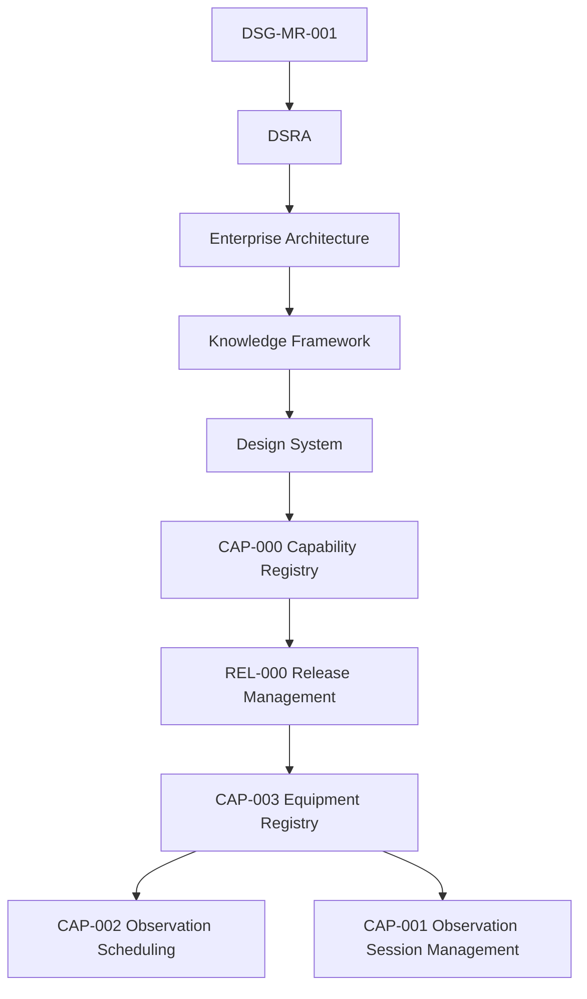

# CAP-003 - Traceability Matrix

## Purpose

La matrice collega ogni artefatto CAP-003 alla catena di governance e alle capability gia approvate: CAP-001 Observation Session Management e CAP-002 Observation Scheduling.

## Governance Traceability

## Artefact Matrix

| Artefact | Roadmap | DSRA | Enterprise Architecture | Knowledge Framework | CAP-000 | REL-000 | CAP-001 | CAP-002 | Notes |
|---|---|---|---|---|---|---|---|---|---|
| `index.md` | DSG-MR-001 observatory/operations | Asset and operational risk | EA-000 / Application Architecture | Equipment, Configuration | CAP-EQR-001 | Capability lifecycle | Readiness consumer | Availability consumer | Overview and scope. |
| `business-process.md` | Operations process | Risk prevention | Business/Application Architecture | Maintenance Activity | CAP-EQR-001 | Promotion evidence | Session readiness | Resource availability | Workflow. |
| `requirements.md` | Capability requirements | Security/availability risk | Application/Data/Technology Architecture | Requirements Repository | CAP-EQR-001 | Readiness checklist | Uses EQR requirements | Uses EQR requirements | 32 requirements. |
| `architecture-mapping.md` | Roadmap alignment | Control inheritance | EA layers | Domain Model | CAP-EQR-001 | Compliance | Session mapping | Scheduling mapping | No redesign. |
| `data-model.md` | Data governance | Retention/open risk | Data Architecture | Canonical Information Model | CAP-EQR-001 | Artefact evidence | Equipment state | Assignment constraints | Conceptual only. |
| `technical-manual.md` | Implementation path | Operational controls | Technology/Integration Architecture | Repository Taxonomy | CAP-EQR-001 | Manual artefact | Readiness interface | Availability interface | No code. |
| `test-plan.md` | Validation expectations | Recovery validation | Observability Architecture | Requirements Repository | CAP-EQR-001 | Validation gate | Regression link | Regression link | Future tests. |
| `acceptance-criteria.md` | Completion criteria | Safety/continuity criteria | EA compliance | Quality Model | CAP-EQR-001 | Release gate | Acceptance dependency | Acceptance dependency | Measurable criteria. |
| `adr/EQR-ADR-001-authoritative-registry.md` | Registry authority | Avoid inconsistent assets | Application/Data Architecture | Glossary | CAP-EQR-001 | ADR artefact | Consumer boundary | Consumer boundary | Authority decision. |
| `adr/EQR-ADR-002-equipment-state-model.md` | State governance | Safety and availability | Observability/Data Architecture | Status vocabulary | CAP-EQR-001 | ADR artefact | Readiness state | Availability state | State model. |
| `sop/register-equipment.md` | Operational procedure | Risk prevention | Application Architecture | Repository Taxonomy | CAP-EQR-001 | SOP artefact | Provides equipment | Provides resource | Registration. |
| `sop/update-equipment.md` | Change control | Configuration risk | Data/Technology Architecture | Traceability Matrix | CAP-EQR-001 | SOP artefact | Preserves readiness | Preserves availability | Updates. |
| `sop/verify-equipment.md` | Operational procedure | Safety controls | Observability Architecture | Quality Model | CAP-EQR-001 | SOP artefact | Verification before session | Verification before schedule | Verification. |
| `sop/retire-equipment.md` | Lifecycle governance | Continuity risk | Data Architecture | Archive concept | CAP-EQR-001 | SOP artefact | Retired not usable | Retired not schedulable | Retirement. |
| `runbooks/equipment-not-found.md` | Recovery path | Registry gap risk | Application Architecture | Knowledge evidence | CAP-EQR-001 | Runbook artefact | Session issue | Scheduling issue | Missing asset. |
| `runbooks/configuration-mismatch.md` | Recovery path | Configuration risk | Technology Architecture | Configuration entity | CAP-EQR-001 | Runbook artefact | Readiness block | Availability block | Mismatch. |
| `runbooks/equipment-offline.md` | Recovery path | Availability/safety risk | Observability Architecture | Health Status | CAP-EQR-001 | Runbook artefact | Session readiness issue | Resource unavailable | Offline. |
| `runbooks/registry-recovery.md` | Recovery path | Continuity risk | Data/Technology Architecture | Repository Quality Model | CAP-EQR-001 | Runbook artefact | Restores evidence | Restores evidence | Registry recovery. |

## Requirement Traceability Summary

| Category | IDs | Governing Reference |
|---|---|---|
| Business | `EQR-BR-001` - `EQR-BR-004` | DSG-MR-001, CAP-000 |
| Functional | `EQR-FR-001` - `EQR-FR-008` | EA Application/Data Architecture |
| Operational | `EQR-OR-001` - `EQR-OR-004` | DSRA, Observability Architecture |
| Security | `EQR-SR-001` - `EQR-SR-004` | Security Architecture |
| Performance | `EQR-PR-001` - `EQR-PR-003` | CAP-001 / CAP-002 operational needs |
| Availability | `EQR-AR-001` - `EQR-AR-003` | DSRA / continuity |
| Quality | `EQR-QR-001` - `EQR-QR-003` | Knowledge Quality Model |
| Traceability | `EQR-TR-001` - `EQR-TR-003` | Governance chain |

## Open Decisions

| Decision | Impact | Owner | Required Input |
|---|---|---|---|
| Final equipment identifier format | Determines naming and cross-reference pattern. | Engineering Owner | Approved identifier policy. |
| Physical storage model | Determines future repository or system of record implementation. | Data/Engineering Owner | Architecture decision when implementation starts. |
| Automated telemetry ingestion | Determines whether state is manual, automated or hybrid. | Operations/Engineering Owner | Observability and integration decision. |
| Detailed compatibility matrix | Determines scheduling and session validation granularity. | Engineering Owner | Equipment and configuration policy. |

## Coverage Statement

CAP-003 has complete documentation coverage for readiness: overview, process, requirements, architecture mapping, conceptual data model, ADR, SOP, runbooks, manual, test plan, acceptance criteria and traceability. Operational implementation evidence remains future release scope.
