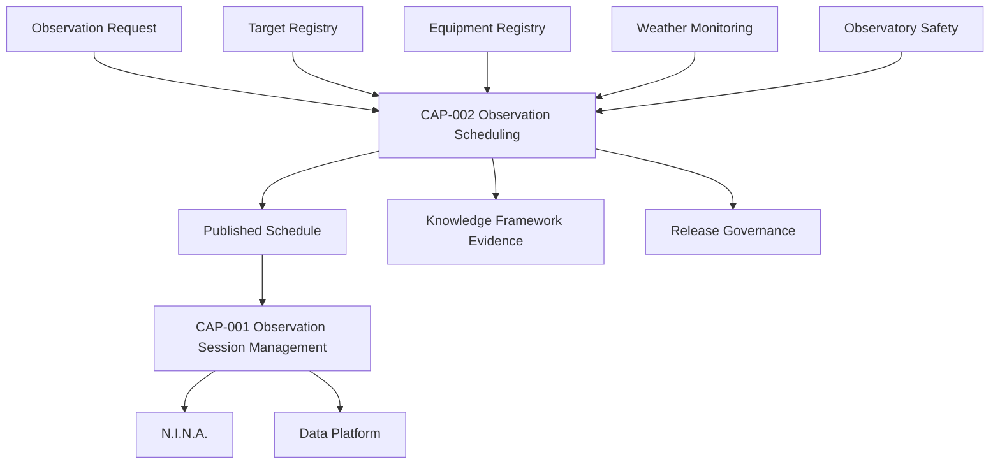

# CAP-002 - Architecture Mapping

## Purpose

Questo documento collega Observation Scheduling alle architetture e ai framework approvati. Non ridefinisce Enterprise Architecture, Knowledge Framework o CAP-001.

## Logical Position

## Application Architecture Mapping

| Application Service | CAP-002 Use |
|---|---|
| Scheduler | Core application service that evaluates candidate schedule, windows, resources and conflicts. |
| Observation Session Manager | Downstream consumer of approved and published schedule. Execution remains in CAP-001. |
| Equipment Registry | Provides availability, compatibility, maintenance status and resource constraints. |
| Target Registry | Provides target identity, coordinates, constraints and scientific metadata. |
| Analytics | Future consumer of scheduling quality and completion metrics. |
| Documentation Platform | Publishes procedures, runbooks, traceability and release evidence. |

## Data Architecture Mapping

| Information Object | CAP-002 Responsibility |
|---|---|
| Observation Request | Consumed as source input. |
| Target Registry | Referenced for target validation. |
| Equipment Registry | Referenced for resource validation. |
| Observation Schedule | Owned by CAP-002 at conceptual level. |
| Scheduled Observation | Produced by CAP-002 and consumed by CAP-001. |
| Observation Window | Produced during window evaluation. |
| Approval Record | Produced during schedule approval. |
| Conflict | Produced when constraints cannot be satisfied. |
| Session Manifest | Not owned by CAP-002; CAP-001 creates it using schedule evidence. |

## Technology Architecture Mapping

| Technology Node / Integration | Relationship |
|---|---|
| Observatory / EAGLE / Windows | Execution environment for downstream observation sessions, not a CAP-002 implementation decision. |
| N.I.N.A. | Receives session work through CAP-001, not directly from CAP-002. |
| ASCOM/Alpaca, CPWI, PHD2 | Indirect operational dependencies through resources and session execution. |
| Weather Station / AllSky | Evidence sources for weather and sky validation. |
| GitHub | Authoritative repository for documentation, release evidence and traceability. |
| Cloud Storage / NAS | Future storage destinations for schedule evidence if adopted by governed implementation. |

## Knowledge Framework Mapping

CAP-002 uses canonical concepts already defined by the Knowledge Framework:

- Observation Request;
- Target;
- Target Registry;
- Equipment;
- Equipment Registry;
- Observation Session;
- Session Manifest;
- Weather Event;
- Safety Event;
- Alert;
- Documentation Asset.

Capability-specific concepts are documented in `data-model.md` and must remain traceable to these canonical entities.

## Design System Mapping

CAP-002 does not implement UI. Future user interfaces for scheduling shall conform to the Design System baseline:

- dashboard patterns for Operations, Engineering and Science views;
- navigation patterns for capability and knowledge traversal;
- component library for status badges, tables, timeline, alerts, equipment cards and observation cards;
- accessibility and night operation guidance.

## Governance Mapping

| Governance Artefact | CAP-002 Relation |
|---|---|
| `DSG-MR-001` | Highest authority for capability scope and platform direction. |
| DSRA | Source for safety, continuity and operational risk constraints. |
| `EA-000` | Certifies Enterprise Architecture baseline from which CAP-002 derives. |
| Knowledge Framework | Provides semantic model, glossary and traceability expectations. |
| `DSG-DS-001` | Governs future UI consistency. |
| `CAP-000` | Registers CAP-002 status, maturity, readiness and links. |
| `REL-000` | Governs readiness and future release movement. |

## Boundaries

- CAP-002 plans and publishes schedules.
- CAP-001 prepares, executes, aborts, recovers and closes sessions.
- Equipment and Target Registry own their source records.
- Weather Monitoring and Observatory Safety own weather/safety evidence.
- Data Platform owns persisted observation data after execution.

## Open Architecture Dependencies

- Final scoring model for target priority is OPEN.
- Final retention for schedule evidence is governed by data/knowledge policy and remains OPEN where not already specified.
- Exact future user interface for scheduling is OPEN and must follow Design System if implemented.
