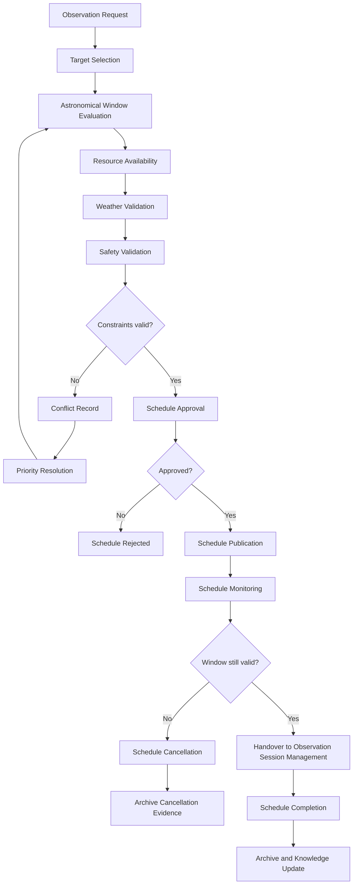

# CAP-002 - Business Process

## Purpose

Questo documento descrive il processo operativo della capability Observation Scheduling. Il processo non implementa automazione: definisce le responsabilita e le evidenze necessarie per trasformare una Observation Request in una schedule approvata, pubblicata, monitorata, completata o cancellata.

## Process Scope

Il processo copre:

- Observation Request;
- Target Selection;
- Astronomical Window Evaluation;
- Resource Availability;
- Weather Validation;
- Safety Validation;
- Priority Resolution;
- Schedule Approval;
- Schedule Publication;
- Schedule Monitoring;
- Schedule Cancellation;
- Schedule Completion.

## Workflow

## Process Steps

| Step | Description | Output |
|---|---|---|
| Observation Request | Registra la richiesta osservativa con target, motivazione, preferenze e vincoli noti. | Observation Request tracciabile. |
| Target Selection | Collega la richiesta a Target Registry e conferma identita e dati minimi target. | Target validato o richiesta sospesa. |
| Astronomical Window Evaluation | Valuta osservabilita, finestra temporale, altezza, oscurita e vincoli astronomici noti. | Observation Window candidata. |
| Resource Availability | Confronta finestra con Equipment Registry, manutenzione, configurazioni e disponibilita. | Resource Allocation candidata. |
| Weather Validation | Valuta meteo previsto o operativo rispetto a criteri safe del repository. | Weather validation evidence. |
| Safety Validation | Verifica stato safety osservatorio prima di approvazione o pubblicazione. | Safety validation evidence. |
| Priority Resolution | Risolve conflitti tra richieste, finestre e risorse con regole documentate. | Decisione di priorita e Conflict Record se necessario. |
| Schedule Approval | Formalizza approvazione, owner, motivazione e stato. | Approval Record. |
| Schedule Publication | Rende la schedule disponibile a CAP-001 per preparazione sessione. | Published Observation Schedule. |
| Schedule Monitoring | Verifica variazioni di meteo, risorse, safety e conflitti fino alla consegna. | Schedule status aggiornato. |
| Schedule Cancellation | Cancella una schedule non piu valida o non sicura. | Cancellation record e motivazione. |
| Schedule Completion | Marca la schedule come completata dopo handover o esito operativo. | Completion evidence e knowledge update. |

## Controls

- La schedule non puo diventare `Approved` senza target, finestra, risorse, meteo, safety e priorita valutate.
- La schedule non puo diventare `Published` senza Approval Record.
- Ogni conflitto deve avere owner, ragione, impatto e risoluzione.
- Ogni cancellazione deve essere registrata e collegata alla richiesta originaria.
- Il passaggio a CAP-001 deve preservare gli identificatori della Observation Request e della Scheduled Observation.

## Related Documents

- `index.md`
- `requirements.md`
- `architecture-mapping.md`
- `data-model.md`
- `sop/create-schedule.md`
- `sop/approve-schedule.md`
- `runbooks/scheduling-conflict.md`
- `traceability.md`
