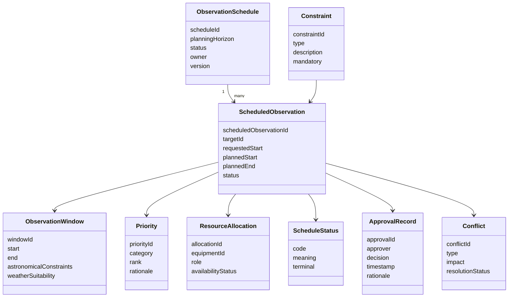

# CAP-002 - Conceptual Data Model

## Purpose

Questo documento descrive le entita concettuali di Observation Scheduling. Non definisce database, schema fisico, API o implementazione.

## Conceptual Model

## Entities

### Observation Schedule

| Field | Description |
|---|---|
| Purpose | Governed planning container for one planning horizon. |
| Owner | Operations Owner / OPEN for final accountable owner. |
| Producer | Scheduling process. |
| Consumer | CAP-001, operators, analytics, knowledge repository. |
| Lifecycle | Draft -> Evaluated -> Approved -> Published -> Completed/Cancelled -> Archived. |
| Relationships | Contains Scheduled Observation records. |

### Scheduled Observation

| Field | Description |
|---|---|
| Purpose | Specific planned observation derived from an Observation Request. |
| Owner | Scheduling capability until handover to CAP-001. |
| Producer | Scheduler / operator workflow. |
| Consumer | Observation Session Management. |
| Lifecycle | Candidate -> Pending Approval -> Approved -> Published -> Handed Over -> Completed/Cancelled. |
| Relationships | Links request, target, window, resources, priority, status and approval. |

### Observation Window

| Field | Description |
|---|---|
| Purpose | Candidate time interval suitable for observing a target. |
| Owner | Scheduling capability with weather/safety evidence from respective domains. |
| Producer | Astronomical Window Evaluation. |
| Consumer | Priority Resolution, Approval, CAP-001. |
| Lifecycle | Candidate -> Validated -> Expired/Lost/Used. |
| Relationships | Linked to Scheduled Observation and constraints. |

### Priority

| Field | Description |
|---|---|
| Purpose | Documents scheduling precedence and rationale. |
| Owner | Science / Operations policy owner, final model OPEN. |
| Producer | Priority Resolution. |
| Consumer | Approval and conflict resolution. |
| Lifecycle | Proposed -> Applied -> Reviewed. |
| Relationships | Linked to conflicts, requests and scheduled observations. |

### Constraint

| Field | Description |
|---|---|
| Purpose | Represents a scheduling rule or limitation. |
| Owner | Domain owner of the constraint. |
| Producer | Request, target, equipment, weather, safety or operational policy. |
| Consumer | Scheduler and approval process. |
| Lifecycle | Active -> Superseded -> Retired. |
| Relationships | Applied to Scheduled Observation and conflicts. |

### Conflict

| Field | Description |
|---|---|
| Purpose | Records incompatibility between requests, windows, resources or safety. |
| Owner | Scheduling process owner. |
| Producer | Conflict detection. |
| Consumer | Runbook, approval, knowledge update. |
| Lifecycle | Open -> Investigating -> Resolved/Cancelled -> Archived. |
| Relationships | Linked to Scheduled Observation, constraints and priority. |

### Resource Allocation

| Field | Description |
|---|---|
| Purpose | Assigns required equipment/resource to a scheduled observation. |
| Owner | Equipment Registry for source state; Scheduling for allocation evidence. |
| Producer | Resource Availability step. |
| Consumer | CAP-001 and Engineering operations. |
| Lifecycle | Candidate -> Reserved -> Released/Failed. |
| Relationships | Links Equipment Registry and Scheduled Observation. |

### Schedule Status

| Field | Description |
|---|---|
| Purpose | Controlled vocabulary for schedule state. |
| Owner | Capability documentation owner. |
| Producer | Scheduling process. |
| Consumer | CAP-000, REL-000, portals and operations. |
| Lifecycle | Governed vocabulary updates through ADR if materially changed. |
| Relationships | Applied to Observation Schedule and Scheduled Observation. |

### Approval Record

| Field | Description |
|---|---|
| Purpose | Captures decision, approver, timestamp and rationale. |
| Owner | Operations Owner / approval role. |
| Producer | Approve Schedule SOP. |
| Consumer | Audit, traceability, release evidence and CAP-001. |
| Lifecycle | Created at approval/rejection/cancellation; retained with schedule evidence. |
| Relationships | Linked to Scheduled Observation and schedule status. |

## Status Vocabulary

| Status | Meaning |
|---|---|
| Draft | Schedule exists but is not evaluated. |
| Candidate | Target, window and resource allocation are proposed. |
| Conflict | At least one constraint is unsatisfied. |
| Pending Approval | Required validations are complete and awaiting approval. |
| Approved | Schedule is accepted for publication. |
| Published | Schedule is available for CAP-001 handover. |
| Cancelled | Schedule is withdrawn with recorded reason. |
| Completed | Schedule has completed its lifecycle. |
| Archived | Evidence is preserved for knowledge and audit. |

## Retention and Storage

Retention and storage are governed by Enterprise Data Architecture and Knowledge Framework. CAP-002 does not define a database. Until a specific retention ADR exists, schedule evidence retention remains an open architectural decision recorded in `traceability.md` and future architecture decision catalogs.
