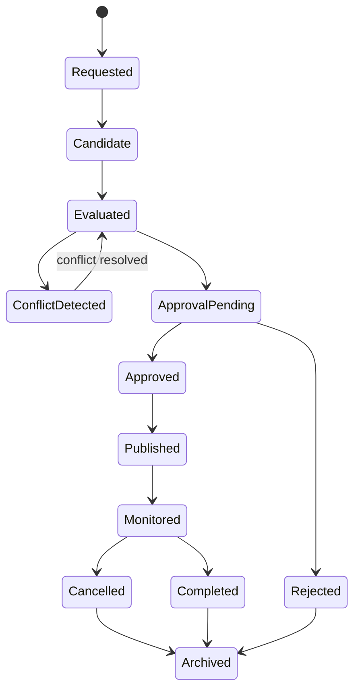

# CAP-002 - Observation Scheduling

| Campo | Valore |
|---|---|
| Capability | Observation Scheduling |
| ID | `CAP-002` / `CAP-SCH-001` |
| Stato | Documented |
| Readiness | Implementation Ready |
| Versione | 0.1 |
| Owner | Lead Solution Architect |
| Fonte gerarchica | `DSG-MR-001` -> DSRA -> Enterprise Architecture -> Knowledge Framework -> Design System -> Capability Registry -> Capability Package |

## Purpose

Observation Scheduling governa la preparazione, valutazione, approvazione, pubblicazione, monitoraggio e chiusura del piano osservativo Digital StarGate.

La capability trasforma le Observation Request in Scheduled Observation tracciabili, verificando target, finestre astronomiche, disponibilita risorse, meteo, sicurezza e priorita prima che una sessione venga consegnata a Observation Session Management.

## Business Value

- Riduce conflitti tra target, strumenti, finestre astronomiche e condizioni operative.
- Rende verificabile il passaggio da richiesta osservativa a sessione pianificata.
- Aumenta la continuita operativa dell'osservatorio remoto automatizzato.
- Fornisce evidenza documentale per priorita, approvazioni, cancellazioni e recuperi.
- Crea un modello riusabile per capability future senza introdurre implementazione software.

## Scope

Incluso:

- definizione del processo di scheduling;
- requisiti di business, funzionali, operativi, sicurezza, performance, disponibilita, qualita e tracciabilita;
- mapping alle architetture e ai framework gia approvati;
- modello dati concettuale della schedulazione;
- ADR specifici della capability;
- SOP per creazione, aggiornamento, approvazione e cancellazione schedule;
- runbook per conflitti, perdita finestra meteo, risorsa non disponibile e recovery;
- manuale tecnico, test plan, acceptance criteria e matrice di tracciabilita.

Escluso:

- implementazione di scheduler software;
- backend, frontend, API o database;
- ridefinizione di Enterprise Architecture, Knowledge Framework, Design System, CAP-001 o REL-000;
- policy scientifiche non presenti nel repository, che restano decisioni aperte.

## Stakeholders

| Stakeholder | Interesse |
|---|---|
| Operations Owner | Pianificazione sostenibile delle attivita osservatorie. |
| Science Owner | Allineamento tra target, priorita scientifica e finestre osservabili. |
| Data Owner | Tracciabilita da richiesta, schedule, sessione e archivio. |
| Engineering Owner | Compatibilita con disponibilita strumenti, configurazioni e manutenzione. |
| Safety Owner | Meteo e safety prima della pubblicazione schedule. |
| Release Owner | Evidenza che la capability sia pronta per implementazione futura. |

## Actors

| Actor | Responsabilita |
|---|---|
| Operatore remoto | Crea, revisiona, approva o cancella schedule secondo SOP. |
| Scheduler | Valuta finestre, vincoli, priorita e conflitti come servizio applicativo previsto dall'architettura. |
| Observation Session Manager | Riceve Scheduled Observation approvate e governa l'esecuzione sessione. |
| Equipment Registry | Fornisce disponibilita e compatibilita delle risorse. |
| Target Registry | Fornisce target, coordinate, vincoli e metadati. |
| Weather Monitoring | Fornisce idoneita meteo e finestre operative. |
| Observatory Safety | Conferma condizioni safe prima della pubblicazione o dell'esecuzione. |

## Dependencies

| Dependency | Role |
|---|---|
| CAP-001 Observation Session Management | Esegue la sessione derivata da una schedule approvata. |
| Equipment Registry | Verifica risorse, profili e manutenzione. |
| Target Registry | Valida target, coordinate e vincoli scientifici. |
| Weather Monitoring | Valida finestra meteo osservabile. |
| Observatory Safety | Valida safe state operativo. |
| Knowledge Framework | Definisce entita canoniche e tracciabilita. |
| Enterprise Architecture | Definisce Scheduler, Data Platform e integrazioni logiche. |
| REL-000 | Governa promotion e release della capability. |

## External Integrations

| Integration | Purpose |
|---|---|
| N.I.N.A. | Destinazione operativa della sessione pianificata tramite CAP-001, non controllo diretto da CAP-002. |
| ASCOM/Alpaca | Dipendenza indiretta per disponibilita strumenti attraverso CAP-001 e Equipment Registry. |
| PHD2 / CPWI | Dipendenze operative indirette per sessione e risorse. |
| Weather Station / AllSky | Evidenza meteo e cielo per finestra osservativa. |
| Astrometry.net / ASTAP | Dipendenze indirette per validazione target e plate solving durante capability successive. |
| GitHub | Repository documentale e governance evidence. |

## Lifecycle

## Success Criteria

- Ogni Scheduled Observation deriva da una Observation Request tracciabile.
- Ogni schedule approvata contiene target, finestra, risorse, vincoli, priorita, stato e approvazione.
- Conflitti e cancellazioni sono registrati con motivazione e owner.
- Nessuna schedule viene pubblicata senza meteo e safety valutati.
- Il passaggio verso CAP-001 avviene solo per schedule approvate e pubblicate.
- ADR, SOP, runbook, manuale, test e acceptance criteria sono disponibili e linkati da CAP-000.

## References

- `DSG-MR-001` Master Roadmap.
- DSRA baseline e reference architecture.
- `EA-000` Enterprise Architecture Baseline.
- Enterprise Architecture Application, Data, Technology, Integration e Observability Architecture.
- Knowledge Framework Domain Model, Canonical Information Model e Traceability Matrix.
- `CAP-000` Capability Registry.
- `CAP-001` Observation Session Management.
- `REL-000` Release Management Baseline.
