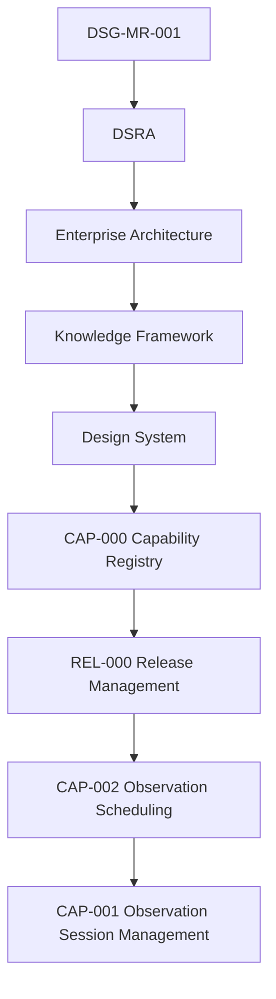

# CAP-002 - Traceability Matrix

## Purpose

La matrice collega ogni artefatto CAP-002 alla catena di governance: Roadmap, DSRA, Enterprise Architecture, Knowledge Framework, `CAP-000` e `REL-000`.

## Governance Traceability

## Artefact Matrix

| Artefact | Roadmap | DSRA | Enterprise Architecture | Knowledge Framework | CAP-000 | REL-000 | Notes |
|---|---|---|---|---|---|---|---|
| `index.md` | DSG-MR-001 operations direction | Operational risk context | EA-000 / Application Architecture | Domain Model | CAP-SCH-001 | Capability lifecycle | Overview and scope. |
| `business-process.md` | Prepare observation / automation | Safety and continuity controls | Business and Application Architecture | Traceability Matrix | CAP-SCH-001 | Promotion evidence | Operational workflow. |
| `requirements.md` | Capability requirements | Security and availability risk | Application/Data/Observability Architecture | Requirements Repository | CAP-SCH-001 | Readiness checklist | 32 requirements. |
| `architecture-mapping.md` | Roadmap alignment | Risk control inheritance | EA layers | Canonical concepts | CAP-SCH-001 | Release compliance | No architecture redesign. |
| `data-model.md` | Data governance | Retention/open risk | Data Architecture | Canonical Information Model | CAP-SCH-001 | Artefact evidence | Conceptual only. |
| `technical-manual.md` | Operations implementation path | Operational risk controls | Technology/Integration Architecture | Repository Taxonomy | CAP-SCH-001 | Manual artefact | No code. |
| `test-plan.md` | Validation expectations | Recovery and safety validation | Observability Architecture | Requirements Repository | CAP-SCH-001 | Validation gate | Future tests. |
| `acceptance-criteria.md` | Completion criteria | Safety and continuity criteria | EA compliance | Quality Model | CAP-SCH-001 | Release gate | Measurable criteria. |
| `adr/OSD-ADR-001-scheduling-boundary.md` | Capability boundary | Avoid control bypass | Application Architecture | Glossary | CAP-SCH-001 | ADR artefact | Scheduling vs session execution. |
| `adr/OSD-ADR-002-priority-resolution.md` | Priority governance | Safety precedence | Business/Application Architecture | Requirements Repository | CAP-SCH-001 | ADR artefact | Deterministic priority evidence. |
| `sop/create-schedule.md` | Operational procedure | Risk prevention | Application Architecture | Repository Taxonomy | CAP-SCH-001 | SOP artefact | Schedule creation. |
| `sop/update-schedule.md` | Operational procedure | Change control | Application/Data Architecture | Traceability Matrix | CAP-SCH-001 | SOP artefact | Controlled updates. |
| `sop/approve-schedule.md` | Governance procedure | Safety gates | Security/Observability Architecture | Governance lifecycle | CAP-SCH-001 | SOP artefact | Approval controls. |
| `sop/cancel-schedule.md` | Operational procedure | Recovery and safety | Observability Architecture | Domain Model | CAP-SCH-001 | SOP artefact | Cancellation evidence. |
| `runbooks/scheduling-conflict.md` | Recovery path | Operational conflict risk | Application Architecture | Knowledge Graph Model | CAP-SCH-001 | Runbook artefact | Conflict resolution. |
| `runbooks/weather-window-lost.md` | Recovery path | Weather risk | Observability Architecture | Weather Event | CAP-SCH-001 | Runbook artefact | Weather loss. |
| `runbooks/resource-unavailable.md` | Recovery path | Equipment risk | Technology Architecture | Equipment Registry | CAP-SCH-001 | Runbook artefact | Resource issue. |
| `runbooks/schedule-recovery.md` | Recovery path | Continuity risk | Observability/Technology Architecture | Traceability Matrix | CAP-SCH-001 | Runbook artefact | Recovery. |

## Requirement Traceability Summary

| Category | IDs | Governing Reference |
|---|---|---|
| Business | `OSD-BR-001` - `OSD-BR-004` | DSG-MR-001, CAP-000 |
| Functional | `OSD-FR-001` - `OSD-FR-008` | EA Application/Data Architecture |
| Operational | `OSD-OR-001` - `OSD-OR-004` | DSRA, Observability Architecture |
| Security | `OSD-SR-001` - `OSD-SR-004` | Security Architecture |
| Performance | `OSD-PR-001` - `OSD-PR-003` | Operational model |
| Availability | `OSD-AR-001` - `OSD-AR-003` | DSRA / Business Continuity |
| Quality | `OSD-QR-001` - `OSD-QR-003` | Knowledge Quality Model |
| Traceability | `OSD-TR-001` - `OSD-TR-003` | Governance chain |

## Open Decisions

| Decision | Impact | Owner | Required Input |
|---|---|---|---|
| Final scheduling priority scoring model | Determines exact tie-break behavior. | Science Owner / Operations Owner | Approved priority policy. |
| Schedule evidence retention period | Determines archive and audit obligations. | Data Owner | Retention rule or ADR. |
| Future scheduling UI surface | Determines Design System component application. | Product/Design Owner | Approved UI scope. |
| Automated notification behavior | Determines alerting integration. | Operations Owner | Notification policy. |

## Coverage Statement

CAP-002 has complete documentation coverage for readiness: overview, process, requirements, architecture mapping, conceptual data model, ADR, SOP, runbooks, manual, test plan, acceptance criteria and traceability. Operational implementation evidence remains future release scope.
