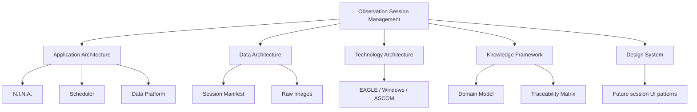

# Observation Session Management - Architecture Mapping

| Campo | Valore |
|---|---|
| Documento | Architecture Mapping |
| Capability | `DSG-CAP-OSM-001` |
| Fonte gerarchica | `DSG-MR-001` -> DSRA -> Enterprise Architecture -> Knowledge Framework -> Design System |
| Stato | Controlled Baseline |

## Purpose

Questo documento descrive come Observation Session Management usa l'architettura enterprise esistente. Non modifica ne estende l'architettura.

## Mapping Summary

## Application Architecture

| Application element | Capability use | Reference |
|---|---|---|
| Observation Session Manager | Core coordinating service for readiness, sequence, events, logs, closure and manifest. | `docs/enterprise-architecture/application-architecture.md` |
| Scheduler | Provides planned observation or session plan. | Application Architecture, open scheduler decisions. |
| Observatory Control | Provides local equipment readiness and device state through N.I.N.A./ASCOM stack. | Application Architecture. |
| Imaging Pipeline | Produces raw images and acquisition logs. | Application Architecture. |
| Data Platform | Receives manifest, metadata, raw image references, catalog and archive evidence. | Application/Data Architecture. |
| Analytics | Consumes session evidence and quality state. | ADR-002, ADR-003. |
| Documentation Platform | Publishes SOP, runbook, manual, test and release evidence. | ADR-004, Repository Map. |

## Data Architecture

| Data object | Capability use | Reference |
|---|---|---|
| Observation Request | Session intent and planning source. | `docs/enterprise-architecture/data-architecture.md` |
| Observation Session | Governed execution unit. | ADR-001, Data Architecture. |
| Observation Manifest | Evidence binder for files, logs, metadata and checksums; schema remains open. | Data Architecture, Architecture Decision Catalog. |
| Session Metadata | Captured from FITS headers, logs and reports. | Data Architecture, ADR-003. |
| Raw Images | Acquisition output linked to session. | Data Architecture. |
| Observation Catalog | Curated index of session evidence. | Data Architecture, Knowledge Framework. |
| Archive | Preservation of session package and data products. | Data/Technology Architecture. |

## Technology Architecture

| Technology context | Capability dependency | Reference |
|---|---|---|
| EAGLE | Local observatory execution node. | Technology Architecture. |
| Windows | Runtime environment for observatory control software. | Technology Architecture. |
| N.I.N.A. | Session execution and image acquisition. | Integration/Technology Architecture. |
| ASCOM / Alpaca | Device integration layer. | Integration Architecture. |
| CPWI | Mount control. | Integration Architecture. |
| PHD2 | Guiding integration. | Integration Architecture. |
| Weather Station / AllSky | Safety and sky-state evidence. | Observability/Integration Architecture. |
| NAS / Cloud Storage | Archive and backup target as governed. | Technology Architecture. |
| VPN / Remote Access | Remote operations channel. | Security/Technology Architecture. |

## Knowledge Framework

| Knowledge artefact | Capability use |
|---|---|
| Domain Model | Defines Observation Request, Target, Equipment, Observation Session, Session Manifest, Weather Event, Safety Event and Alert. |
| Canonical Information Model | Defines identifiers, status, lifecycle and traceability concepts. |
| Enterprise Glossary | Provides official UI/document labels. |
| Requirements Repository | Provides requirement categories and governance alignment. |
| Traceability Matrix | Defines no-orphan traceability obligations. |
| Repository Taxonomy | Guides folder, naming and document lifecycle. |

## Design System

Observation Session Management documentation and future UI must respect:

- Design System Baseline;
- Component Library for session cards, observation cards, weather cards, equipment cards, alerts and timelines;
- Dashboard Patterns for operations and engineering dashboards;
- Interaction Patterns for loading, error, confirmation and accessibility;
- Implementation Guidelines restricting future UI to authorized technologies unless ADR-approved.

## Constraints

- No new architecture is introduced by this mapping.
- Session Manifest schema remains governed by open architectural decisions until approved.
- Future UI or software implementation requires downstream governance and does not derive directly from this document alone.
