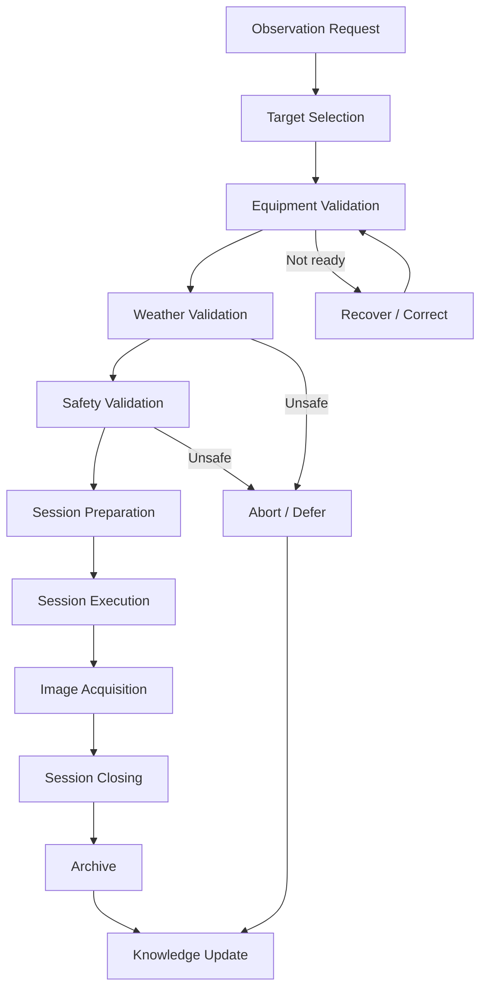

# Observation Session Management - Business Process

| Campo | Valore |
|---|---|
| Documento | Business Process |
| Capability | `DSG-CAP-OSM-001` |
| Fonte gerarchica | `DSG-MR-001` -> DSRA -> Enterprise Architecture -> Knowledge Framework -> Design System |
| Stato | Controlled Baseline |

## Purpose

Questo documento descrive il processo operativo della capability Observation Session Management. Il processo resta documentale e non definisce implementazione software.

## Process Overview

## Process Steps

| Step | Purpose | Main inputs | Main outputs | Controls |
|---|---|---|---|---|
| Observation Request | Registrare l'intento osservativo. | Target candidate, objective, constraints. | Request tracciabile. | Roadmap/Knowledge terminology. |
| Target Selection | Selezionare target osservabile e prioritario. | Target Registry, constraints, season. | Target scelto o sessione rinviata. | Target identity and coordinates. |
| Equipment Validation | Confermare readiness strumenti e profilo. | Equipment Registry, configuration, manuals. | Equipment ready/not ready. | Configuration and maintenance evidence. |
| Weather Validation | Valutare meteo e cielo. | Weather Station, AllSky, forecast/evidence. | Weather safe/unsafe snapshot. | Safety and freshness rules. |
| Safety Validation | Confermare stato osservatorio e remote operation. | Roof, mount, network, power, weather. | Safety state. | Emergency/abort path available. |
| Session Preparation | Preparare sequenza, profilo e manifest iniziale. | Plan, target, equipment, weather, safety. | Prepared session. | ADR-001 and manifest governance. |
| Session Execution | Eseguire sessione tramite strumenti autorizzati. | Prepared session, N.I.N.A., ASCOM, PHD2. | Execution events and logs. | Operator monitoring and failure handling. |
| Image Acquisition | Acquisire raw images e metadati. | Camera, filter, guider, target. | Raw images, logs, acquisition evidence. | Data lineage and quality checks. |
| Session Closing | Fermare acquisizione e consolidare evidenze. | Logs, raw files, status, safety state. | Closed session, manifest status. | Close SOP and archive readiness. |
| Archive | Conservare dati, manifest e output. | Raw images, logs, manifest, metadata. | Archived session package. | Backup/recovery policy. |
| Knowledge Update | Aggiornare catalogo, documentazione e traceability. | Session evidence, outcome, incidents. | Catalog, report, open decisions if needed. | Knowledge Framework consistency. |

## Process Roles

| Role | Responsibilities |
|---|---|
| Operations Owner | Autorizza processo operativo e safety path. |
| Operator | Esegue preparazione, monitoraggio, abort e chiusura. |
| Data Owner | Garantisce manifest, catalogo, archive e lineage. |
| Engineering Owner | Garantisce readiness equipment/configurazioni. |
| Knowledge Architect | Garantisce aggiornamento semantico e tracciabilita. |

## Exit Conditions

Una sessione puo uscire dal processo come:

- `Archived`, quando completata e consolidata;
- `Aborted`, quando interrotta per safety o failure;
- `Deferred`, quando non avviata per condizioni non valide;
- `Recovery`, quando richiede ripristino prima della chiusura documentale.

## Governance References

- `docs/enterprise-architecture/application-architecture.md`
- `docs/enterprise-architecture/data-architecture.md`
- `docs/enterprise-architecture/observability-architecture.md`
- `docs/knowledge/domain-model.md`
- `docs/knowledge/traceability-matrix.md`
