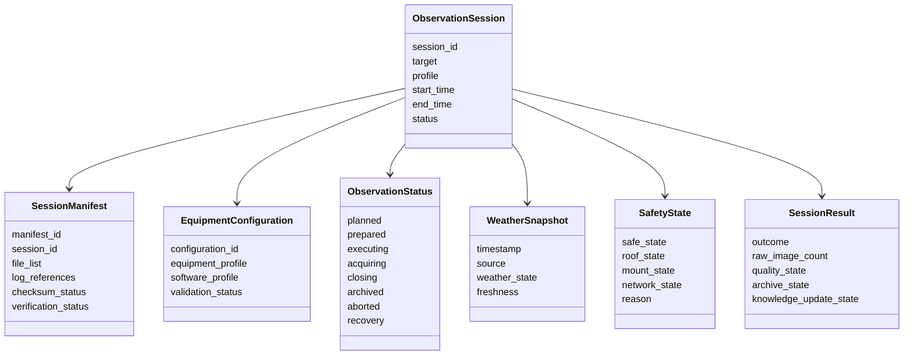

# Observation Session Management - Data Model

| Campo | Valore |
|---|---|
| Documento | Capability Data Model |
| Capability | `DSG-CAP-OSM-001` |
| Fonte gerarchica | `DSG-MR-001` -> DSRA -> Enterprise Architecture -> Knowledge Framework -> Design System |
| Stato | Controlled Baseline |
| Vincolo | Conceptual model only; no database design |

## Purpose

Questo documento descrive il modello dati concettuale della capability Observation Session Management. Non definisce tabelle, API, storage engine o schema database.

## Conceptual Model

## Information Objects

| Object | Purpose | Main attributes | Owner | Lifecycle | Related entities |
|---|---|---|---|---|---|
| Observation Session | Governed execution unit. | session ID, target, profile, start/end, status. | Operations Owner | Planned -> Prepared -> Executing -> Closing -> Archived / Aborted / Recovery | Observation Request, Target, Equipment, Raw Images, Manifest. |
| Session Manifest | Evidence binder for session. | manifest ID, file list, logs, metadata, checksum, verification. | Data Owner | Draft -> Verified -> Archived | Session, Raw Images, Logs, Observation Catalog, Archive. |
| Equipment Configuration | Configuration snapshot for the session. | equipment profile, software profile, validation state, version. | Engineering Owner | Proposed -> Validated -> Used -> Superseded | Equipment Registry, Software Component, Calibration Asset. |
| Observation Status | Canonical state of session execution. | state, timestamp, reason, actor/source. | Operations Owner | Requested -> Planned -> Prepared -> Ready -> Executing -> Acquiring -> Closing -> Archived | Session, Alert, Runbook. |
| Weather Snapshot | Weather evidence at decision points. | timestamp, source, state, freshness, safe/unsafe. | Operations Owner | Captured -> Classified -> Archived | Weather Event, Safety State, AllSky, Weather Station. |
| Safety State | Operational safety state. | weather safe, roof state, mount state, network state, reason. | Operations Owner | Unknown -> Safe -> Unsafe -> Recovery -> Closed | Observatory, Safety Event, Alert. |
| Session Result | Outcome and acceptance evidence. | outcome, raw image count, quality state, archive state, knowledge update. | Data/Operations Owner | Draft -> Reviewed -> Accepted -> Released | Catalog, Archive, Analytics, Release Notes. |

## Related Entities

The model uses existing Knowledge Framework entities:

- Observation Request
- Target
- Target Registry
- Equipment
- Equipment Registry
- Observatory
- Calibration Asset
- Raw Image
- Observation Catalog
- Knowledge Graph
- Alert
- Documentation Asset

## Status Vocabulary

| Status | Meaning |
|---|---|
| Requested | Intent exists but session is not planned. |
| Planned | Target and preliminary plan exist. |
| Prepared | Equipment, sequence and initial evidence are prepared. |
| Ready | Weather and safety checks allow execution. |
| Executing | Session is active. |
| Acquiring | Images are being acquired. |
| Closing | Acquisition stopped and evidence is being consolidated. |
| Archived | Session package is preserved. |
| Aborted | Session stopped before normal completion. |
| Recovery | Session requires corrective action before closure. |

## Open Data Decisions

| ID | Decision | Reason | Impact | Owner | Required input |
|---|---|---|---|---|---|
| `OSM-ODD-001` | Final Session Manifest schema | Architecture catalog keeps manifest schema open. | Affects validation, catalog and archive automation. | Data Owner | Approved ADR/schema evidence. |
| `OSM-ODD-002` | Exact session identifier format | Knowledge Framework keeps identifier format open. | Affects file naming and traceability. | Data Owner | Historical naming policy and governance decision. |
| `OSM-ODD-003` | Session result quality scale | Quality state vocabulary is not fully formalized. | Affects analytics and acceptance gates. | Data/Science Owner | Test and quality gate decision. |
