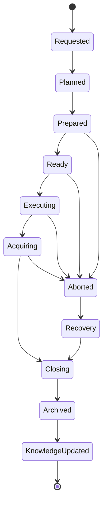

# Observation Session Management

| Campo | Valore |
|---|---|
| Capability | Observation Session Management |
| ID | `DSG-CAP-OSM-001` |
| Stato | Capability Documentation Baseline |
| Versione | 1.0 |
| Data | 2026-07-27 |
| Owner | Lead Solution Architect |
| Fonte gerarchica | `DSG-MR-001` -> DSRA -> Enterprise Architecture -> Knowledge Framework -> Design System |
| ADR principale | `ADR-001 - Session Layer` |

## Purpose

Observation Session Management governa la sessione osservativa come unita operativa, informativa e di tracciabilita. La capability collega richiesta osservativa, target, configurazione strumenti, condizioni meteo/safety, esecuzione N.I.N.A., acquisizione immagini, chiusura sessione, archiviazione e aggiornamento della conoscenza.

Questo pacchetto non implementa software. Definisce la documentazione di riferimento per guidare implementazioni future capability-by-capability.

## Business Value

| Valore | Descrizione |
|---|---|
| Tracciabilita scientifica | Ogni immagine e prodotto osservativo resta collegato a sessione, target, metadati e manifest. |
| Affidabilita operativa | La sessione diventa il contenitore governato per readiness, safety, acquisizione, recovery e chiusura. |
| Qualita dati | Manifest, log, meteo, configurazione e output supportano catalogazione, analytics e audit. |
| Riuso architetturale | La capability diventa pattern per future capability package. |
| Continuita documentale | ADR, SOP, runbook, manuale e test plan sono integrati nella stessa catena governata. |

## Scope

Incluso:

- gestione della sessione da Observation Request a Knowledge Update;
- requisiti funzionali, operativi, sicurezza, qualita e tracciabilita;
- mapping alle architetture enterprise esistenti;
- modello dati concettuale, senza database design;
- ADR di capability coerenti con `ADR-001`;
- SOP operative;
- runbook di recovery;
- manuale tecnico;
- test plan e criteri di accettazione.

Escluso:

- codice applicativo;
- backend, frontend, API e database;
- redesign architetturale;
- redesign UI;
- modifica di roadmap, DSRA, EA-000, Knowledge Framework o Design System.

## Stakeholders

| Stakeholder | Interesse |
|---|---|
| Operations Owner | Esecuzione sicura e ripetibile delle sessioni. |
| Science Owner | Qualita e tracciabilita dei dati acquisiti. |
| Data Owner | Manifest, catalogo, archiviazione e lineage. |
| Engineering Owner | Validazione asset, configurazioni e integrazioni. |
| Security Owner | Remote operations, audit, accesso e gestione informazioni sensibili. |
| Knowledge Architect | Aggiornamento del repository semantico e tracciabilita. |
| Release Owner | Evidenza di readiness e accettazione capability. |

## Actors

| Actor | Ruolo nella sessione |
|---|---|
| Operatore remoto | Richiede, prepara, monitora, abortisce o chiude la sessione. |
| Scheduler | Produce o supporta il piano osservativo. |
| Observation Session Manager | Coordina readiness, esecuzione, manifest, eventi e chiusura. |
| N.I.N.A. | Esegue sequenza, acquisizione immagini e integrazione con dispositivi. |
| ASCOM/Alpaca | Espone interfacce di controllo device. |
| CPWI | Supporta controllo montatura Celestron. |
| PHD2 | Supporta guida durante acquisizione. |
| Weather Station / AllSky | Forniscono evidenza meteo e cielo. |
| Data Platform | Riceve dati, metadata, manifest e output sessione. |
| Documentation Platform | Pubblica evidenze, SOP, runbook e release notes. |

## Dependencies

- `docs/architecture/ADR-001-Session-Layer.md`
- `docs/enterprise-architecture/application-architecture.md`
- `docs/enterprise-architecture/data-architecture.md`
- `docs/enterprise-architecture/technology-architecture.md`
- `docs/enterprise-architecture/observability-architecture.md`
- `docs/knowledge/domain-model.md`
- `docs/knowledge/canonical-information-model.md`
- `docs/knowledge/traceability-matrix.md`
- `docs/design-system/DSG-DS-001-design-system-baseline.md`

## External Integrations

| Integration | Capability use |
|---|---|
| N.I.N.A. | Session execution and image acquisition. |
| ASCOM / Alpaca | Equipment control interface. |
| CPWI | Mount control state and operation. |
| PHD2 | Guiding state and events. |
| ASTAP | Plate solving support where used by session execution. |
| AllSky | Sky-state evidence. |
| Weather Station | Weather safe/unsafe evidence. |
| PixInsight | Post-session processing evidence downstream. |
| Cloud Storage / NAS | Archive and backup targets as governed by architecture. |
| GitHub / MkDocs | Documentation and release evidence. |

## Lifecycle

## Success Criteria

- Sessione tracciata da richiesta a archivio.
- Manifest presente o decisione aperta esplicitata.
- Dati acquisiti collegati a target, equipment, meteo, safety e configurazione.
- Runbook disponibili per failure principali.
- SOP disponibili per preparazione, esecuzione, abort, recovery e chiusura.
- Test plan e criteri di accettazione definiti.
- Navigazione MkDocs aggiornata.

## Roadmap Reference

La capability deriva da `DSG-MR-001`, con riferimento alle aree Operations, Data, Analytics, Documentation, Observatory e Knowledge gia mappate in Enterprise Architecture e Knowledge Framework.

## DSRA Reference

La capability e allineata a `DSRA-000`, `DSRA-001` e alla risk assessment enterprise per continuita operativa, safety, data lineage, remote operation e recovery.