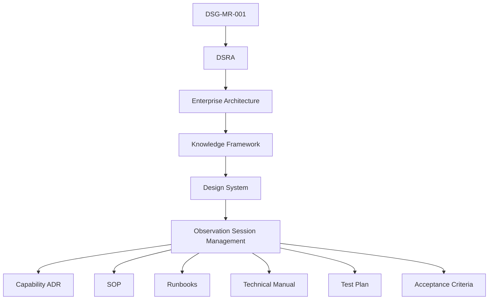

# Observation Session Management - Traceability

| Campo | Valore |
|---|---|
| Documento | Capability Traceability Matrix |
| Capability | `DSG-CAP-OSM-001` |
| Stato | Controlled Baseline |
| Fonte gerarchica | `DSG-MR-001` -> DSRA -> Enterprise Architecture -> Knowledge Framework -> Design System |

## Purpose

Mappare ogni documento della capability ai layer governati. Questa matrice non sostituisce la Knowledge Framework Traceability Matrix; la specializza per Observation Session Management.

## Governance Traceability

## Document Traceability Matrix

| Capability document | Roadmap | DSRA | Enterprise Architecture | Knowledge Framework | Design System | Downstream use |
|---|---|---|---|---|---|---|
| `index.md` | `DSG-MR-001` | DSRA | EA-000, Application/Data/Technology | Domain, CIM, Traceability | DSG-DS-001 | Capability overview |
| `business-process.md` | `DSG-MR-001` | DSRA safety/data | Application, Observability | Domain Model | Dashboard/Interaction patterns | SOP derivation |
| `requirements.md` | `DSG-MR-001` | DSRA security/safety | Application/Data/Security | Requirements Repository | Design Governance | Test plan |
| `architecture-mapping.md` | `DSG-MR-001` | DSRA | Application/Data/Technology/Observability | Traceability Matrix | Implementation Guidelines | Implementation governance |
| `data-model.md` | `DSG-MR-001` | DSRA data lineage | Data Architecture | Domain Model, CIM | Component Library future UI | Manifest/catalog work |
| `adr/OSM-ADR-001-session-governance-boundary.md` | `DSG-MR-001` | DSRA | EA-000, ADR-001 | Repository Taxonomy | Design Governance | SOP/runbook boundary |
| `adr/OSM-ADR-002-session-manifest-evidence-binder.md` | `DSG-MR-001` | DSRA data | Data Architecture, ADR-001 | Domain Model, CIM | Design Governance | Manifest future ADR |
| `sop/prepare-session.md` | `DSG-MR-001` | DSRA safety | Application/Technology/Observability | Domain Model | Interaction Patterns | Operational execution |
| `sop/execute-session.md` | `DSG-MR-001` | DSRA safety | Application/Integration | Domain Model | Dashboard Patterns | Operational execution |
| `sop/abort-session.md` | `DSG-MR-001` | DSRA safety | Security/Observability | Domain Model | Interaction Patterns | Emergency/recovery |
| `sop/recover-session.md` | `DSG-MR-001` | DSRA continuity | Observability/Technology | Domain Model | Interaction Patterns | Recovery execution |
| `sop/close-session.md` | `DSG-MR-001` | DSRA data | Data Architecture | CIM, Traceability | Component Library | Archive and knowledge update |
| `runbooks/scheduler-failure.md` | `DSG-MR-001` | DSRA ops | Application Architecture | Requirements | Interaction Patterns | Failure recovery |
| `runbooks/weather-unsafe.md` | `DSG-MR-001` | DSRA safety | Observability Architecture | Domain Model | Alerts/weather cards | Safety recovery |
| `runbooks/roof-failure.md` | `DSG-MR-001` | DSRA safety | Technology/Observability | Domain Model | Alerts | Emergency recovery |
| `runbooks/camera-failure.md` | `DSG-MR-001` | DSRA data/ops | Technology/Integration | Domain Model | Alerts/log viewer | Acquisition recovery |
| `runbooks/mount-failure.md` | `DSG-MR-001` | DSRA safety | Technology/Integration | Domain Model | Alerts/log viewer | Mount recovery |
| `runbooks/nina-failure.md` | `DSG-MR-001` | DSRA ops | Application/Integration | Software Component | Alerts/log viewer | Application recovery |
| `runbooks/ascom-failure.md` | `DSG-MR-001` | DSRA ops | Integration Architecture | Software Component | Alerts/log viewer | Device recovery |
| `runbooks/emergency-stop.md` | `DSG-MR-001` | DSRA safety | Security/Observability | Safety Event, Alert | Danger alerts | Emergency stop |
| `technical-manual.md` | `DSG-MR-001` | DSRA | Application/Data/Technology/Integration | Domain, Taxonomy | Component Library | Manuals and implementation planning |
| `test-plan.md` | `DSG-MR-001` | DSRA | EA-000 and architecture layers | Requirements/Quality | Design Governance | Assessment and release readiness |
| `acceptance-criteria.md` | `DSG-MR-001` | DSRA | EA-000 | Traceability Matrix | Design System | Acceptance/release gate |
| `traceability.md` | `DSG-MR-001` | DSRA | EA-000 | Traceability Matrix | Design System | Capability audit |

## Coverage Summary

| Metric | Value |
|---|---:|
| Capability documents mapped | 24 |
| Roadmap references | 24 / 24 |
| DSRA references | 24 / 24 |
| Enterprise Architecture references | 24 / 24 |
| Knowledge Framework references | 24 / 24 |
| Design System references | 24 / 24 |
| Orphan capability documents | 0 |

## Open Traceability Notes

| ID | Note | Impact | Owner |
|---|---|---|---|
| `OSM-TRC-OPEN-001` | Exact DSRA subsection identifiers are not duplicated here; capability references DSRA layer and documents. | Future release may add precise anchors if available. | Lead Solution Architect |
| `OSM-TRC-OPEN-002` | Specific future implementation artefacts do not exist yet. | Implementation traceability starts in next phase. | Release Owner |
