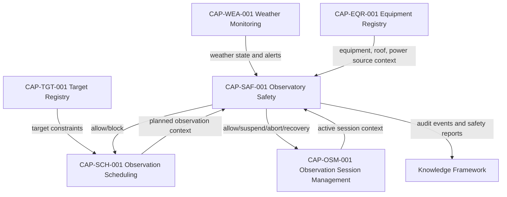

# CAP-SAF-001 - Architecture Mapping

## Purpose

This document maps Observatory Safety to approved Digital StarGate governance and architecture. It does not redefine Enterprise Architecture, Knowledge Framework, Design System, `DOM-001`, `CAP-000`, `REL-000` or `REV-001`.

## Governance Mapping

| Artefact | Mapping |
|---|---|
| `DSG-MR-001` | Safety supports governed remote observatory operation and continuity. |
| DSRA | Primary risk and control reference for unsafe operations, emergency and recovery posture. |
| `EA-000` | Safety refines the baselined architecture as a capability package only. |
| Knowledge Framework | Uses Safety Event, Alert, Operator Decision, Audit Record and traceability concepts. |
| Design System | Applies to future safety UI; no UI implementation is introduced. |
| `DOM-001` | Safety becomes an included Core Observatory capability. |
| `REV-001` | Resolves the review observation that Safety lacked a dedicated package. |
| `CAP-000` | Registry status/readiness synchronized to package evidence. |
| `REL-000` | Promotion follows readiness checklist and release evidence rules. |

## Logical Dependencies

## Application Architecture Alignment

| Application Service | Relationship |
|---|---|
| Observation Session Manager | Consumes Safety outputs for readiness, suspend, abort, safe mode and recovery. |
| Scheduler | Consumes Safety allow/block posture for schedule approval and monitoring. |
| Equipment Registry | Provides governed equipment and infrastructure context. |
| Target Registry | Provides target and constraint context indirectly through Scheduling/Session. |
| Weather Monitoring | Provides weather safety evidence; Safety does not replace weather authority. |
| Documentation Platform | Preserves ADR, SOP, runbook, review and traceability evidence. |
| Knowledge Graph | May link safety events, sessions, equipment, weather and decisions conceptually. |

## Data Architecture Alignment

| Information Object | Mapping |
|---|---|
| Safety Assessment | Evaluation result based on inputs and policy. |
| Safety Rule | Governed safety policy rule. |
| Safety State | Current safety posture. |
| Safety Event | Significant unsafe, emergency, recovery or maintenance occurrence. |
| Emergency Action | Emergency action support evidence. |
| Recovery Action | Safety recovery support evidence. |
| Operator Decision | Manual acknowledgement, override or decision. |
| Audit Record | Trace of input, policy, state and decision. |

## Technology Architecture Boundary

Observatory Safety may consume physical-context evidence from roof, power, network, weather or equipment status, but this package does not define:

- device drivers;
- PLC logic;
- roof controller implementation;
- power monitoring implementation;
- communications protocol;
- database or messaging topology.

## Integration Alignment

| Integration | Direction | Purpose | Boundary |
|---|---|---|---|
| Weather Monitoring | Weather -> Safety | Weather state and alerts. | Conceptual state only. |
| Equipment Registry | Equipment -> Safety | Asset, roof/power/source context. | No device control. |
| OSM | Session -> Safety and Safety -> Session | Active session context and safety decisions. | No sequence implementation. |
| Scheduling | Schedule -> Safety and Safety -> Schedule | Schedule context and allow/block decisions. | No scheduling algorithm change. |
| Manual Operator | Operator -> Safety | Decisions, acknowledgements, emergency calls. | No identity implementation. |

## Open Architecture Decisions

| Decision | Impact | Owner | Required Input |
|---|---|---|---|
| Safety rule priority model | Determines conflict handling among weather, roof, power, comms and operator inputs. | Safety Reviewer | Approved policy ordering. |
| State publication interface | Future implementation boundary. | Solution Architect | Implementation ADR when needed. |
| Operator override policy | Affects audit and fail-safe behavior. | Operations / Security | Governance approval. |
| Audit retention | Affects Data Platform and Backup & Recovery. | Data Owner | Retention class. |
