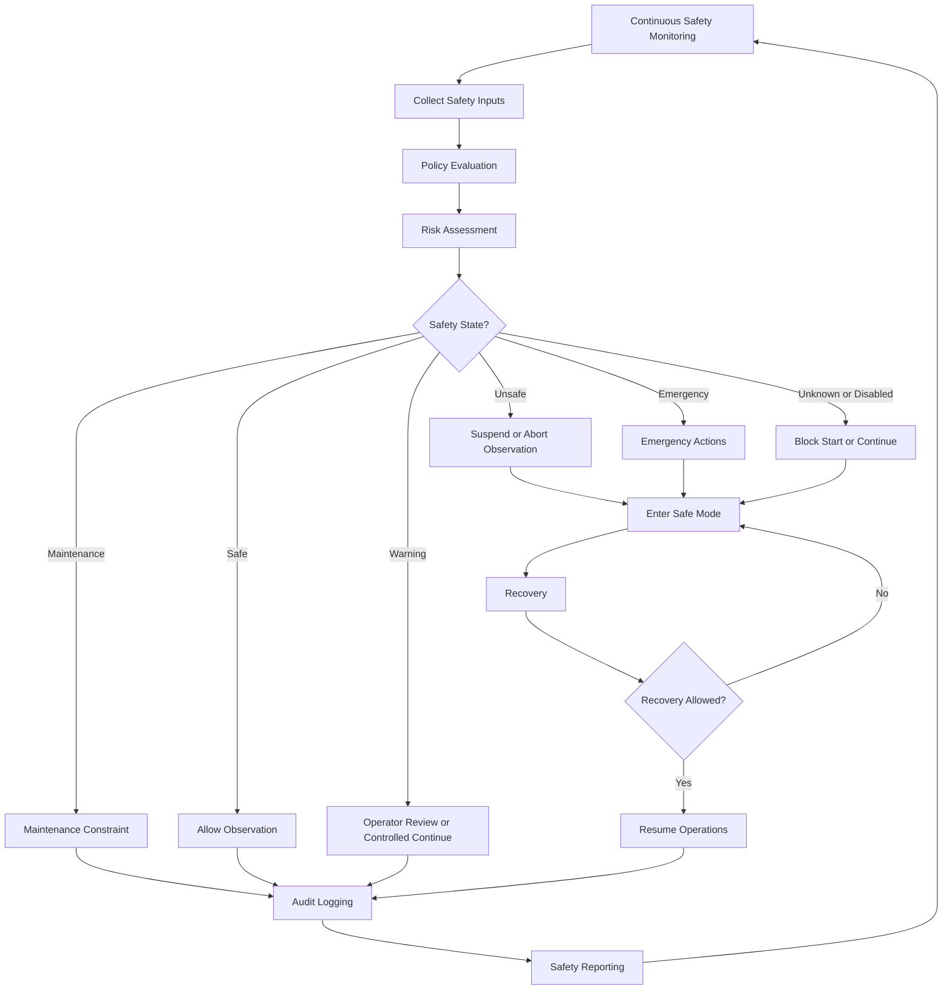

# CAP-SAF-001 - Business Process

## Purpose

This document defines the conceptual safety process for the Core Observatory. It does not implement control logic, hardware actions or PLC behavior.

## Process Scope

The process covers:

- Continuous Safety Monitoring;
- Policy Evaluation;
- Risk Assessment;
- Operational Decision;
- Emergency Actions;
- Recovery;
- Audit Logging;
- Safety Reporting.

## Safety Workflow

## Process Steps

| Step | Description | Producer | Consumer | Evidence |
|---|---|---|---|---|
| Continuous Safety Monitoring | Observes safety-relevant context from domain inputs. | Observatory Safety | Safety Policy | Input snapshot. |
| Policy Evaluation | Applies conceptual safety rules to current inputs. | Observatory Safety | Risk Assessment | Rule evaluation. |
| Risk Assessment | Determines severity and confidence of safety condition. | Observatory Safety | Operational Decision | Safety Assessment. |
| Operational Decision | Determines allow, suspend, abort, safe mode or recovery posture. | Observatory Safety | OSM, Scheduling, Operations | Safety Decision. |
| Emergency Actions | Records immediate emergency posture when state is Emergency. | Operations / Safety | OSM / Operators | Emergency Action. |
| Recovery | Evaluates whether return to Warning or Safe is permitted. | Safety / Operations | OSM / Scheduling | Recovery Action. |
| Audit Logging | Records safety state, input, rule, decision and operator action. | Observatory Safety | Knowledge / Governance | Audit Record. |
| Safety Reporting | Summarizes state transitions, events and unresolved decisions. | Observatory Safety | Governance / Operations | Safety Report. |

## Conceptual Decision Outputs

| Output | Meaning |
|---|---|
| Allow Observation | Observation may start or continue subject to all other gates. |
| Suspend Observation | Observation should pause or hold through OSM procedure. |
| Abort Observation | Observation should stop through governed OSM/emergency procedure. |
| Close Roof Request | Conceptual request to move toward roof/cupola-safe posture; no hardware action defined. |
| Safe Mode | Observatory should enter a protective operational posture. |
| Recovery Allowed | Recovery/resume may proceed after validation. |
| Operator Notification | Operator attention required; notification implementation not defined. |
| Audit Event | Safety evidence must be recorded. |

## Controls

- `Unknown`, `Disabled`, `Unsafe` and `Emergency` shall not authorize unattended observation.
- Emergency response takes precedence over scientific continuity.
- Weather evidence remains owned by `CAP-WEA-001`; Safety consumes it.
- Session lifecycle remains owned by `CAP-OSM-001`; Safety provides decision authority.
- Hardware/PLC behavior is explicitly outside this capability package.
