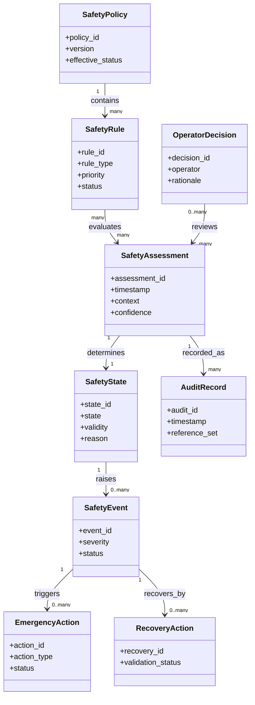

# CAP-SAF-001 - Conceptual Data Model

## Purpose

This document defines the conceptual information model for Observatory Safety. It does not define physical storage, database design, API contract or implementation logic.

## Conceptual Entities

| Entity | Purpose | Owner | Producer | Consumer | Lifecycle |
|---|---|---|---|---|---|
| Safety Assessment | Evaluation of current safety context. | Safety Reviewer / Operations Owner | Observatory Safety | OSM, Scheduling, Governance | Created -> Evaluated -> Recorded |
| Safety Rule | Governed conceptual rule used for policy evaluation. | Safety Reviewer | ADR/SOP governance | Observatory Safety | Proposed -> Approved -> Applied -> Reviewed |
| Safety State | Current safety posture. | Observatory Safety | Observatory Safety | OSM, Scheduling, Weather, Operations | Unknown -> Safe/Warning/Unsafe/Emergency/Recovery/Maintenance/Disabled |
| Safety Event | Significant safety-related occurrence. | Operations Owner | Observatory Safety / OSM / Weather | Knowledge Framework, Runbooks | Raised -> Acknowledged -> Resolved -> Archived |
| Emergency Action | Emergency posture or action request. | Operations Owner | Observatory Safety | OSM / Operators | Triggered -> Executed externally -> Recorded |
| Recovery Action | Governed recovery step after unsafe or emergency condition. | Operations Owner | Observatory Safety / Operators | OSM / Scheduling | Proposed -> Validated -> Completed |
| Operator Decision | Human decision, acknowledgement or override. | Operations Owner | Manual Operator | Audit / Governance | Recorded -> Reviewed |
| Safety Policy | Set of governed decision principles and rules. | Safety Reviewer | ADR / Governance | Observatory Safety | Draft -> Approved -> Effective -> Revised |
| Audit Record | Trace of input, rule, state, decision and action. | Governance Owner | Observatory Safety | Reviews / Release | Recorded -> Retained -> Archived |

## Entity Relationships

## Safety Inputs

| Input | Source Capability / Context | Use |
|---|---|---|
| Weather State | `CAP-WEA-001` | Weather safety, unsafe conditions and alerts. |
| Observation Session | `CAP-OSM-001` | Active session, readiness, suspend/abort/resume context. |
| Equipment Registry | `CAP-EQR-001` | Equipment readiness, roof-related context, asset lifecycle. |
| Observation Scheduling | `CAP-SCH-001` | Planned observation, approval and time window. |
| Target Registry | `CAP-TGT-001` | Target constraints and observation context. |
| Manual Operator | Operations | Acknowledgement, decision, override or emergency call. |
| Maintenance Activities | Maintenance context | Maintenance state and operational restrictions. |
| Power Status | Infrastructure evidence | UPS/power safety and continuity context. |
| Roof Status | Observatory/equipment evidence | Roof/cupola safe posture. |
| Communication Status | Network/remote access evidence | Ability to monitor and control safely. |

## Safety Outputs

| Output | Consumer | Description |
|---|---|---|
| Allow Observation | Scheduling, OSM | Observation may start/continue subject to other gates. |
| Suspend Observation | OSM | Pause or hold observation through OSM procedure. |
| Abort Observation | OSM / Operations | Stop observation through governed emergency/session procedure. |
| Close Roof Request | Operations / Roof-related process | Conceptual request, not hardware implementation. |
| Safe Mode | OSM / Operations | Protective posture for observatory operations. |
| Recovery Allowed | OSM / Scheduling | Recovery/resume may proceed after validation. |
| Operator Notification | Operations | Operator attention required; no notification technology defined. |
| Audit Event | Governance / Knowledge | Record of safety decision and evidence. |

## Open Data Decisions

| Decision | Impact |
|---|---|
| Final safety rule priority model | Affects conflict resolution between inputs. |
| Safety policy versioning | Affects auditability of historical decisions. |
| Decision freshness targets | Affects future implementation and monitoring. |
| Audit retention class | Affects Data Platform and Backup & Recovery alignment. |
