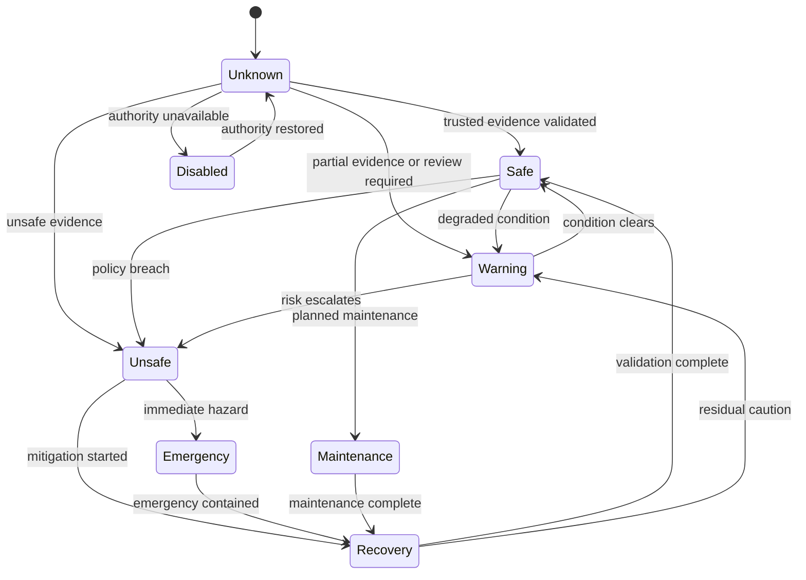

# CAP-SAF-001 - Observatory Safety

| Campo | Valore |
|---|---|
| Capability | Observatory Safety |
| ID | `CAP-SAF-001` |
| Stato | Documented |
| Maturity | Documented |
| Readiness | Implementation Ready |
| Versione | 0.1 |
| Fonte gerarchica | `DSG-MR-001` -> DSRA -> `EA-000` -> Knowledge Framework -> Design System -> `CAP-000` -> `REL-000` -> `DOM-001` -> Capability Package |
| Review reference | `REV-001` Core Observatory Readiness Review |

## Purpose

Observatory Safety e la capability autorevole che valuta lo stato di sicurezza operativa del Core Observatory e determina concettualmente se le attivita osservative possono iniziare, continuare, sospendersi o fermarsi.

La capability definisce governance, stati, regole concettuali, decisioni, procedure e tracciabilita. Non descrive implementazione hardware, logica PLC, driver, automazioni fisiche, API, database, frontend o backend.

## Business Value

- Protegge persone, osservatorio, roof/cupola, equipment e dati scientifici da condizioni operative non sicure.
- Centralizza la decisione safety rispetto a meteo, equipment, sessione, alimentazione, comunicazioni e intervento manuale.
- Riduce ambiguita tra Weather Monitoring, Observation Session Management e procedure di emergenza.
- Fornisce evidenza auditabile per allow, suspend, abort, safe mode, recovery e emergency shutdown.
- Completa il Core Observatory domain per l'ingresso in implementation governance.

## Scope

Incluso:

- safety authority concettuale;
- safety state model;
- input safety da capability Core Observatory e stato operativo;
- output safety e decision support;
- procedure per evaluate, safe mode, resume ed emergency shutdown;
- runbook per emergency stop, roof unsafe, communications lost e power failure;
- requisiti, ADR, data model, test plan, acceptance e traceability.

Escluso:

- hardware implementation;
- PLC logic;
- roof controller design;
- sensor driver, protocollo, API o database;
- automazione fisica di chiusura/apertura;
- modifica di Roadmap, DSRA, EA-000, Knowledge Framework, Design System, CAP-000 o REL-000 governance.

## Stakeholders

| Stakeholder | Interest |
|---|---|
| Operations Owner | Safe operation and controlled recovery. |
| Safety Reviewer | DSRA alignment and fail-safe policy. |
| Engineering Owner | Equipment, power, roof and communications evidence. |
| Session Operator | Clear start, suspend, abort and resume decisions. |
| Science Owner | Protection of observing windows and data integrity. |
| Repository Governance | Traceability from decision to evidence and release gate. |

## Dependencies

| Dependency | Relationship |
|---|---|
| `CAP-WEA-001` Weather Monitoring | Provides weather state, weather alerts and weather safety evidence. |
| `CAP-OSM-001` Observation Session Management | Consumes allow/suspend/abort/recovery decisions and provides active session context. |
| `CAP-SCH-001` Observation Scheduling | Consumes allow/block decision for schedule approval and monitoring. |
| `CAP-EQR-001` Equipment Registry | Provides equipment identity, readiness, lifecycle, roof-related and source context. |
| `CAP-TGT-001` Target Registry | Provides target constraints and observation context relevant to schedule/session safety. |
| DSRA | Authoritative risk and control reference for safety. |
| `DOM-001` | Core Observatory domain collaboration and information flow. |
| `REV-001` | Review condition that Safety package was pending before this package. |

## Safety State Model

| State | Meaning | Operational posture |
|---|---|---|
| `Unknown` | Safety cannot be determined from trusted evidence. | Do not allow unattended start/continue. |
| `Safe` | Evidence supports observation under approved controls. | Allow observation subject to other gates. |
| `Warning` | Non-critical condition requires attention or operator review. | Continue or start only if policy permits. |
| `Unsafe` | Conditions violate safety policy. | Suspend or prevent observation. |
| `Emergency` | Immediate protective action is required. | Abort/stop and enter emergency handling. |
| `Recovery` | Safety state is being restored after unsafe/emergency condition. | Resume only after validation. |
| `Maintenance` | Operations intentionally constrained for maintenance. | Observation disabled unless governance permits. |
| `Disabled` | Safety capability or authority is unavailable/disabled. | Fail-safe: observation not allowed. |

## Conceptual State Transitions

## Success Criteria

| ID | Criterion |
|---|---|
| `SAF-SC-001` | Safety state is explicitly available as Safe, Warning, Unsafe, Emergency, Recovery, Maintenance, Disabled or Unknown. |
| `SAF-SC-002` | Unknown and Disabled do not authorize unattended observation. |
| `SAF-SC-003` | Allow, suspend, abort, close roof request, safe mode, recovery allowed, operator notification and audit event outputs are defined conceptually. |
| `SAF-SC-004` | Procedures and runbooks cover normal evaluation, safe mode, resume and emergency response. |
| `SAF-SC-005` | Capability traces to Roadmap, DSRA, EA-000, Knowledge Framework, DOM-001, REV-001, CAP-000, REL-000 and existing Core Observatory packages. |
