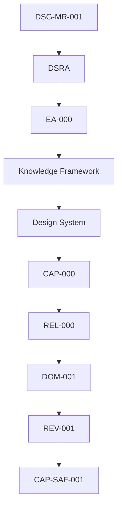

# CAP-SAF-001 - Traceability Matrix

## Purpose

This document maps Observatory Safety artefacts to approved governance and Core Observatory dependencies. It confirms documentation readiness without claiming implementation or operational release.

## Governance Chain

## Artefact Matrix

| Artefact | Roadmap | DSRA | EA-000 / Architecture | Knowledge Framework | DOM-001 | REV-001 | CAP-000 | REL-000 | Core Observatory Links |
|---|---|---|---|---|---|---|---|---|---|
| `index.md` | Safe observatory operation | Safety risk and controls | EA baseline | Safety Event, Alert | Included capability | Resolves pending safety package | CAP-SAF-001 entry | Implementation Ready evidence | OSM, SCH, EQR, TGT, WEA |
| `business-process.md` | Operational workflow | Emergency/recovery control | Observability and operations | Process evidence | Domain collaboration | Review reassessment | Package coverage | Promotion evidence | OSM, SCH, WEA |
| `requirements.md` | Capability requirements | Security/safety requirements | Architecture layers | Requirements Repository | Capability boundary | Readiness evidence | Requirement coverage | Readiness checklist | All Core packages |
| `architecture-mapping.md` | Architecture alignment | Control inheritance | Application/Data/Technology/Observability | Traceability concepts | Domain dependencies | Review rationale | Registry dependency map | Release compliance | All Core packages |
| `data-model.md` | Data governance | Safety evidence | Data Architecture | Canonical concepts | Information flow | Evidence closure | Dataset coverage | Artefact evidence | OSM, EQR, WEA |
| `technical-manual.md` | Manual evidence | Operational controls | Integration/Technology | Repository Taxonomy | Interfaces | Review evidence | Manual coverage | Mandatory artefact | OSM/SCH/EQR/WEA |
| `test-plan.md` | Validation expectations | Safety validation | Quality gates | Quality Model | KPI support | Reassessment support | Test coverage | Validation gate | All Core packages |
| `acceptance-criteria.md` | Completion criteria | Safety acceptance | EA compliance | Traceability Matrix | Domain acceptance | Decision support | Readiness score | Release gate | All Core packages |
| `adr/SAF-ADR-001-safety-authority.md` | Decision trace | Avoid authority ambiguity | ADR pattern | Decision asset | Safety authority | Resolves pending safety authority | ADR coverage | ADR completion | OSM/SCH/WEA consumers |
| `adr/SAF-ADR-002-fail-safe-policy.md` | Decision trace | Fail-safe risk control | Security/Observability | Open decision governance | Safety posture | Review rationale | ADR coverage | ADR completion | OSM/SCH/EQR/WEA |
| SOP files | Operations | Procedural controls | Operational architecture | SOP lifecycle | Domain procedures | Review evidence | SOP coverage | SOP completion | OSM and Operations |
| Runbook files | Recovery | Incident controls | Observability/recovery | Runbook lifecycle | Domain recovery | Review evidence | Runbook coverage | Runbook completion | OSM/EQR/WEA |

## Existing Core Observatory Capability Traceability

| Capability | Observatory Safety Relationship |
|---|---|
| `CAP-OSM-001` Observation Session Management | Consumes allow, suspend, abort, safe mode and recovery allowed decisions. |
| `CAP-SCH-001` Observation Scheduling | Consumes allow/block safety posture for schedule approval and monitoring. |
| `CAP-EQR-001` Equipment Registry | Provides equipment, roof, power and communication context where documented. |
| `CAP-TGT-001` Target Registry | Provides target constraints through schedule/session context. |
| `CAP-WEA-001` Weather Monitoring | Provides weather state, alerts and weather safety evidence. |

## Requirement Traceability Summary

| Category | IDs | Governing Reference |
|---|---|---|
| Business | `SAF-BR-001` - `SAF-BR-004` | DSG-MR-001, DSRA, DOM-001, REV-001 |
| Functional | `SAF-FR-001` - `SAF-FR-008` | EA Application/Data/Observability Architecture |
| Operational | `SAF-OR-001` - `SAF-OR-004` | DSRA, OSM and runbook governance |
| Security | `SAF-SR-001` - `SAF-SR-004` | Security Architecture |
| Performance | `SAF-PR-001` - `SAF-PR-003` | Operational safety needs |
| Availability | `SAF-AR-001` - `SAF-AR-003` | DSRA / Business Continuity |
| Quality | `SAF-QR-001` - `SAF-QR-003` | Knowledge Quality Model |
| Traceability | `SAF-TR-001` - `SAF-TR-003` | Governance chain |

## Open Decisions

| Decision | Impact | Owner | Required Input |
|---|---|---|---|
| Final safety rule priority model | Determines conflict handling between weather, roof, power, communication, maintenance and operator inputs. | Safety Reviewer | Approved policy ordering. |
| Safety policy versioning | Determines auditability and historical interpretation. | Governance Owner | Versioning rule. |
| Safety decision freshness targets | Determines future implementation timing rules. | Operations Owner | Approved freshness target. |
| Operator override policy | Determines if, when and how operator override is permitted. | Operations / Security | Governance approval. |
| Audit retention class | Determines archive and backup treatment. | Data Owner | Retention policy. |

## Coverage Statement

CAP-SAF-001 has complete documentation coverage for implementation readiness: overview, process, requirements, architecture mapping, conceptual data model, ADR, SOP, runbooks, manual, test plan, acceptance criteria and traceability. Operational implementation evidence remains future release scope.
