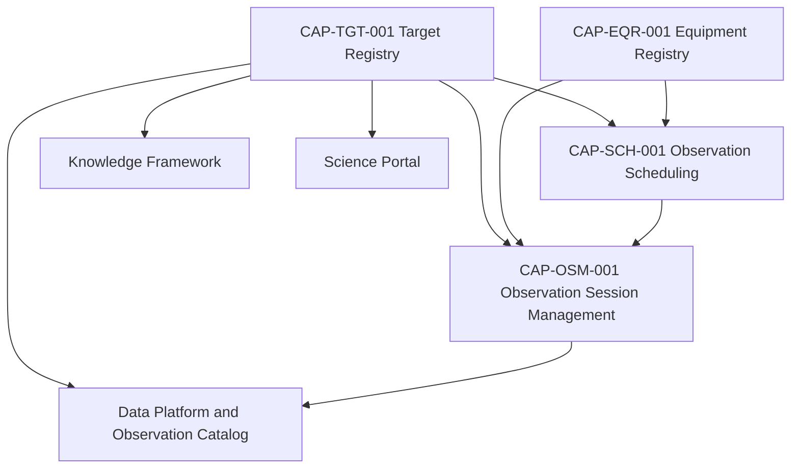

# CAP-TGT-001 - Architecture Mapping

## Purpose

Questo documento collega Target Registry alle architetture e alle capability esistenti. Non ridefinisce Enterprise Architecture, Knowledge Framework or capability package gia approvati.

## Logical Position

## Application Architecture Mapping

| Application Service | CAP-TGT-001 Relation |
|---|---|
| Target Registry | Core capability: authoritative conceptual target model. |
| Scheduler | Consumes target identity, priority, constraints and visibility profile. |
| Observation Session Manager | Consumes target identity and coordinates for session execution context. |
| Equipment Registry | Supports equipment compatibility constraints for targets through CAP-SCH-001 and CAP-OSM-001. |
| Data Platform | Links observations and scientific products to target identity. |
| Knowledge Graph | Links targets to requests, sessions, catalogues, publications and documentation. |
| Science Portal | Future consumer of published target and observation history. |

## Data Architecture Mapping

| Information Object | CAP-TGT-001 Responsibility |
|---|---|
| Target | Owned conceptually by Target Registry. |
| Target Registry | Capability-owned information domain. |
| Target Identity | Canonical identity and aliases. |
| Catalogue Reference | External catalogue reference evidence. |
| Coordinates / Epoch | Required target positioning evidence where applicable. |
| Observation Request | Upstream consumer/producer relationship. |
| Observation Schedule | Consumes target and constraints through CAP-SCH-001. |
| Observation Session | Consumes target context through CAP-OSM-001. |
| Observation Catalog | Links observation history and products to target identity. |

## Knowledge Framework Mapping

CAP-TGT-001 derives from canonical concepts:

- Target;
- Target Registry;
- Observation Request;
- Observation Session;
- Observation Catalog;
- Scientific Product;
- Knowledge Graph;
- Documentation Asset.

## External Catalogue Position

External catalogues are evidence sources and reference systems. CAP-TGT-001 does not replace Messier, NGC, IC, Sharpless, Barnard, LBN, Abell or other catalogue authorities. It stores and governs references needed by Digital StarGate to identify and use targets consistently.

## Design System Mapping

CAP-TGT-001 does not implement UI. Future interfaces must conform to Design System patterns for:

- observation cards;
- science dashboard;
- tables;
- search and knowledge navigation;
- status badges;
- alerts for unresolved identifiers or invalid coordinates.

## Governance Boundaries

- CAP-TGT-001 owns target identity and target lifecycle.
- CAP-SCH-001 owns scheduling decisions that consume target data.
- CAP-OSM-001 owns session execution and consumes published target context.
- CAP-EQR-001 owns equipment compatibility evidence, not target identity.
- External catalogues remain external references, not internal governance authorities.

## Open Dependencies

- Final physical storage model remains OPEN.
- Automated catalogue import remains OPEN.
- Dynamic ephemeris handling for moving targets remains OPEN.
- Future UI implementation remains OPEN and must follow Design System.
