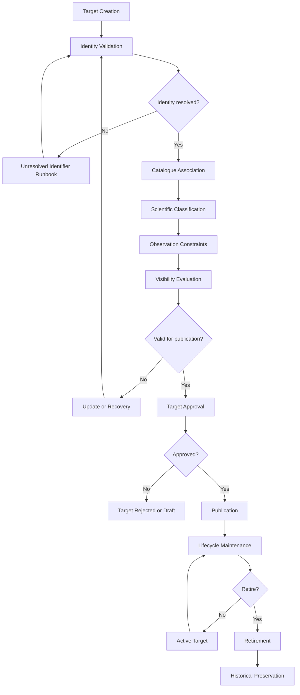

# CAP-TGT-001 - Business Process

## Purpose

Questo documento descrive il processo operativo del Target Registry, dalla creazione alla preservazione storica. Il processo definisce evidenze e controlli, non implementazione software.

## Workflow

## Process Steps

| Step | Description | Output |
|---|---|---|
| Target Creation | Registra una proposta target con nome, tipo presunto, fonte e owner. | Proposed Target. |
| Identity Validation | Verifica identita canonica, alias e potenziali duplicati. | Validated or unresolved identity. |
| Catalogue Association | Collega riferimenti Messier, NGC, IC or other catalogues where applicable. | Catalogue Reference set. |
| Scientific Classification | Classifica target secondo tipo e interesse scientifico. | Target Type and Scientific Classification. |
| Observation Constraints | Registra constraints noti: visibilita, sicurezza, finestre, setup richiesto or note. | Observation Constraints. |
| Visibility Evaluation | Valuta concettualmente osservabilita e profilo di visibilita. | Visibility Profile. |
| Target Approval | Conferma che il target sia usabile per scheduling. | Approval evidence. |
| Publication | Rende il target disponibile a CAP-SCH-001 and CAP-OSM-001. | Published Target. |
| Lifecycle Maintenance | Aggiorna identita, metadata, constraints, priority and history. | Maintained Target. |
| Retirement | Ritira target non piu valido, utile or osservabile nel programma. | Retired Target. |
| Historical Preservation | Mantiene record, alias, history and decision evidence. | Archived Target evidence. |

## Controls

- Un target non validato non puo diventare `Published`.
- Coordinate invalide impediscono approvazione e richiedono runbook.
- Duplicati potenziali richiedono risoluzione prima della pubblicazione.
- Riferimenti catalogo esterni sono evidenza, non fonte sostitutiva del target model interno.
- Retirement non elimina lo storico osservativo o scientifico.

## Related Documents

- `requirements.md`
- `architecture-mapping.md`
- `data-model.md`
- `sop/register-target.md`
- `sop/validate-target.md`
- `runbooks/duplicate-target.md`
- `runbooks/invalid-coordinates.md`
