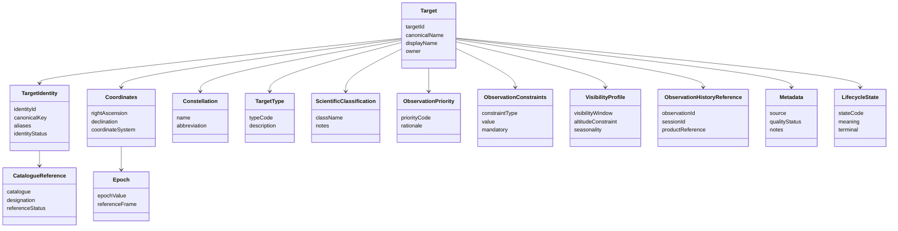

# CAP-TGT-001 - Conceptual Data Model

## Purpose

Questo documento descrive le entita concettuali del Target Registry. Non definisce database fisico, API, backend, frontend or storage implementation.

## Conceptual Model

## Entities

| Entity | Purpose | Owner | Producer | Consumer | Lifecycle |
|---|---|---|---|---|---|
| Target | Canonical target managed by Digital StarGate. | Science Owner | Register/Update SOP | CAP-SCH-001, CAP-OSM-001, Data Platform | Proposed -> Validated -> Published -> Retired -> Archived |
| Target Identity | Canonical key, names and alias governance. | Science/Knowledge Owner | Validate Target SOP | Scheduling, Session, Knowledge Graph | Draft -> Resolved -> Superseded |
| Catalogue Reference | External catalogue designation evidence. | Science Owner | Register/Update SOP | Science, Data Platform | Proposed -> Confirmed -> Deprecated |
| Coordinates | Position evidence where applicable. | Science Owner | Validate Target SOP | Scheduler, Session Manager | Draft -> Validated -> Superseded |
| Epoch | Temporal/reference context for coordinates. | Science Owner | Validate Target SOP | Scheduler, Session Manager | Active -> Superseded |
| Constellation | Sky region classification. | Science Owner | Register/Update SOP | Science Portal, Analytics | Active -> Corrected |
| Target Type | Controlled high-level type. | Science Owner | Classification step | Scheduling, Analytics | Active -> Superseded |
| Scientific Classification | More specific scientific category and notes. | Science Owner | Classification step | Science, Knowledge Graph | Draft -> Approved -> Superseded |
| Observation Priority | Priority evidence for scheduling. | Science/Operations Owner | Update/Approval process | CAP-SCH-001 | Proposed -> Applied -> Reviewed |
| Observation Constraints | Constraints affecting scheduling or session planning. | Science/Operations Owner | Register/Update SOP | CAP-SCH-001, CAP-EQR-001 indirectly | Active -> Superseded |
| Visibility Profile | Conceptual visibility and observability evidence. | Science/Operations Owner | Visibility Evaluation | CAP-SCH-001 | Candidate -> Validated -> Expired |
| Observation History Reference | Link to sessions, products and catalog. | Data Owner | Data Platform / CAP-OSM-001 | Analytics, Science Portal | Active -> Archived |
| Metadata | Source, notes, quality and provenance. | Knowledge/Data Owner | Registry process | All consumers | Active -> Updated -> Archived |
| Lifecycle State | Controlled state vocabulary. | Registry Owner | Target governance | All consumers | Governed vocabulary |

## Lifecycle State Vocabulary

| State | Meaning | Schedulable |
|---|---|---|
| Proposed | Target candidate exists. | No |
| Identity Pending | Identity or aliases not yet resolved. | No |
| Validated | Identity and coordinates/reference are acceptable. | Conditional |
| Approved | Target approved for publication. | Conditional |
| Published | Target available for scheduling and sessions. | Yes |
| Suspended | Target temporarily blocked. | No |
| Retired | Target no longer active for new planning. | No |
| Archived | Historical record only. | No |

## Moving Targets

Comets, asteroids, planets, Moon, Sun and artificial satellites may require dynamic position or ephemeris evidence. CAP-TGT-001 records this as conceptual metadata and open implementation dependency; it does not define ephemeris tooling or algorithms.

## Retention and Storage

CAP-TGT-001 does not define database or storage technology. Retention follows Enterprise Data Architecture, Knowledge Framework and future ADR if needed. Retirement preserves historical target evidence and observation history references.
