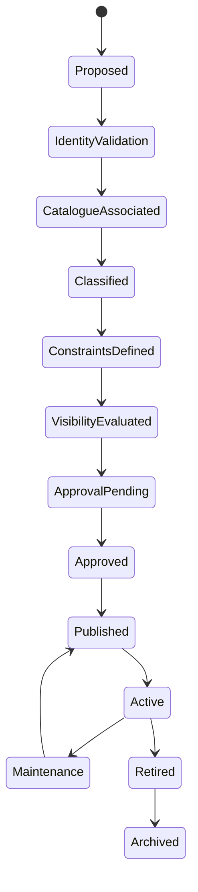

# CAP-TGT-001 - Target Registry

| Campo | Valore |
|---|---|
| Capability | Target Registry |
| ID | `CAP-TGT-001` |
| Stato | Documented |
| Maturity | Documented |
| Readiness | Implementation Ready |
| Versione | 0.1 |
| Owner | Science Owner / OPEN for final accountability |
| Fonte gerarchica | `DSG-MR-001` -> DSRA -> Enterprise Architecture -> Knowledge Framework -> Design System -> Capability Registry -> Capability Package |

## Purpose

Target Registry definisce la fonte concettuale autorevole dei target astronomici gestiti da Digital StarGate. Il registry non sostituisce cataloghi esterni: governa come la piattaforma rappresenta, classifica, valida, referenzia, approva, pubblica, mantiene e ritira un target.

La capability crea un modello comune per collegare target, coordinate, riferimenti catalogo, classificazione scientifica, vincoli osservativi, priorita, storia osservativa e lifecycle state.

## Business Value

- Riduce ambiguita tra denominazioni, alias e riferimenti catalogo.
- Migliora la qualita della schedulazione collegando target, priorita e vincoli.
- Supporta Observation Session Management con target validati e coordinate coerenti.
- Supporta Data Platform, Knowledge Graph, Science Portal e Analytics con identita target stabile.
- Preserva storico scientifico e operativo senza dipendere da un singolo catalogo esterno.

## Scope

Incluso:

- rappresentazione concettuale dei target gestiti da Digital StarGate;
- identity validation, catalogue association and scientific classification;
- observation constraints, visibility profile and lifecycle management;
- ADR, SOP, runbook, manuale, test plan, acceptance criteria and traceability;
- integrazione con CAP-OSM-001, CAP-SCH-001 and CAP-EQR-001.

Escluso:

- database fisico;
- import automatico da cataloghi;
- API, backend or frontend;
- sostituzione di cataloghi astronomici esterni;
- algoritmi di astrometria, plate solving or ephemeris;
- modifica di Roadmap, DSRA, Enterprise Architecture, Knowledge Framework, Design System, CAP-000 or REL-000 structure.

## Target Coverage

Il registry supporta concettualmente:

- Messier;
- NGC;
- IC;
- Sharpless;
- Barnard;
- LBN;
- Abell;
- Planetary Nebulae;
- Galaxies;
- Globular Clusters;
- Open Clusters;
- Nebulae;
- Dark Nebulae;
- Comets;
- Asteroids;
- Planets;
- Moon;
- Sun;
- Artificial Satellites;
- Custom Targets.

## Actors

| Actor | Responsibility |
|---|---|
| Science Owner | Governa identita, classificazione, priorita e qualita target. |
| Operations Owner | Usa target approvati per scheduling e sessioni. |
| Scheduler | Consuma target validati, vincoli e visibility profile. |
| Observation Session Manager | Consuma target pubblicati e coordinate per sessioni. |
| Data Owner | Collega target a observation history, catalog and products. |
| Knowledge Architect | Preserva semantica, alias, riferimenti e traceability. |
| Documentation Owner | Mantiene package e navigazione documentale. |

## Stakeholders

| Stakeholder | Interest |
|---|---|
| Science | Identita target stabile, classificazione e priorita scientifica. |
| Operations | Target schedulabili e osservabili senza ambiguita. |
| Engineering | Compatibilita tra target, setup e vincoli strumentali. |
| Data Platform | Metadata coerenti per catalogazione e lineage. |
| Analytics | Metriche target-centric e coverage scientifica. |
| Release Management | Evidenza per readiness e future release. |

## Dependencies

| Dependency | Role |
|---|---|
| CAP-SCH-001 Observation Scheduling | Consuma target validati, constraints and visibility information. |
| CAP-OSM-001 Observation Session Management | Consuma target identity and coordinates during session lifecycle. |
| CAP-EQR-001 Equipment Registry | Fornisce compatibilita strumentale indiretta per target constraints. |
| Knowledge Framework | Definisce Target, Target Registry, Observation Request and Observation Catalog concepts. |
| Enterprise Architecture | Definisce Target Registry come application/data capability. |
| External catalogues | Referenced as identifiers and evidence, not replaced by CAP-TGT-001. |
| REL-000 | Governa readiness e release evidence. |

## Lifecycle

## Success Criteria

- Ogni target gestito ha identita canonica, coordinate, epoch, type, lifecycle state and metadata.
- Alias e riferimenti catalogo non creano duplicati non governati.
- Target non validati non sono pubblicati per scheduling.
- Vincoli osservativi e visibility profile sono disponibili per CAP-SCH-001 quando necessari.
- Target pubblicati sono consumabili da CAP-OSM-001 senza ambiguita di coordinate.
- CAP-000 registra `CAP-TGT-001` con status `Documented`, maturity `Documented`, readiness `Implementation Ready`, version `0.1`.

## References

- `DSG-MR-001` Master Roadmap.
- DSRA baseline and operational risk context.
- `EA-000` Enterprise Architecture Baseline.
- Knowledge Framework Domain Model and Canonical Information Model.
- `CAP-000` Capability Registry.
- `CAP-OSM-001` Observation Session Management.
- `CAP-SCH-001` Observation Scheduling.
- `CAP-EQR-001` Equipment Registry.
- `REL-000` Release Management Baseline.
