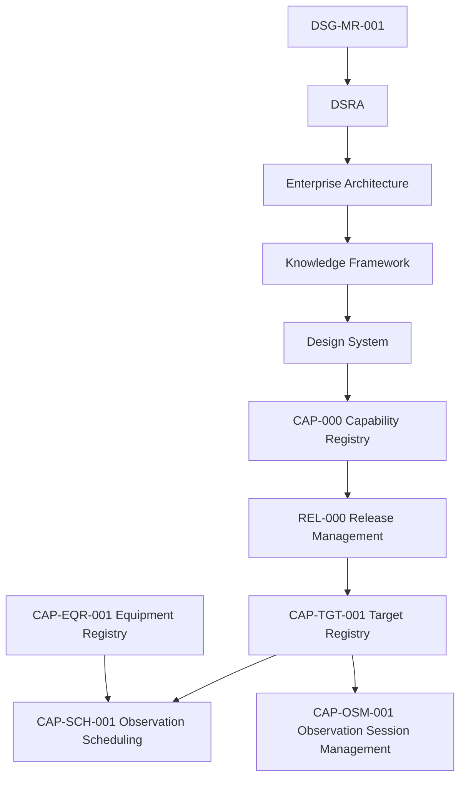

# CAP-TGT-001 - Traceability Matrix

## Purpose

La matrice collega ogni artefatto CAP-TGT-001 alla catena di governance e alle capability gia approvate: CAP-OSM-001, CAP-SCH-001 and CAP-EQR-001.

## Governance Traceability

## Artefact Matrix

| Artefact | Roadmap | DSRA | Enterprise Architecture | Knowledge Framework | CAP-000 | REL-000 | CAP-OSM-001 | CAP-SCH-001 | CAP-EQR-001 | Notes |
|---|---|---|---|---|---|---|---|---|---|---|
| `index.md` | DSG-MR-001 science/data direction | Data quality and operational risk | EA-000 / Application Architecture | Target, Target Registry | CAP-TGT-001 | Capability lifecycle | Session target consumer | Scheduling target consumer | Equipment compatibility context | Overview. |
| `business-process.md` | Prepare observation | Risk prevention | Business/Application Architecture | Observation Request | CAP-TGT-001 | Promotion evidence | Session target context | Target selection | Compatibility boundary | Workflow. |
| `requirements.md` | Capability requirements | Quality/availability risk | Application/Data Architecture | Requirements Repository | CAP-TGT-001 | Readiness checklist | Uses target requirements | Uses target requirements | Related constraints | 32 requirements. |
| `architecture-mapping.md` | Roadmap alignment | Control inheritance | EA layers | Domain Model | CAP-TGT-001 | Compliance | Session mapping | Scheduling mapping | Equipment mapping | No redesign. |
| `data-model.md` | Data governance | Retention/open risk | Data Architecture | Canonical Information Model | CAP-TGT-001 | Artefact evidence | Target coordinates | Target constraints | Compatibility references | Conceptual only. |
| `technical-manual.md` | Implementation path | Operational controls | Technology/Integration Architecture | Repository Taxonomy | CAP-TGT-001 | Manual artefact | Target interface | Scheduling interface | Compatibility context | No code. |
| `test-plan.md` | Validation expectations | Recovery validation | Observability Architecture | Requirements Repository | CAP-TGT-001 | Validation gate | Regression link | Regression link | Regression link | Future tests. |
| `acceptance-criteria.md` | Completion criteria | Continuity criteria | EA compliance | Quality Model | CAP-TGT-001 | Release gate | Acceptance dependency | Acceptance dependency | Acceptance dependency | Measurable criteria. |
| `adr/TGT-ADR-001-authoritative-target-model.md` | Registry authority | Avoid inconsistent targets | Application/Data Architecture | Glossary | CAP-TGT-001 | ADR artefact | Consumer boundary | Consumer boundary | Related boundary | Authority decision. |
| `adr/TGT-ADR-002-canonical-target-identity.md` | Identity governance | Duplicate risk | Data Architecture | Identity model | CAP-TGT-001 | ADR artefact | Stable target context | Stable target context | Not equipment-owned | Identity decision. |
| `sop/register-target.md` | Operational procedure | Data quality | Application Architecture | Repository Taxonomy | CAP-TGT-001 | SOP artefact | Provides target | Provides target | Constraint context | Registration. |
| `sop/update-target.md` | Change control | Data risk | Data Architecture | Traceability Matrix | CAP-TGT-001 | SOP artefact | Preserves session context | Preserves scheduling context | Preserves constraints | Updates. |
| `sop/validate-target.md` | Operational procedure | Quality controls | Observability/Data Architecture | Quality Model | CAP-TGT-001 | SOP artefact | Validation before session | Validation before schedule | Constraint alignment | Validation. |
| `sop/retire-target.md` | Lifecycle governance | Continuity risk | Data Architecture | Archive concept | CAP-TGT-001 | SOP artefact | Retired not usable | Retired not schedulable | Compatibility no longer active | Retirement. |
| `runbooks/duplicate-target.md` | Recovery path | Duplicate risk | Data Architecture | Knowledge evidence | CAP-TGT-001 | Runbook artefact | Prevents ambiguous session target | Prevents ambiguous schedule target | No direct ownership | Duplicate. |
| `runbooks/unresolved-identifier.md` | Recovery path | Identity risk | Application/Data Architecture | Catalogue reference | CAP-TGT-001 | Runbook artefact | Blocks session target | Blocks scheduling | No direct ownership | Unknown identifier. |
| `runbooks/invalid-coordinates.md` | Recovery path | Coordinate risk | Data Architecture | Coordinates | CAP-TGT-001 | Runbook artefact | Blocks session target | Blocks scheduling | Equipment setup context | Invalid coordinates. |
| `runbooks/registry-recovery.md` | Recovery path | Continuity risk | Data/Technology Architecture | Repository Quality Model | CAP-TGT-001 | Runbook artefact | Restores target evidence | Restores target evidence | Restores related constraints | Registry recovery. |

## Requirement Traceability Summary

| Category | IDs | Governing Reference |
|---|---|---|
| Business | `TGT-BR-001` - `TGT-BR-004` | DSG-MR-001, CAP-000 |
| Functional | `TGT-FR-001` - `TGT-FR-008` | EA Application/Data Architecture |
| Operational | `TGT-OR-001` - `TGT-OR-004` | DSRA, process governance |
| Security | `TGT-SR-001` - `TGT-SR-004` | Security Architecture |
| Performance | `TGT-PR-001` - `TGT-PR-003` | CAP-SCH-001 operational needs |
| Availability | `TGT-AR-001` - `TGT-AR-003` | DSRA / continuity |
| Quality | `TGT-QR-001` - `TGT-QR-003` | Knowledge Quality Model |
| Traceability | `TGT-TR-001` - `TGT-TR-003` | Governance chain |

## Open Decisions

| Decision | Impact | Owner | Required Input |
|---|---|---|---|
| Final target identifier format | Determines canonical key and cross-reference pattern. | Science/Knowledge Owner | Approved identifier policy. |
| Physical storage model | Determines future system of record implementation. | Data/Science Owner | Architecture decision when implementation starts. |
| Automated catalogue import | Determines validation and freshness behavior. | Science/Engineering Owner | Integration decision. |
| Moving target ephemeris handling | Determines comets, asteroids, planets, Moon, Sun and satellite support details. | Science Owner | Ephemeris governance decision. |

## Coverage Statement

CAP-TGT-001 has complete documentation coverage for readiness: overview, process, requirements, architecture mapping, conceptual data model, ADR, SOP, runbooks, manual, test plan, acceptance criteria and traceability. Operational implementation evidence remains future release scope.
