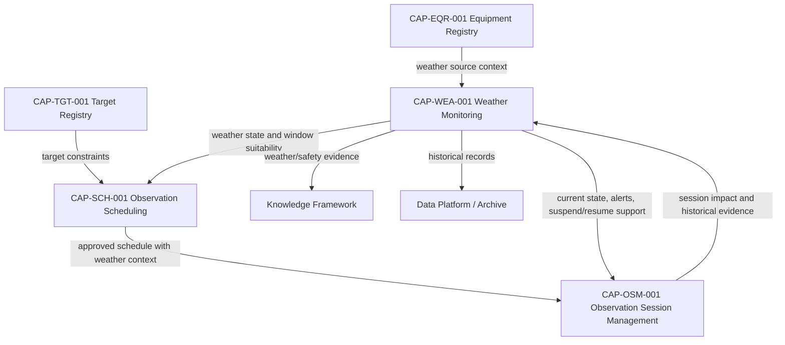

# CAP-WEA-001 - Architecture Mapping

## Purpose

This document maps Weather Monitoring to the approved Digital StarGate architecture. It does not redefine Enterprise Architecture, Knowledge Framework, Design System, `DOM-001`, `CAP-000` or `REL-000`.

## Governance Mapping

| Governance Artefact | Mapping |
|---|---|
| `DSG-MR-001` | Weather Monitoring supports safe observatory operations, automation and operational continuity. |
| DSRA | Provides weather-related risk evidence and environmental safety control context. |
| `EA-000` | Weather Monitoring is a refinement of the baselined Enterprise Architecture, not a new layer. |
| Enterprise Architecture | Aligns primarily with Observability, Technology, Integration and Data Architecture. |
| Knowledge Framework | Uses canonical concepts such as Weather Event, Safety Event, Alert and Documentation Asset. |
| Design System | Applies only to future portal or dashboard surfaces; this package does not implement UI. |
| `CAP-000` | Registers lifecycle, maturity, readiness, related artefacts and dependencies. |
| `REL-000` | Provides promotion rules, readiness criteria and release synchronization. |
| `DOM-001` | Includes Weather Monitoring as Core Observatory operational context provider. |

## Capability Interactions

## Application Architecture Alignment

| Application Service | Weather Monitoring Relationship |
|---|---|
| Observation Session Manager | Consumes current weather state, alerts and safety decision support. |
| Scheduler | Consumes weather state and caution/unsafe evidence when approving, updating or cancelling schedules. |
| Equipment Registry | Provides governed identity and state context for Weather Station, AllSky and related assets. |
| Target Registry | Provides target constraints affected by sky quality, seeing, transparency or clouds. |
| Knowledge Graph | Conceptually links weather events, safety decisions, sessions, targets and documentation. |
| Analytics | May consume historical weather records after data platform governance is defined. |
| Engineering Portal / Maintenance Portal | May expose monitoring status and recovery evidence under Design System governance. |

## Data Architecture Alignment

| Information Object | Mapping |
|---|---|
| Weather Observation | Environmental evidence from a Weather Source. |
| Weather Snapshot | Authoritative point-in-time weather state. |
| Weather Threshold | Governed rule or threshold used in operational assessment. |
| Safety Decision | Decision support output for schedule/session actions. |
| Weather Alert | Operational event raised for unsafe, unknown or degraded state. |
| Historical Weather Record | Retained evidence linked to session, schedule or recovery. |

## Technology Architecture Alignment

Weather Monitoring depends conceptually on existing deployment context:

- observatory-local equipment and monitoring sources;
- Weather Station and AllSky evidence described in manuals;
- EAGLE/observatory operations context where weather affects session execution;
- remote access and network availability governed by Technology and Security Architecture;
- storage/archive locations only where governed by Data Platform and Backup & Recovery.

No physical deployment topology is introduced by this capability.

## Integration Architecture Alignment

| Integration | Direction | Purpose | Implementation Boundary |
|---|---|---|---|
| Weather Station | External source -> Weather Monitoring | Environmental measurements and availability evidence. | No driver or polling implementation defined. |
| AllSky | External source -> Weather Monitoring | Sky condition evidence and visual context. | No image processing implementation defined. |
| Equipment Registry | Equipment Registry -> Weather Monitoring | Source identity, configuration and health context. | Conceptual dependency only. |
| Scheduling | Weather Monitoring -> Scheduling | Weather state for window approval and monitoring. | No API defined. |
| Session Management | Weather Monitoring -> OSM | Safety gates, alerts and suspend/resume support. | No API defined. |

## Observability Alignment

Weather Monitoring is itself an observability capability for environmental conditions. It also exposes its own monitoring status:

- available;
- degraded;
- offline;
- stale;
- conflicting;
- recovered.

These states support operational runbooks and release evidence without prescribing a monitoring tool.

## Open Architecture Decisions

| Decision | Impact | Owner | Required Input |
|---|---|---|---|
| Final thresholds and severity mapping | Required before implementation and test automation. | Operations Owner / Safety Reviewer | Approved threshold table. |
| Multi-source arbitration | Determines how Weather Station, AllSky and manual evidence combine. | Engineering Owner | Source priority and conflict rules. |
| Weather state publication interface | Future implementation concern. | Solution Architect | ADR when implementation begins. |
| Historical retention | Affects Data Platform and Backup & Recovery. | Data Owner | Retention class and storage policy. |

## Related Documents

- `docs/enterprise-architecture/application-architecture.md`
- `docs/enterprise-architecture/data-architecture.md`
- `docs/enterprise-architecture/integration-architecture.md`
- `docs/enterprise-architecture/observability-architecture.md`
- `docs/enterprise-architecture/technology-architecture.md`
- `docs/knowledge/knowledge-graph-model.md`
- `docs/capabilities/weather-monitoring/traceability.md`
