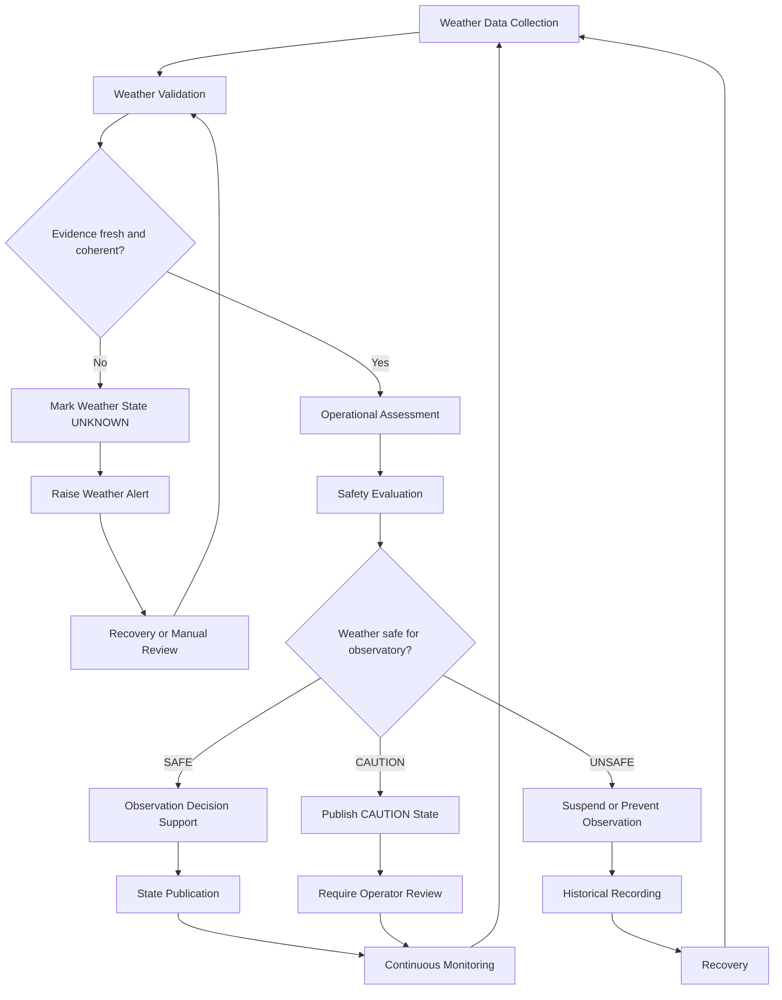
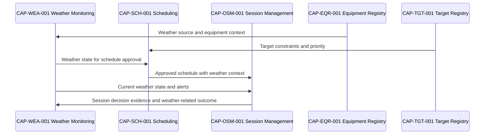

# CAP-WEA-001 - Business Process

## Purpose

Questo documento descrive il processo operativo governato di Weather Monitoring. Il processo produce stato meteo affidabile per Core Observatory senza implementare strumenti, sensori, algoritmi previsionali o automazioni.

## Process Scope

Il processo copre:

- raccolta di evidenze ambientali;
- validazione di disponibilita, freschezza e coerenza;
- valutazione operativa rispetto alle soglie approvate;
- supporto decisionale a scheduling e session management;
- pubblicazione dello stato meteo;
- monitoraggio continuo, recovery e registrazione storica.

## Operational Workflow

## Process Steps

| Step | Description | Producer | Consumer | Evidence |
|---|---|---|---|---|
| Weather Data Collection | Raccoglie evidenze ambientali disponibili da fonti documentate. | Weather Monitoring | Weather Validation | Source, timestamp, raw observed values or qualitative observation. |
| Weather Validation | Verifica disponibilita, freschezza, coerenza e completezza minima. | Weather Monitoring | Operational Assessment | Validation result, stale/conflict indicators. |
| Operational Assessment | Traduce evidenze validate in stato operativo governato. | Weather Monitoring | Safety Evaluation | Assessment, confidence, rationale. |
| Safety Evaluation | Valuta se le condizioni consentono scheduling o sessione. | Weather Monitoring / Safety | Scheduling, OSM | Safety decision and reason. |
| Observation Decision Support | Fornisce input a schedule, start, suspend, resume o close. | Weather Monitoring | `CAP-SCH-001`, `CAP-OSM-001` | Published state reference. |
| State Publication | Rende disponibile lo stato autorevole. | Weather Monitoring | Core Observatory | Weather Snapshot, Monitoring Status. |
| Continuous Monitoring | Aggiorna lo stato durante finestra osservativa e sessione. | Weather Monitoring | OSM / Safety | Change records, alerts. |
| Recovery | Ripristina monitoraggio dopo sorgente offline, conflitto o stato unknown. | Operations / Engineering | Weather Monitoring | Recovery evidence. |
| Historical Recording | Conserva evidenza di stato e decisioni correlate. | Weather Monitoring | Data Platform / Knowledge | Historical Weather Record. |

## Decision States

| State | Meaning | Default Operational Treatment |
|---|---|---|
| `SAFE` | Evidenza coerente e compatibile con osservazione. | Scheduling/session may proceed subject to other gates. |
| `CAUTION` | Condizione non critica ma richiede attenzione o validazione operatore. | Proceed only with explicit operational review. |
| `UNSAFE` | Condizione incompatibile con osservazione o apertura tetto/cupola. | Suspend, prevent start or close according to SOP/runbook. |
| `UNKNOWN` | Evidenza assente, stale o conflittuale. | Treated as not safe for autonomous progression until reviewed. |

## Integration with Core Observatory

## Controls

| Control | Description |
|---|---|
| Freshness control | Weather state must indicate timestamp and freshness status. |
| Conflict control | Conflicting sources must be surfaced as `UNKNOWN` or `CAUTION`, not hidden. |
| Safety control | `UNSAFE` and `UNKNOWN` block unattended progression unless governance explicitly permits operator override. |
| Traceability control | Schedule/session decisions reference weather snapshot or alert evidence. |
| Recovery control | Recovery must document source, condition, action and restored state. |

## Related Documents

- `docs/capabilities/weather-monitoring/requirements.md`
- `docs/capabilities/weather-monitoring/sop/monitor-weather.md`
- `docs/capabilities/weather-monitoring/runbooks/unsafe-weather-state.md`
- `docs/capabilities/observation-scheduling/index.md`
- `docs/capabilities/observation-session-management/index.md`
