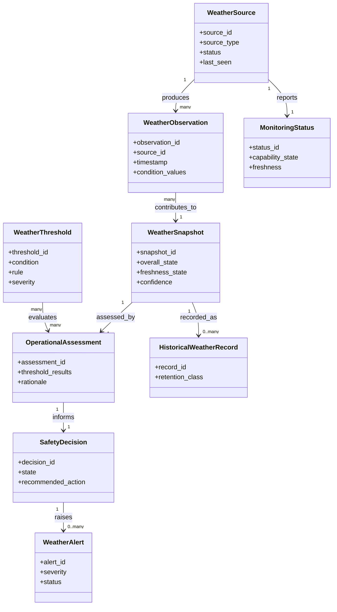

# CAP-WEA-001 - Conceptual Data Model

## Purpose

This document defines the conceptual information model for Weather Monitoring. It does not define a database, schema, API, storage engine or implementation model.

## Conceptual Entities

| Entity | Purpose | Owner | Producer | Consumer | Lifecycle |
|---|---|---|---|---|---|
| Weather Observation | Individual weather evidence from a source. | Operations Owner | Weather Source | Weather Monitoring | Collected -> Validated -> Assessed -> Recorded |
| Weather Snapshot | Point-in-time authoritative weather state. | Operations Owner | Weather Monitoring | Scheduling, OSM, Safety, Knowledge | Created -> Published -> Superseded -> Archived |
| Weather Source | Conceptual source such as weather station or AllSky evidence. | Engineering Owner | Equipment Registry | Weather Monitoring | Registered -> Active -> Degraded -> Retired |
| Weather Threshold | Governed threshold or qualitative rule for operational assessment. | Safety Reviewer / Operations Owner | ADR/SOP governance | Weather Monitoring | Proposed -> Approved -> Applied -> Reviewed |
| Operational Assessment | Evaluation of observed weather against operational criteria. | Operations Owner | Weather Monitoring | Scheduling, OSM | Draft -> Validated -> Published |
| Safety Decision | Decision support result for safe, caution, unsafe or unknown state. | Operations / Safety | Weather Monitoring | OSM, Scheduling, Safety | Created -> Acted on -> Recorded |
| Historical Weather Record | Retained weather evidence tied to time, session or schedule context. | Data Owner | Weather Monitoring | Data Platform, Knowledge Framework | Recorded -> Retained -> Archived |
| Weather Alert | Notification-worthy weather state change or anomaly. | Operations Owner | Weather Monitoring | Operations, OSM, Safety | Raised -> Acknowledged -> Resolved -> Recorded |
| Monitoring Status | Health of monitoring capability and source freshness. | Engineering Owner | Weather Monitoring | Operations | Available -> Degraded -> Offline -> Recovered |

## Core Attributes

| Entity | Attributes |
|---|---|
| Weather Observation | observation_id, source_id, timestamp, wind, humidity, temperature, cloud_cover, rain, sky_quality, seeing, transparency, lightning, roof_safe_state, raw_reference |
| Weather Snapshot | snapshot_id, timestamp, overall_state, freshness_state, confidence, source_set, assessment_reference, validity_window |
| Weather Source | source_id, source_type, equipment_reference, location, status, last_seen, owner, lifecycle_state |
| Weather Threshold | threshold_id, condition, limit_or_rule, severity, approval_reference, effective_status |
| Operational Assessment | assessment_id, snapshot_reference, evaluated_conditions, threshold_results, confidence, rationale |
| Safety Decision | decision_id, snapshot_reference, state, reason, recommended_action, operator_review_required |
| Historical Weather Record | record_id, snapshot_reference, session_reference, schedule_reference, retention_class |
| Weather Alert | alert_id, trigger, severity, snapshot_reference, status, action_reference |
| Monitoring Status | status_id, source_reference, capability_state, freshness, degradation_reason, recovery_reference |

## Entity Relationships

## Relationships to Existing Domain Entities

| Weather Entity | Related Existing Entity | Relationship |
|---|---|---|
| Weather Source | Equipment | Weather sources are registered and governed through `CAP-EQR-001`. |
| Weather Snapshot | Observation Schedule | Schedules reference weather state for approval and monitoring through `CAP-SCH-001`. |
| Weather Snapshot | Observation Session | Sessions reference current weather state for readiness, suspend, resume and close through `CAP-OSM-001`. |
| Safety Decision | Safety Event | Unsafe or unknown state may create safety evidence governed by DSRA and future `CAP-SAF-001`. |
| Weather Alert | Alert | Alerts are knowledge and operational evidence without defining notification implementation. |
| Historical Weather Record | Knowledge Graph / Observation Catalog | Historical state can be linked conceptually to sessions, targets and outcomes. |

## Retention Guidance

| Dataset | Retention |
|---|---|
| Weather Observation | Retain when used to produce a published weather snapshot or decision. Exact duration is OPEN. |
| Weather Snapshot | Retain with schedule/session evidence. Exact duration is OPEN. |
| Safety Decision | Retain with session manifest, runbook and incident evidence. |
| Weather Alert | Retain until resolved and linked to recovery evidence. Long-term retention is OPEN. |
| Monitoring Status | Retain for operational troubleshooting and reliability review. Exact duration is OPEN. |

## Open Data Decisions

| Decision | Reason | Impact |
|---|---|---|
| Final state vocabulary | Repository defines conceptual states but not final enum names. | Affects tests, SOP language and future implementation. |
| Weather data retention period | No approved retention duration exists for all weather evidence. | Affects archive and data platform rules. |
| Threshold versioning model | Threshold values are not finalized. | Affects auditability of historical decisions. |
| Multi-source arbitration model | Weather Station and AllSky relationship is conceptual. | Affects conflict handling and confidence scoring. |

## Related Documents

- `docs/knowledge/domain-model.md`
- `docs/knowledge/canonical-information-model.md`
- `docs/enterprise-architecture/data-architecture.md`
- `docs/capabilities/equipment-registry/data-model.md`
- `docs/capabilities/observation-scheduling/data-model.md`
- `docs/capabilities/observation-session-management/data-model.md`
