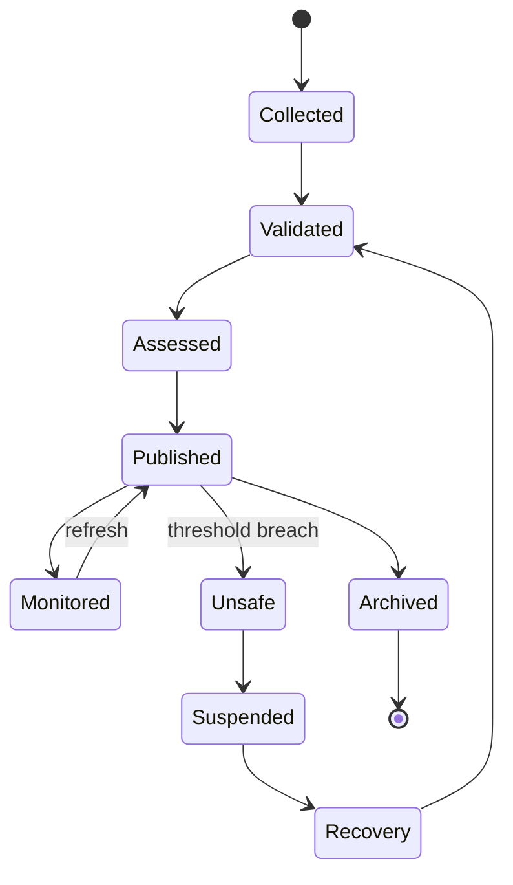

# CAP-WEA-001 - Weather Monitoring

| Campo | Valore |
|---|---|
| Capability | Weather Monitoring |
| ID | `CAP-WEA-001` |
| Stato | Documented |
| Maturity | Documented |
| Readiness | Implementation Ready |
| Versione | 0.1 |
| Fonte gerarchica | `DSG-MR-001` -> DSRA -> `EA-000` -> Knowledge Framework -> Design System -> `CAP-000` -> `REL-000` -> Domain Blueprint -> Capability Package |
| Domain Blueprint | `DOM-001` Core Observatory Domain Blueprint |

## Purpose

Weather Monitoring fornisce la valutazione operativa autorevole delle condizioni ambientali richieste dal Core Observatory per pianificare, avviare, sospendere, riprendere o chiudere una sessione osservativa.

La capability produce informazione concettuale di weather state. Non implementa driver, sensori, motori previsionali, automazioni hardware o database fisici.

## Business Value

- Protegge osservatorio, strumenti e dati scientifici da condizioni non sicure.
- Fornisce a Scheduling e Observation Session Management una fonte governata di stato meteo.
- Riduce ambiguita operative tra dato ambientale, valutazione di sicurezza e decisione osservativa.
- Crea tracciabilita tra condizioni ambientali, sospensioni, recovery e manifest di sessione.
- Supporta continuous monitoring e registrazione storica senza prescrivere tecnologia.

## Scope

Incluso:

- raccolta concettuale delle evidenze meteo disponibili;
- validazione dello stato meteo e della freschezza delle evidenze;
- valutazione operativa delle soglie di sicurezza;
- pubblicazione dello stato meteo autorevole;
- supporto decisionale per scheduling e session execution;
- sospensione, ripresa e recovery documentale;
- registrazione storica del contesto meteo rilevante.

Escluso:

- implementazione di stazioni meteo, AllSky, sensori o driver;
- progettazione di API, database o servizi applicativi;
- definizione numerica definitiva delle soglie, se non presente in documenti approvati;
- sostituzione della capability `CAP-SAF-001` Observatory Safety;
- forecasting scientifico o meteorologico non documentato dalla repository evidence.

## Weather Model

La capability rappresenta concettualmente:

| Elemento | Uso governato |
|---|---|
| Wind | Valutazione di rischio per puntamento, guida, cupola/tetto e stabilita operativa. |
| Humidity | Valutazione rischio condensa, ottiche e chiusura preventiva. |
| Temperature | Contesto operativo, trend termico e rischio ambientale. |
| Cloud Cover | Idoneita osservativa e continuita acquisizione. |
| Rain | Condizione critica per sospensione o stop operativo. |
| Sky Quality | Supporto a priorita osservativa e qualita dati. |
| Seeing | Contesto di qualita per schedule e sessione. |
| Transparency | Contesto di qualita per acquisizione scientifica. |
| Lightning | Condizione di sicurezza esterna e rischio infrastrutturale. |
| Roof Safe State | Stato concettuale che indica se il meteo consente operazioni con tetto/cupola aperta. |
| Overall Observatory Weather State | Sintesi autorevole: `SAFE`, `CAUTION`, `UNSAFE`, `UNKNOWN` o stato equivalente governato. |

I valori concreti, le soglie numeriche e il mapping tecnico restano decisioni aperte finche non approvati.

## Actors

| Actor | Responsibility |
|---|---|
| Operations Owner | Supervisiona uso operativo dello stato meteo. |
| Session Operator | Usa lo stato meteo per preparare, sospendere, riprendere o chiudere sessioni. |
| Scheduling Owner | Usa finestre e stato meteo per approvare o aggiornare schedule. |
| Engineering Owner | Verifica sorgenti, configurazioni e recovery delle evidenze meteo. |
| Safety Reviewer | Valuta coerenza con DSRA e Observatory Safety. |

## Stakeholders

- osservatorio e asset fisici;
- team operations;
- team engineering;
- team scientifico;
- repository governance;
- future portal users governed by Design System.

## Dependencies

| Dependency | Relationship |
|---|---|
| `CAP-SCH-001` Observation Scheduling | Consuma stato meteo per finestre, approvazione, aggiornamento e cancellazione schedule. |
| `CAP-OSM-001` Observation Session Management | Consuma stato meteo per readiness, execution, suspend, resume, close e manifest. |
| `CAP-EQR-001` Equipment Registry | Fornisce contesto su weather station, AllSky, roof controller e asset correlati. |
| `CAP-TGT-001` Target Registry | Fornisce target constraints che possono dipendere da qualita cielo. |
| `DOM-001` Core Observatory Domain | Consolida collaborazione tra capability Core Observatory. |
| DSRA | Fonte di riferimento per safety, rischio ambientale e mitigazioni. |
| Enterprise Architecture | Fonte di riferimento per Technology, Observability e Integration Architecture. |
| Knowledge Framework | Fonte per entita `Weather Event`, `Safety Event`, `Alert` e traceability. |

## External Integrations

| Integration | Use |
|---|---|
| Weather Station | Fonte ambientale primaria prevista dalla documentazione esistente. |
| AllSky | Fonte visuale/ambientale correlata, senza sostituire la weather authority. |
| Observatory Safety | Consumatore e correlatore della decisione meteo/sicurezza. |
| N.I.N.A. / Session Operations | Consuma decision support tramite `CAP-OSM-001`; questa capability non integra direttamente sequenze. |

## Lifecycle

## Success Criteria

| ID | Criterion |
|---|---|
| `WEA-SC-001` | Every schedule and session can reference a weather state or an explicit `UNKNOWN` state. |
| `WEA-SC-002` | Unsafe weather produces documented decision support for suspension or cancellation. |
| `WEA-SC-003` | Conflicting or stale weather evidence is not silently treated as safe. |
| `WEA-SC-004` | Weather state, source, freshness and decision rationale are traceable. |
| `WEA-SC-005` | SOP and runbooks cover monitoring, validation, suspend, resume and recovery. |
| `WEA-SC-006` | Capability is linked to `CAP-000`, `DOM-001`, `REL-000` and existing Core Observatory packages. |

## Related Documents

- `docs/capabilities/CAP-000-capability-registry.md`
- `docs/domains/DOM-001-core-observatory-domain.md`
- `docs/releases/REL-000-release-management-baseline.md`
- `docs/capabilities/observation-session-management/index.md`
- `docs/capabilities/observation-scheduling/index.md`
- `docs/capabilities/equipment-registry/index.md`
- `docs/capabilities/target-registry/index.md`
- `docs/enterprise-architecture/observability-architecture.md`
- `docs/knowledge/domain-model.md`
- `docs/chapters/26-monitoraggio-meteo-sicurezza-ambientale.md`
- `docs/chapters/27-sistema-allsky.md`
