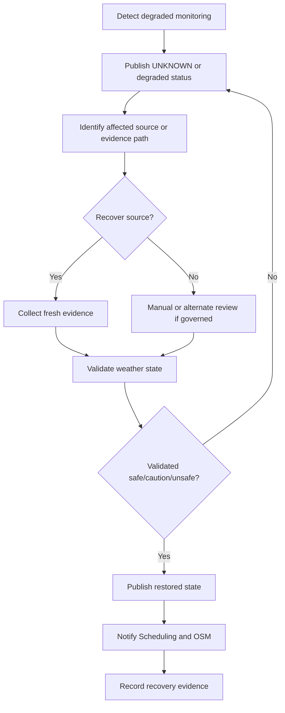

# Runbook - Weather Monitor Recovery

| Campo | Valore |
|---|---|
| Runbook | Weather Monitor Recovery |
| Capability | `CAP-WEA-001` |
| Stato | Baseline |
| Severity | Operational continuity |

## Trigger

Weather Monitoring is degraded, stale, conflicting, unavailable or recovering after weather source failure.

## Objective

Restore trusted weather assessment while keeping Scheduling and Observation Session Management informed of degraded or unknown state.

## Recovery Workflow

## Diagnostic Steps

| Step | Action | Evidence |
|---|---|---|
| 1 | Determine degradation type: offline, stale, conflict, unknown, alert. | Monitoring Status. |
| 2 | Identify affected source, schedule or session. | Source/session references. |
| 3 | Check related Equipment Registry state. | Equipment context. |
| 4 | Determine whether observation is active, pending or not impacted. | OSM/Scheduling context. |
| 5 | Publish current degraded state. | Weather Snapshot / Alert. |

## Recovery Steps

| Step | Action | Expected Result |
|---|---|---|
| 1 | Restore or validate weather source availability. | Source available or alternate review started. |
| 2 | Collect fresh evidence. | New Weather Observation. |
| 3 | Validate evidence and resolve stale/conflict indicators. | Validation result. |
| 4 | Publish restored Weather Snapshot. | Updated state. |
| 5 | Notify impacted capabilities. | Schedule/session context updated. |
| 6 | Record recovery timeline and final state. | Historical Weather Record. |

## Controls

- Recovery does not imply resume; resume requires SOP and OSM/Scheduling review.
- Alternate or manual evidence must be traceable.
- If recovery cannot be completed, state remains `UNKNOWN`, `CAUTION` or `UNSAFE` as applicable.

## Exit Criteria

- Monitoring Status is restored or explicitly degraded with owner and action, and
- affected schedule/session references have been updated, and
- historical recovery evidence exists.

## Related Documents

- `docs/capabilities/weather-monitoring/runbooks/weather-station-offline.md`
- `docs/capabilities/weather-monitoring/runbooks/conflicting-weather-data.md`
- `docs/capabilities/weather-monitoring/sop/validate-weather-state.md`
