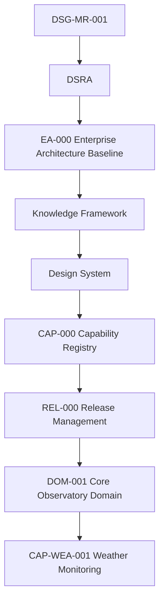

# CAP-WEA-001 - Traceability Matrix

## Purpose

This document proves that Weather Monitoring remains aligned with approved Digital StarGate governance. It connects every package artefact to Roadmap, DSRA, Enterprise Architecture, Knowledge Framework, Domain Blueprint, Capability Registry, Release Management and existing Core Observatory capabilities.

## Governance Chain

## Artefact Traceability

| Artefact | Roadmap | DSRA | EA-000 / Architecture | Knowledge Framework | DOM-001 | CAP-000 | REL-000 | Existing Capability Links |
|---|---|---|---|---|---|---|---|---|
| `index.md` | Safe automated observatory operations | Environmental risk and controls | EA baseline, Observability, Technology | Weather Event, Safety Event, Alert | Core Observatory context | CAP-WEA-001 registry entry | Implementation Ready evidence | CAP-SCH, CAP-OSM, CAP-EQR, CAP-TGT |
| `business-process.md` | Operations workflow | Unsafe weather handling | Observability lifecycle | Process evidence | Domain collaboration | Package coverage | Promotion rules | Scheduling/session decision flow |
| `requirements.md` | Capability requirements | Safety and continuity requirements | NFR and observability alignment | Requirement repository pattern | Domain capability | Requirement coverage | Readiness checklist | Core Observatory dependencies |
| `architecture-mapping.md` | Architecture alignment | Risk trace | Application, Data, Technology, Integration, Observability | Knowledge and traceability | Domain interactions | Registry dependency map | Release compliance | CAP-SCH, CAP-OSM, CAP-EQR, CAP-TGT |
| `data-model.md` | Data governance | Weather/safety evidence | Data Architecture | Canonical entities | Information flow | Dataset coverage | Artefact evidence | Schedules, sessions, equipment, targets |
| `technical-manual.md` | Operational manuals | Safety operation notes | Technology / Integration / Observability | Documentation Asset | Domain interfaces | Manual coverage | Mandatory artefact | Existing package manual references |
| `test-plan.md` | Validation | Recovery and safety verification | Quality gates | Quality model | KPI evidence | Test coverage | Validation gate | Schedule/session recovery evidence |
| `acceptance-criteria.md` | Completion criteria | Safety acceptance | Architecture compliance | Traceability and taxonomy | Domain acceptance | Readiness score | Release gate | Existing capability linkage |
| `adr/WEA-ADR-001-authoritative-weather-state.md` | Decision trace | Risk control | Architecture decision catalog pattern | Decision asset | Domain authority | ADR coverage | ADR completion | CAP-SCH / CAP-OSM consumers |
| `adr/WEA-ADR-002-operational-safety-thresholds.md` | Decision trace | Threshold risk | Security/Observability decision context | Open decision governance | Domain safety | ADR coverage | ADR completion | Observatory Safety dependency |
| SOP files | Operations | Procedural control | Operational architecture | SOP lifecycle | Domain procedures | SOP coverage | SOP completion | Scheduling/session procedures |
| Runbook files | Recovery | Incident/recovery controls | Observability and recovery | Runbook lifecycle | Domain recovery | Runbook coverage | Runbook completion | OSM recovery linkage |

## Existing Core Observatory Capability Traceability

| Capability | Weather Monitoring Relationship |
|---|---|
| `CAP-SCH-001` Observation Scheduling | Consumes weather state for schedule approval, monitoring, cancellation and completion decisions. |
| `CAP-OSM-001` Observation Session Management | Consumes weather state for readiness, execution, suspend, resume, close and manifest evidence. |
| `CAP-EQR-001` Equipment Registry | Governs identity and lifecycle context for weather-related equipment and monitoring sources. |
| `CAP-TGT-001` Target Registry | Provides target constraints and scientific quality context affected by weather and sky state. |

## Requirement Traceability

| Requirement Group | Artefact Evidence |
|---|---|
| Business | `requirements.md`, `index.md`, DSRA references. |
| Functional | `requirements.md`, `data-model.md`, `architecture-mapping.md`. |
| Operational | `business-process.md`, SOP, runbooks. |
| Security | `requirements.md`, `technical-manual.md`, Security Architecture reference. |
| Performance | `requirements.md`, open decisions for freshness and thresholds. |
| Availability | `requirements.md`, recovery runbooks. |
| Quality | `test-plan.md`, `acceptance-criteria.md`. |
| Traceability | This document, CAP-000, REL-000, DOM-001. |

## Open Decisions Traceability

| Decision | Recorded In | Impact |
|---|---|---|
| Final weather thresholds | `WEA-ADR-002`, `data-model.md`, `technical-manual.md` | Required before implementation and operational release. |
| Multi-source arbitration | `WEA-ADR-001`, `architecture-mapping.md` | Required for conflict handling and confidence. |
| State publication interface | `architecture-mapping.md`, `technical-manual.md` | Future implementation ADR may be required. |
| Historical retention | `data-model.md`, `architecture-mapping.md` | Data Platform and Backup & Recovery alignment. |

## Compliance Statement

`CAP-WEA-001` introduces no implementation. It defines a governed documentation package for Weather Monitoring and integrates with existing architecture, knowledge, registry, release and Core Observatory domain artefacts.
