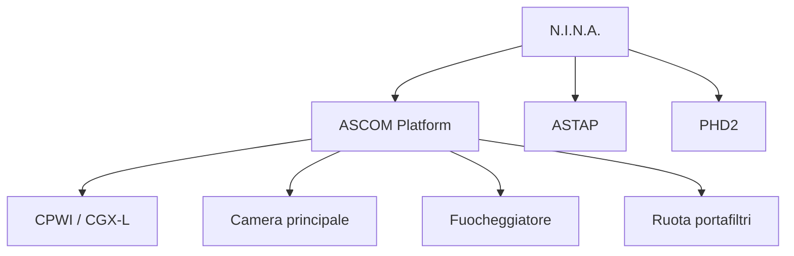

# Capitolo 11 — N.I.N.A.

**Codice capitolo:** DSG-CH-011  
**Revisione:** 0.4  
**Stato:** Bozza consolidata

## 11.1 Scopo

N.I.N.A. costituisce il software di orchestrazione delle sessioni osservative di Digital StarGate. Coordina montatura, camera principale, ruota portafiltri, fuocheggiatore, plate solving, guida e sequenze automatiche.

## 11.2 Campo di applicazione

Il presente capitolo descrive:

- profili di configurazione;
- connessione dei dispositivi;
- sequenze avanzate;
- plate solving;
- autofocus;
- dithering;
- meridian flip;
- gestione degli errori;
- logging e backup.

## 11.3 Architettura funzionale

## 11.4 Profili operativi

| ID profilo | Configurazione | Uso previsto |
|---|---|---|
| DSG-NINA-C8-LRGB | C8 + QHY695A + LRGB | Galassie e ammassi |
| DSG-NINA-C8-SHO | C8 + QHY695A + SHO | Nebulose compatte |
| DSG-NINA-Q200-OSC | Quattro 200P + ToupTek 294MC | Largo campo a colori |
| DSG-NINA-Q200-SHO | Quattro 200P + QHY695A + SHO | Nebulose estese |

> **DA VALIDARE:** nomi effettivi dei profili e versioni delle configurazioni.

## 11.5 Sequenza di inizializzazione

### Procedura DSG-PROC-011-01 — Avvio di N.I.N.A.

1. Avviare CPWI e verificare la connessione alla CGX-L.
2. Avviare PHD2.
3. Avviare N.I.N.A.
4. Selezionare il profilo corretto.
5. Connettere tutti i dispositivi.
6. Verificare camera, temperatura, montatura, fuocheggiatore e ruota filtri.
7. Eseguire un plate solve di prova.
8. Eseguire un autofocus di prova.
9. Salvare eventuali modifiche al profilo.

## 11.6 Plate solving

ASTAP è il solver di riferimento. Il flusso standard prevede:

1. slew verso il target;
2. acquisizione immagine;
3. solve;
4. correzione del puntamento;
5. nuova acquisizione fino al rispetto della tolleranza.

### Criteri di accettazione

| Parametro | Requisito |
|---|---|
| Coordinate iniziali | Coerenti con il target |
| Scala immagine | Configurata correttamente |
| Tolleranza centratura | **DA VALIDARE** |
| Numero massimo tentativi | **DA VALIDARE** |

## 11.7 Autofocus

L'autofocus viene eseguito:

- all'inizio della sessione;
- dopo il meridian flip;
- al cambio filtro, quando previsto;
- dopo variazioni termiche significative;
- quando l'FWHM supera la soglia prevista.

### Parametri da registrare

- step size;
- backlash compensation;
- numero di punti;
- intervallo HFR/FWHM;
- filtro di riferimento;
- posizione finale.

## 11.8 Dithering

Il dithering è comandato da N.I.N.A. e realizzato da PHD2. Devono essere definiti:

- frequenza;
- ampiezza;
- tempo massimo di stabilizzazione;
- soglia RMS per la ripresa.

## 11.9 Meridian flip

### Procedura DSG-PROC-011-02 — Meridian flip automatico

1. Sospensione delle esposizioni.
2. Arresto della guida.
3. Comando di flip a CPWI.
4. Attesa del completamento.
5. Plate solving.
6. Autofocus.
7. Riavvio della guida.
8. Ripresa della sequenza.

## 11.10 Gestione degli errori

| Evento | Azione primaria | Escalation |
|---|---|---|
| Camera non connessa | Riconnessione | Arresto sequenza |
| Plate solving fallito | Nuovo tentativo | Notifica operatore |
| Autofocus fallito | Ripetizione | Pausa sequenza |
| Guida persa | Riaggancio PHD2 | Arresto controllato |
| Flip fallito | Stop immediato | SAFE MODE |

## 11.11 Logging e backup

Devono essere salvati:

- log applicativi N.I.N.A.;
- profili;
- sequenze;
- plugin installati;
- impostazioni autofocus;
- report di sessione.

## 11.12 Checklist di validazione

- [ ] Profilo corretto selezionato
- [ ] Tutti i dispositivi connessi
- [ ] Plate solving valido
- [ ] Autofocus valido
- [ ] PHD2 connesso
- [ ] Percorso di salvataggio verificato
- [ ] Sequenza testata

## 11.13 Troubleshooting

### Plate solving non riuscito

Verificare scala immagine, coordinate iniziali, fuoco, nuvole e configurazione ASTAP.

### Autofocus instabile

Verificare seeing, backlash, fissaggio del motore, step size e filtro selezionato.

### Sequenza bloccata dopo il flip

Verificare CPWI, PHD2, timeout e stato della montatura.

## 11.14 KPI

| KPI | Descrizione |
|---|---|
| Success rate plate solving | % solve completati |
| Success rate autofocus | % autofocus validi |
| Sessioni completate | % sequenze terminate |
| Recovery automatici | Numero e percentuale di successo |

## 11.15 Dati da validare

- versione N.I.N.A.;
- plugin installati;
- nomi reali dei profili;
- parametri autofocus;
- parametri dithering;
- timeout e tentativi di recovery.
