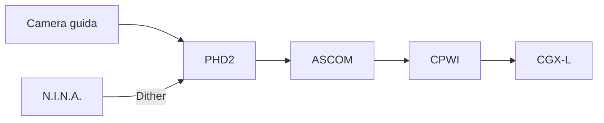

# Capitolo 12 — PHD2 Guiding

**Codice capitolo:** DSG-CH-012  
**Revisione:** 0.4  
**Stato:** Bozza consolidata

## 12.1 Scopo

PHD2 gestisce la guida automatica della montatura CGX-L durante le esposizioni lunghe. Il sistema invia correzioni Pulse Guide tramite ASCOM e CPWI.

## 12.2 Architettura

## 12.3 Profili di guida

| ID profilo | Ottica principale | Camera guida | Metodo |
|---|---|---|---|
| DSG-PHD2-C8 | C8 XLT | **DA VALIDARE** | Pulse Guide ASCOM |
| DSG-PHD2-Q200 | Quattro 200P | **DA VALIDARE** | Pulse Guide ASCOM |

## 12.4 Calibrazione

La calibrazione deve essere ripetuta quando:

- cambia l'orientamento della camera guida;
- cambia il metodo di guida;
- cambia la scala dell'ottica guida;
- PHD2 segnala una calibrazione non valida;
- vengono modificati parametri meccanici rilevanti.

### Procedura DSG-PROC-012-01 — Calibrazione

1. Puntare una zona idonea del cielo.
2. Verificare il fuoco della camera guida.
3. Avviare la calibrazione.
4. Controllare ortogonalità e numero di step.
5. Salvare il profilo.
6. Annotare data e configurazione.

## 12.5 Parametri principali

- aggressività RA;
- aggressività DEC;
- isteresi;
- min move;
- durata massima impulso;
- esposizione camera guida;
- soglia SNR;
- settling dopo dithering.

> **DA VALIDARE:** valori effettivi per C8 e Quattro 200P.

## 12.6 Dithering

PHD2 riceve il comando da N.I.N.A. e:

1. esegue lo spostamento;
2. misura l'errore residuo;
3. attende la stabilizzazione;
4. restituisce il completamento.

## 12.7 Indicatori di qualità

| Parametro | Significato |
|---|---|
| RMS totale | Qualità globale della guida |
| RMS RA | Stabilità asse RA |
| RMS DEC | Stabilità asse DEC |
| SNR stella guida | Affidabilità della misura |
| Stelle perse | Indicatore di nuvole o problemi di fuoco |

## 12.8 Procedura di avvio guida

### DSG-PROC-012-02

1. Connettere camera guida.
2. Connettere montatura via ASCOM.
3. Selezionare stella guida.
4. Verificare SNR.
5. Avviare guida.
6. Attendere stabilizzazione.
7. Autorizzare l'inizio delle esposizioni.

## 12.9 Caso noto: Pulse Guide Failed

### Sintomi

- arresto delle correzioni;
- errore PHD2;
- pausa o blocco della sequenza N.I.N.A.

### Diagnosi

1. verificare CPWI;
2. verificare connessione ASCOM;
3. controllare alimentazione CGX-L;
4. controllare USB;
5. verificare sospensione selettiva USB di Windows;
6. analizzare log PHD2;
7. verificare eventuali stati di errore della montatura.

### Recovery

1. fermare la sequenza;
2. riconnettere CPWI se necessario;
3. riconnettere PHD2;
4. verificare posizione montatura;
5. eseguire plate solve;
6. riprendere solo dopo guida stabile.

## 12.10 Troubleshooting

### Stella guida persa

Verificare nuvole, fuoco, saturazione, esposizione e flessioni.

### Oscillazioni RA/DEC

Verificare aggressività, backlash, bilanciamento e seeing.

### Settling troppo lungo

Ridurre ampiezza dithering o rivedere soglia/timeout.

## 12.11 Manutenzione

- backup mensile dei profili;
- verifica periodica della calibrazione;
- controllo fuoco ottica guida;
- controllo cavi e connettori;
- aggiornamenti solo dopo test.

## 12.12 KPI

| KPI | Descrizione |
|---|---|
| RMS mediano | Valore per sessione |
| Pulse Guide Failed | Numero eventi/mese |
| Recovery riusciti | Percentuale |
| Dither stabilizzati | Percentuale entro timeout |

## 12.13 Dati da validare

- camera guida effettiva per ciascun setup;
- focale guida;
- pixel size;
- parametri PHD2;
- valori RMS di riferimento.
