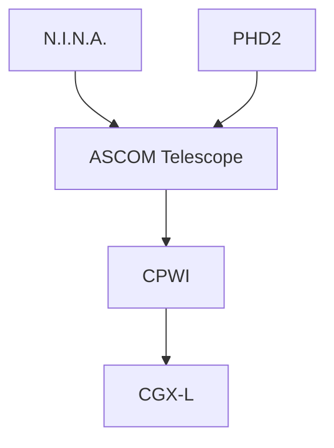

# Capitolo 13 — CPWI

**Codice capitolo:** DSG-CH-013  
**Revisione:** 0.4  
**Stato:** Bozza consolidata

## 13.1 Scopo

CPWI è il software di controllo diretto della montatura Celestron CGX-L. Espone la montatura tramite ASCOM a N.I.N.A. e PHD2.

## 13.2 Principio architetturale

CPWI deve essere l'unico software che comunica direttamente con la montatura. Tutte le altre applicazioni utilizzano il driver ASCOM.

## 13.3 Sequenza di avvio

### DSG-PROC-013-01 — Avvio CPWI

1. Accendere la CGX-L.
2. Verificare la connessione USB.
3. Avviare CPWI.
4. Connettere la montatura.
5. Verificare data, ora e coordinate.
6. Verificare stato Park/Unpark.
7. Controllare assenza di allarmi.
8. Rendere disponibile il driver ASCOM.

## 13.4 Modello di puntamento

Il modello deve essere verificato dopo:

- modifiche meccaniche;
- modifiche al treno ottico;
- aggiornamenti firmware;
- variazioni della posizione Park;
- errori ripetuti di puntamento.

Il plate solving di N.I.N.A. corregge gli errori residui.

## 13.5 Park e Unpark

### Requisiti della posizione Park

- compatibilità con la chiusura della cupola;
- assenza di collisioni;
- ripetibilità;
- accessibilità per manutenzione.

### DSG-PROC-013-02 — Park

1. Terminare esposizioni.
2. Arrestare guida.
3. Comandare Park.
4. Verificare completamento.
5. Confermare posizione sicura.
6. Autorizzare chiusura cupola.

## 13.6 Meridian flip

CPWI esegue il movimento comandato da N.I.N.A. Il sistema deve verificare:

- limiti configurati;
- posizione corrente;
- assenza di ostacoli;
- ripresa del tracking;
- coerenza delle coordinate.

## 13.7 Parametri critici

| Parametro | Requisito |
|---|---|
| Coordinate sito | Corrette |
| Data e ora | Sincronizzate |
| Tracking rate | Siderale, salvo casi specifici |
| Posizione Park | Documentata |
| Limiti meridiano | **DA VALIDARE** |
| Limiti di slew | **DA VALIDARE** |

## 13.8 Recovery

### Connessione persa

1. fermare i comandi da N.I.N.A.;
2. verificare USB e alimentazione;
3. ristabilire CPWI;
4. verificare posizione reale;
5. eseguire plate solve;
6. riprendere solo se lo stato è coerente.

## 13.9 Troubleshooting

### Montatura non disponibile in ASCOM

Verificare che CPWI sia avviato e connesso.

### Puntamento errato

Verificare ora, coordinate, modello e plate solving.

### Flip non completato

Verificare limiti, timeout, tracking e stato meccanico.

## 13.10 Manutenzione software

- backup configurazione;
- registrazione versione CPWI;
- registrazione firmware CGX-L;
- test Park/Unpark dopo aggiornamenti;
- test flip in ambiente controllato.

## 13.11 KPI

| KPI | Descrizione |
|---|---|
| Slew completati | % senza errore |
| Park riusciti | % |
| Flip riusciti | % |
| Disconnessioni | Numero per mese |

## 13.12 Dati da validare

- versione CPWI;
- firmware CGX-L;
- coordinate sito configurate;
- posizione Park;
- limiti meridiano;
- modello di puntamento utilizzato.
