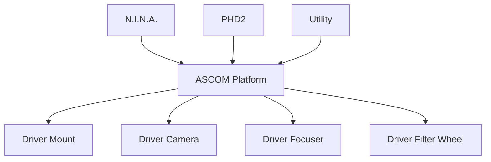

# Capitolo 14 — ASCOM Platform

**Codice capitolo:** DSG-CH-014  
**Revisione:** 0.4  
**Stato:** Bozza consolidata

## 14.1 Scopo

ASCOM è il middleware che standardizza la comunicazione tra applicazioni astronomiche e dispositivi hardware.

## 14.2 Componenti gestiti

- montatura;
- camera principale;
- camera guida;
- fuocheggiatore;
- ruota filtri;
- cupola o tetto, quando integrati;
- sensori meteo, quando disponibili.

## 14.3 Architettura

## 14.4 Regola di controllo

Ogni dispositivo deve essere gestito attraverso una sola catena di controllo coerente. Sono da evitare accessi diretti concorrenti allo stesso hardware.

## 14.5 Sequenza di inizializzazione

### DSG-PROC-014-01

1. Avviare Windows.
2. Verificare installazione ASCOM.
3. Avviare CPWI.
4. Collegare montatura.
5. Collegare camera.
6. Collegare fuocheggiatore.
7. Collegare ruota filtri.
8. Avviare PHD2.
9. Avviare N.I.N.A.

## 14.6 Aggiornamento driver

### Procedura DSG-PROC-014-02

1. Registrare versioni correnti.
2. Eseguire backup.
3. Creare punto di ripristino Windows.
4. Installare il nuovo driver.
5. Riavviare.
6. Verificare connessione di ogni dispositivo.
7. Testare Park, autofocus, guida e acquisizione.
8. Aggiornare il registro software.

## 14.7 Matrice di compatibilità

| Applicazione | Driver | Stato |
|---|---|---|
| N.I.N.A. | Telescope ASCOM | Da validare |
| N.I.N.A. | Focuser ASCOM | Da validare |
| N.I.N.A. | Filter Wheel ASCOM | Da validare |
| PHD2 | Mount ASCOM | Da validare |
| CPWI | Driver nativo | Da validare |

## 14.8 Troubleshooting

### Driver non visibile

Verificare installazione, architettura 32/64 bit, privilegi e registrazione COM.

### Driver occupato

Chiudere processi concorrenti e riavviare l'applicazione interessata.

### Periferica disconnessa

Verificare alimentazione, USB, Device Manager, driver e log eventi.

## 14.9 Rollback

Devono essere conservati:

- installer stabili;
- copie dei profili;
- versioni precedenti dei driver;
- registro modifiche;
- punto di ripristino.

## 14.10 KPI

| KPI | Descrizione |
|---|---|
| Errori driver | Numero per sessione |
| Disconnessioni | Numero per mese |
| Aggiornamenti riusciti | Percentuale |
| Rollback necessari | Numero |

## 14.11 Dati da validare

- versione ASCOM;
- elenco completo driver;
- architettura 32/64 bit;
- versioni stabili approvate;
- percorsi installer di rollback.
