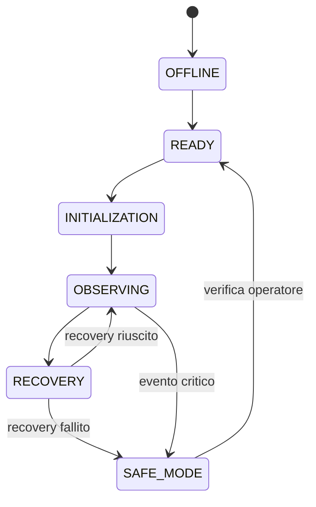

# Capitolo 15 — Architettura dell'automazione

**Codice capitolo:** DSG-CH-015  
**Revisione:** 0.4  
**Stato:** Bozza consolidata

## 15.1 Scopo

L'automazione coordina infrastruttura, computer di controllo, dispositivi astronomici, cupola, sequenze osservative e procedure di recovery.

## 15.2 Principi progettuali

- Safety First;
- determinismo;
- fail safe;
- recovery controllato;
- tracciabilità;
- modularità.

## 15.3 Livelli di automazione

| Livello | Ambito |
|---|---|
| L1 | Alimentazione e rete |
| L2 | EAGLE e Windows |
| L3 | Driver e dispositivi |
| L4 | N.I.N.A., PHD2, CPWI |
| L5 | Supervisione, recovery e sicurezza |

## 15.4 Stati dell'osservatorio

| Stato | Descrizione |
|---|---|
| OFFLINE | Sistema spento |
| READY | Cupola chiusa, montatura Park, rete disponibile |
| INITIALIZATION | Connessione e controlli preliminari |
| OBSERVING | Sequenza attiva |
| RECOVERY | Tentativo di ripristino |
| SAFE MODE | Sistema messo in sicurezza |

## 15.5 Sequenza operativa completa

### DSG-PROC-015-01 — Ciclo di una notte

1. Verifica rete e VPN.
2. Connessione EAGLE.
3. Controllo alimentazioni.
4. Avvio CPWI.
5. Connessione dispositivi.
6. Verifica sensori cupola.
7. Apertura cupola.
8. Slew e plate solving.
9. Autofocus.
10. Avvio guida.
11. Acquisizione.
12. Dithering.
13. Meridian flip.
14. Ripresa acquisizione.
15. Fine sequenza.
16. Park.
17. Chiusura cupola.
18. Backup dati e log.
19. Report sessione.

## 15.6 Supervisione

Devono essere monitorati:

- stato VPN;
- stato EAGLE;
- stato montatura;
- tracking;
- guida;
- temperatura camere;
- fuoco;
- stato cupola;
- alimentazioni;
- disponibilità disco.

## 15.7 Eventi e azioni

| Evento | Azione |
|---|---|
| Guida persa | Tentativo di riaggancio |
| Autofocus fallito | Ripetizione e pausa |
| Camera disconnessa | Stop sequenza |
| Plate solve fallito | Nuovo tentativo limitato |
| Flip fallito | SAFE MODE |
| Sensori incoerenti | Blocco cupola |
| Perdita montatura | Stop immediato |

## 15.8 Recovery

Il recovery segue questa logica:

1. identificazione errore;
2. classificazione gravità;
3. tentativo automatico;
4. verifica esito;
5. ripresa solo se lo stato è coerente;
6. SAFE MODE se il recovery fallisce.

## 15.9 Registro eventi

| Campo | Descrizione |
|---|---|
| Timestamp | Data e ora |
| Stato iniziale | Stato osservatorio |
| Evento | Tipo anomalia |
| Azione | Recovery eseguito |
| Esito | Riuscito / Fallito |
| Log associati | N.I.N.A., PHD2, CPWI, Windows |

## 15.10 Test dell'automazione

Devono essere previsti test controllati per:

- perdita VPN;
- perdita guida;
- plate solve fallito;
- autofocus fallito;
- flip simulato;
- incoerenza sensori;
- arresto sequenza;
- passaggio a SAFE MODE.

## 15.11 KPI

| KPI | Descrizione |
|---|---|
| Sessioni automatiche completate | Percentuale |
| Recovery automatici riusciti | Percentuale |
| Passaggi a SAFE MODE | Numero per mese |
| Tempo medio recovery | Minuti |
| Eventi non classificati | Numero |

## 15.12 Dati da validare

- automazioni effettivamente implementate;
- canale di notifica operatore;
- numero massimo tentativi;
- timeout;
- stato reale dei sensori;
- logica di chiusura automatica.
