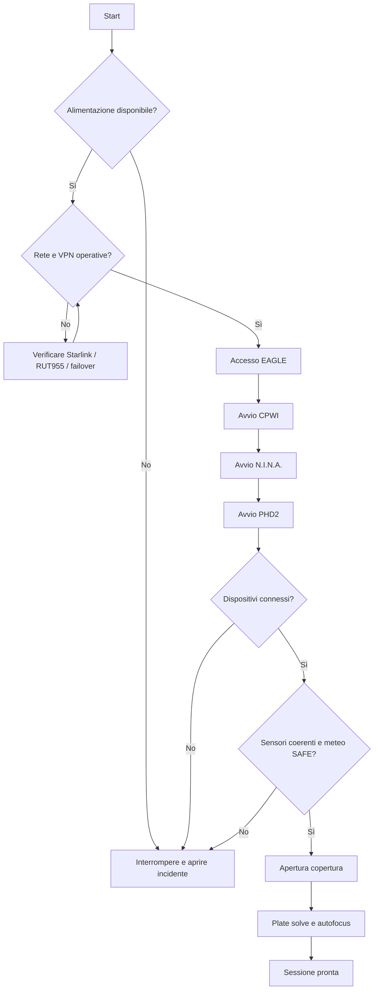

# Capitolo 16 — Procedure operative standard: avvio dell'osservatorio

**Codice documento:** DSG-TM-001-16  
**Revisione:** 0.2 Draft  
**Classificazione:** Engineering Documentation

## 16.1 Scopo

Il presente capitolo definisce la procedura standard per portare l'Osservatorio Remoto Digital StarGate dallo stato di riposo allo stato operativo, verificando in modo sistematico alimentazione, connettività, computer di controllo, software, dispositivi astronomici, copertura mobile e condizioni di sicurezza.

La procedura ha priorità sulla rapidità di avvio: nessuna sessione deve iniziare finché i controlli minimi non risultano coerenti e tracciati.

## 16.2 Campo di applicazione

La procedura si applica a:

- sessioni fotografiche remote;
- sessioni locali;
- prove funzionali;
- collaudi dopo manutenzione;
- riavvii successivi a blackout o recovery;
- validazione dopo aggiornamenti hardware o software.

## 16.3 Ruoli e responsabilità

| Ruolo | Responsabilità |
|---|---|
| Operatore remoto | Avvio, verifica e supervisione della sessione |
| Operatore locale | Intervento fisico in caso di blocco o incoerenza |
| Responsabile tecnico | Approvazione delle modifiche alla procedura |
| Sistema automatico | Esecuzione dei controlli e registrazione degli eventi |

## 16.4 Prerequisiti

Prima dell'avvio devono essere soddisfatte le seguenti condizioni:

| Controllo | Stato richiesto |
|---|---|
| Alimentazione sito | Disponibile e stabile |
| Starlink | Operativa |
| Teltonika RUT955 | Online |
| VPN | Raggiungibile |
| EAGLE | Avviabile o già operativo |
| Cupola / tetto | Chiuso |
| Montatura | In Park o posizione nota e sicura |
| Meteo | Compatibile con l'apertura |
| Sensori | Coerenti |

> **DA VALIDARE:** definire le soglie operative meteo reali (vento, umidità, pioggia, nuvolosità) e la logica del sensore SAFE.

## 16.5 Stati iniziali ammessi

| Stato | Descrizione | Azione |
|---|---|---|
| OFFLINE | Sito non raggiungibile | Verificare rete e alimentazione |
| READY-CLOSED | Sistemi disponibili, copertura chiusa | Avvio consentito |
| UNKNOWN | Stato non determinabile | Avvio vietato |
| RECOVERY | Sistema reduce da anomalia | Applicare Capitolo 18 |

## 16.6 Diagramma di flusso

## 16.7 Procedura DSG-PROC-016-01 — Verifica della connettività

1. Verificare la raggiungibilità del router Starlink.
2. Verificare la raggiungibilità del Teltonika RUT955.
3. Verificare l'accesso alla VPN.
4. Verificare la raggiungibilità dell'EAGLE.
5. Controllare eventuali perdite di pacchetti o latenze anomale.
6. Registrare l'esito nel log di sessione.

### Criteri di accettazione

- VPN stabilita;
- EAGLE raggiungibile;
- nessuna perdita di pacchetti persistente;
- failover disponibile o testato secondo pianificazione.

## 16.8 Procedura DSG-PROC-016-02 — Accesso all'EAGLE

1. Aprire la sessione Desktop Remoto.
2. Verificare data e ora di Windows.
3. Verificare spazio libero su disco.
4. Controllare CPU e RAM.
5. Verificare che non siano presenti finestre di aggiornamento o riavvii pendenti.
6. Verificare il corretto riconoscimento delle periferiche USB principali.

### Criteri di accettazione

- nessun errore critico in Gestione dispositivi;
- almeno il 15% di spazio libero sul volume dati;
- nessun riavvio obbligatorio pendente;
- temperatura del sistema nei limiti del costruttore.

## 16.9 Procedura DSG-PROC-016-03 — Sequenza di avvio software

Ordine raccomandato:

1. CPWI;
2. driver e servizi ASCOM necessari;
3. N.I.N.A.;
4. PHD2;
5. ASTAP o plate solver configurato;
6. utility di monitoraggio e notifica.

L'ordine evita accessi concorrenti alla montatura e riduce le possibilità di conflitto tra driver.

## 16.10 Procedura DSG-PROC-016-04 — Verifica dispositivi

| Dispositivo | Verifica minima |
|---|---|
| CGX-L | Connected, posizione nota, nessun allarme |
| Camera principale | Connected, raffreddamento disponibile |
| Camera guida | Connected e operativa |
| FocusCube / ESATTO | Connected e posizione leggibile |
| Ruota portafiltri | Posizione coerente |
| Flat box | Raggiungibile |
| Sensori copertura | Stati coerenti |
| GPS / sincronizzazione oraria | Disponibile o già validata |

Se un dispositivo critico non è disponibile, la sequenza non deve iniziare.

## 16.11 Procedura DSG-PROC-016-05 — Verifica sensori copertura

La logica minima deve rispettare una matrice di coerenza.

| OPEN | CLOSED | SAFE | Interpretazione |
|---:|---:|---:|---|
| 0 | 1 | 1 | Copertura chiusa e sicura |
| 1 | 0 | 1 | Copertura aperta e sicura |
| 0 | 0 | 0/1 | Stato intermedio o non determinato |
| 1 | 1 | 0/1 | Stato incoerente — movimento vietato |

> **ATTENZIONE:** qualunque combinazione incoerente deve bloccare apertura e chiusura fino a verifica manuale.

## 16.12 Procedura DSG-PROC-016-06 — Apertura controllata

1. Confermare meteo SAFE.
2. Confermare montatura in posizione di sicurezza.
3. Inviare comando OPEN.
4. Monitorare il tempo di corsa.
5. Verificare che CLOSED diventi FALSE.
6. Verificare che OPEN diventi TRUE entro il timeout previsto.
7. Registrare durata e stato finale.

> **DA VALIDARE:** tempo massimo di apertura, logica di timeout e gestione del comando di stop.

## 16.13 Procedura DSG-PROC-016-07 — Preparazione della sessione

1. Sbloccare o effettuare Unpark della montatura.
2. Eseguire uno slew di prova in zona sicura.
3. Eseguire plate solving.
4. Eseguire autofocus.
5. Avviare PHD2 e stabilizzare la guida.
6. Confermare che la prima immagine di test sia valida.
7. Autorizzare la sequenza automatica.

## 16.14 Checklist DSG-CHK-016-01 — Avvio

- [ ] Alimentazione disponibile
- [ ] Starlink operativa
- [ ] RUT955 online
- [ ] VPN disponibile
- [ ] EAGLE raggiungibile
- [ ] Ora di sistema corretta
- [ ] Spazio disco sufficiente
- [ ] CPWI connesso
- [ ] N.I.N.A. operativo
- [ ] PHD2 operativo
- [ ] Camera principale connessa
- [ ] Camera guida connessa
- [ ] Fuocheggiatore connesso
- [ ] Sensori coerenti
- [ ] Meteo SAFE
- [ ] Copertura aperta
- [ ] Plate solve completato
- [ ] Autofocus valido
- [ ] Guida stabile

## 16.15 Eccezioni e criteri di arresto

La procedura deve essere interrotta in presenza di:

- stato sconosciuto della montatura;
- sensori incoerenti;
- meteo non sicuro;
- perdita persistente della connessione alla montatura;
- impossibilità di controllare la copertura;
- anomalia elettrica;
- errore critico del computer EAGLE.

## 16.16 KPI

| KPI | Definizione |
|---|---|
| Tempo medio di avvio | Dall'accesso remoto alla prima esposizione valida |
| Avvii completati al primo tentativo | Percentuale sul totale |
| Errori di inizializzazione | Numero per sessione |
| Tempo medio di connessione dispositivi | Minuti |
| Interventi manuali | Numero per mese |

## 16.17 Registro modifiche

| Revisione | Data | Descrizione |
|---|---|---|
| 0.1 | 2026-07 | Prima bozza |
| 0.2 | 2026-07 | Consolidamento per repository Docs-as-Code |
