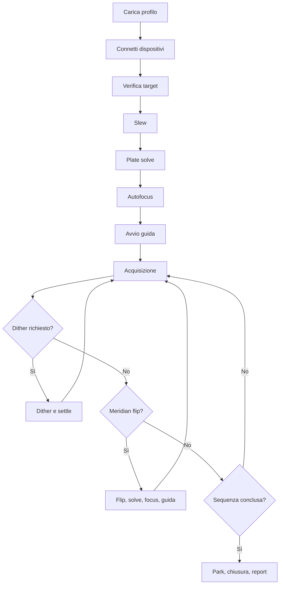

# Capitolo 17 — Procedura operativa: acquisizione automatica

**Codice documento:** DSG-TM-001-17  
**Revisione:** 0.2 Draft  
**Classificazione:** Engineering Documentation

## 17.1 Scopo

Il presente capitolo descrive il ciclo completo di acquisizione automatica delle immagini astronomiche mediante N.I.N.A., PHD2, CPWI e i dispositivi integrati nell'Osservatorio Remoto Digital StarGate.

Gli obiettivi sono:

- garantire ripetibilità;
- massimizzare il tempo utile di integrazione;
- mantenere la qualità dei dati;
- ridurre gli interventi manuali;
- mettere in sicurezza il sistema in caso di anomalia.

## 17.2 Prerequisiti

Devono risultare completate con esito positivo le verifiche del Capitolo 16.

| Controllo | Stato richiesto |
|---|---|
| Copertura | OPEN |
| Montatura | READY / TRACKING |
| Camera | Raffreddamento stabilizzato |
| Fuocheggiatore | Operativo |
| Guida | Disponibile |
| Target | Visibile e sopra l'altezza minima |
| Meteo | SAFE |

## 17.3 Profili di acquisizione

Profili raccomandati:

| Profilo | Configurazione |
|---|---|
| DSG-C8-LRGB | C8 XLT + QHY695A + LRGB |
| DSG-C8-SHO | C8 XLT + QHY695A + SHO |
| DSG-Q200-OSC | Quattro 200P + ToupTek 294MC Pro |
| DSG-Q200-SHO | Quattro 200P + camera mono + SHO |

Ogni profilo deve includere impostazioni di camera, focuser, ruota filtri, guida, plate solving, meridian flip, directory di output e notifiche.

## 17.4 Diagramma del flusso

## 17.5 Procedura DSG-PROC-017-01 — Caricamento profilo

1. Selezionare il profilo corrispondente alla configurazione fisica installata.
2. Verificare camera, telescopio, focuser e filtri.
3. Verificare cartella di salvataggio.
4. Verificare naming convention dei file.
5. Verificare gain, offset, binning e temperatura.
6. Verificare parametri di guida e dithering.

> **DA VALIDARE:** gain e offset standard per QHY695A e ToupTek 294MC Pro nelle diverse configurazioni.

## 17.6 Procedura DSG-PROC-017-02 — Verifica target

Prima dello slew verificare:

- coordinate;
- altezza minima;
- transito al meridiano;
- finestra temporale disponibile;
- eventuali ostacoli all'orizzonte;
- Luna e distanza angolare;
- disponibilità dei filtri richiesti.

La sequenza non deve iniziare se il target non soddisfa i limiti configurati.

## 17.7 Procedura DSG-PROC-017-03 — Plate solving iniziale

1. Eseguire lo slew verso il target.
2. Acquisire un frame di solving.
3. Inviare il frame ad ASTAP.
4. Calcolare l'offset rispetto alle coordinate richieste.
5. Correggere il puntamento.
6. Ripetere finché l'errore rientra nella tolleranza.

### Criterio di accettazione

Target centrato entro la tolleranza definita dal profilo.

> **DA VALIDARE:** tolleranza di centratura per C8 e Quattro 200P.

## 17.8 Procedura DSG-PROC-017-04 — Autofocus

L'autofocus deve essere eseguito:

- all'inizio della sessione;
- dopo il meridian flip;
- al cambio filtro, se previsto;
- dopo variazioni termiche significative;
- quando l'FWHM supera la soglia.

### Criteri di accettazione

- curva regolare;
- stima del fuoco valida;
- assenza di saturazione;
- FWHM coerente con seeing e configurazione.

## 17.9 Procedura DSG-PROC-017-05 — Avvio guida

1. Connettere PHD2.
2. Selezionare automaticamente o manualmente una stella guida.
3. Applicare o validare la calibrazione.
4. Avviare la guida.
5. Attendere il settle.
6. Verificare RMS totale e assenza di oscillazioni anomale.

> **DA VALIDARE:** soglie RMS di accettazione per i diversi setup.

## 17.10 Procedura DSG-PROC-017-06 — Acquisizione

N.I.N.A. deve gestire:

- durata esposizioni;
- cambio filtri;
- dithering;
- autofocus;
- meridian flip;
- salvataggio file;
- metadati FITS;
- notifiche di errore.

Ogni immagine deve contenere almeno:

- data e ora;
- target;
- filtro;
- tempo di posa;
- temperatura sensore;
- gain e offset;
- binning;
- telescopio e focale dichiarata.

## 17.11 Controllo qualità in tempo reale

| Parametro | Controllo |
|---|---|
| FWHM | Stabilità rispetto alla mediana della sessione |
| Eccentricità | Forma delle stelle |
| RMS guida | Compatibilità con la scala immagine |
| Temperatura camera | Stabilità sul setpoint |
| Background | Presenza di nuvole, Luna o velature |
| Saturazione | Stelle o fondo cielo fuori scala |

Le immagini fuori soglia devono essere marcate per revisione o scarto.

## 17.12 Procedura DSG-PROC-017-07 — Dithering

1. N.I.N.A. sospende l'acquisizione.
2. Invia la richiesta a PHD2.
3. PHD2 esegue lo spostamento.
4. Attende la stabilizzazione.
5. Comunica il completamento.
6. N.I.N.A. avvia l'esposizione successiva.

## 17.13 Procedura DSG-PROC-017-08 — Meridian flip

1. Terminare l'esposizione in corso.
2. Mettere in pausa la sequenza.
3. Arrestare la guida.
4. Eseguire il flip tramite CPWI/ASCOM.
5. Verificare tracking.
6. Eseguire plate solve e centratura.
7. Eseguire autofocus.
8. Riavviare la guida.
9. Attendere il settle.
10. Riprendere la sequenza.

### Criterio di arresto

Qualunque posizione sconosciuta o timeout della montatura comporta passaggio al Capitolo 18.

## 17.14 Gestione degli eventi

| Evento | Azione |
|---|---|
| Nuvolosità temporanea | Pausa e verifica |
| Stella guida persa | Tentativo di riaggancio |
| Autofocus fallito | Ripetizione entro limite |
| Plate solving fallito | Nuovo tentativo, poi escalation |
| Camera disconnessa | Arresto controllato |
| Pulse Guide Failed | Applicare DSG-INC-PHD2-001 |
| Meteo UNSAFE | Chiusura controllata |

## 17.15 Fine sessione

1. Completare o interrompere in modo controllato l'ultima esposizione.
2. Arrestare la guida.
3. Parcheggiare la montatura.
4. Verificare Park.
5. Chiudere la copertura.
6. Verificare CLOSED.
7. Arrestare il raffreddamento in modo graduale.
8. Salvare log e report.
9. Eseguire backup secondo pianificazione.

## 17.16 Report di sessione

Il report deve contenere:

- data e durata;
- profilo utilizzato;
- target;
- immagini acquisite e valide;
- tempo totale di integrazione;
- eventi e recovery;
- FWHM medio;
- RMS medio;
- esito finale.

## 17.17 KPI

| KPI | Descrizione |
|---|---|
| Efficienza sessione | Tempo di integrazione / durata complessiva |
| Esposizioni valide | Percentuale sul totale |
| Recovery automatici | Numero e successo |
| Tempo perso | Minuti dovuti ad anomalie |
| FWHM mediano | Qualità media della sessione |
| RMS guida mediano | Stabilità dell'inseguimento |

## 17.18 Checklist DSG-CHK-017-01 — Sessione automatica

- [ ] Profilo corretto
- [ ] Target valido
- [ ] Plate solve completato
- [ ] Autofocus valido
- [ ] Guida stabile
- [ ] Temperatura camera stabile
- [ ] Dithering configurato
- [ ] Meridian flip configurato
- [ ] Percorso di salvataggio verificato
- [ ] Monitoraggio meteo attivo
- [ ] Fine sessione e Park configurati

## 17.19 Registro modifiche

| Revisione | Data | Descrizione |
|---|---|---|
| 0.1 | 2026-07 | Prima bozza |
| 0.2 | 2026-07 | Consolidamento per repository Docs-as-Code |
