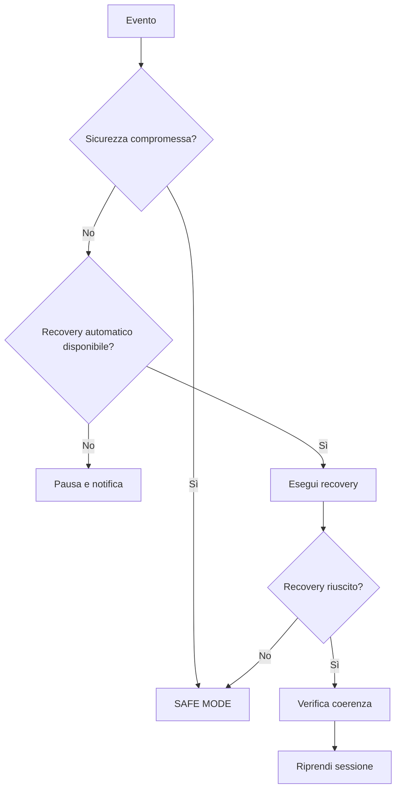

# Capitolo 18 — Procedure di emergenza e ripristino

**Codice documento:** DSG-TM-001-18  
**Revisione:** 0.2 Draft  
**Classificazione:** Engineering Documentation

## 18.1 Scopo

Il presente capitolo definisce la risposta agli eventi anomali che possono compromettere sicurezza, continuità operativa o integrità dei dati dell'Osservatorio Remoto Digital StarGate.

La priorità è sempre:

1. protezione delle persone;
2. protezione della strumentazione;
3. chiusura e messa in sicurezza;
4. conservazione dei dati;
5. ripristino della sessione.

## 18.2 Principi operativi

- **Safety First:** la sicurezza prevale sulla continuità della sessione.
- **Fail Safe:** in caso di dubbio si assume lo stato più sicuro.
- **Determinismo:** ogni evento deve avere una risposta definita.
- **Recovery controllato:** la sessione riprende solo dopo verifica positiva.
- **Tracciabilità:** ogni anomalia deve essere registrata.

## 18.3 Classificazione della gravità

| Livello | Significato | Azione |
|---|---|---|
| INFO | Evento informativo | Log |
| WARNING | Anomalia recuperabile | Recovery automatico |
| ERROR | Recovery fallito | Pausa o stop controllato |
| CRITICAL | Sicurezza compromessa | SAFE MODE |
| EMERGENCY | Rischio immediato | Arresto e intervento locale |

## 18.4 SAFE MODE

Lo stato SAFE MODE deve ottenere, quando possibile:

- esposizioni interrotte;
- guida arrestata;
- movimenti non indispensabili fermati;
- montatura parcheggiata;
- copertura chiusa;
- dispositivi raffreddati riportati a temperatura sicura;
- log salvati;
- operatore notificato.

## 18.5 Diagramma decisionale

## 18.6 Incidente DSG-INC-018-01 — Perdita VPN

**Gravità:** WARNING

### Diagnosi

1. Verificare Starlink.
2. Verificare RUT955.
3. Verificare failover SIM1/SIM2.
4. Verificare servizio OpenVPN.
5. Verificare DNS o endpoint remoto.

### Azione

Se l'automazione locale è stabile, la sessione può proseguire fino al termine pianificato. Se si verifica un secondo evento critico, il sistema deve entrare in SAFE MODE.

## 18.7 Incidente DSG-INC-018-02 — Perdita Starlink

**Gravità:** WARNING

1. Verificare WAN primaria.
2. Attendere il timeout di failover.
3. Verificare commutazione su SIM1.
4. Se necessario, verificare SIM2.
5. Confermare il ripristino della VPN.
6. Registrare durata e linea utilizzata.

## 18.8 Incidente DSG-INC-018-03 — EAGLE non raggiungibile

**Gravità:** ERROR

1. Verificare VPN e routing.
2. Verificare ping dell'EAGLE.
3. Verificare Desktop Remoto.
4. Tentare un riavvio remoto solo se previsto e sicuro.
5. Se lo stato della copertura è sconosciuto, richiedere intervento locale.
6. Non comandare movimenti se la posizione della montatura non è verificabile.

## 18.9 Incidente DSG-INC-018-04 — Sensori copertura incoerenti

**Gravità:** CRITICAL

Esempi:

- OPEN = TRUE e CLOSED = TRUE;
- nessun finecorsa attivo fuori da una fase di movimento;
- SAFE non coerente con OPEN/CLOSED.

### Azione

- bloccare immediatamente tutti i comandi di movimento;
- verificare cablaggio e centralina;
- controllare meccanicamente la copertura;
- consentire nuovi comandi solo dopo risoluzione e test.

## 18.10 Incidente DSG-INC-018-05 — Perdita guida

**Gravità:** WARNING

1. Mettere in pausa le esposizioni.
2. Verificare cielo e SNR della stella guida.
3. Tentare il riaggancio.
4. Se necessario selezionare una nuova stella.
5. Se il problema persiste, terminare la sequenza in modo controllato.

## 18.11 Incidente DSG-INC-018-06 — Pulse Guide Failed

**Gravità:** ERROR

### Diagnosi

1. Verificare connessione PHD2 → ASCOM.
2. Verificare connessione ASCOM → CPWI.
3. Verificare stato CGX-L in CPWI.
4. Analizzare i log PHD2.
5. Verificare eventuale sospensione USB di Windows.
6. Verificare alimentazione e cavo USB della montatura.

### Recovery

1. Arrestare la guida.
2. Ristabilire CPWI e ASCOM.
3. Riconnettere PHD2.
4. Eseguire un test di pulse guide.
5. Eseguire plate solve.
6. Riprendere solo dopo verifica completa.

## 18.12 Incidente DSG-INC-018-07 — Camera non raggiungibile

1. Mettere in pausa la sequenza.
2. Verificare alimentazione.
3. Verificare cavo e porta USB.
4. Verificare driver.
5. Tentare la riconnessione.
6. Se necessario riavviare N.I.N.A.
7. Terminare la sessione se la camera resta non disponibile.

## 18.13 Incidente DSG-INC-018-08 — Autofocus fallito

1. Ripetere l'autofocus una volta.
2. Verificare seeing e nuvole.
3. Verificare backlash.
4. Verificare connessione FocusCube/ESATTO.
5. Verificare saturazione delle stelle.
6. Mettere in pausa o terminare se il problema persiste.

## 18.14 Incidente DSG-INC-018-09 — Meridian flip fallito

**Gravità:** CRITICAL

1. Arrestare esposizioni e guida.
2. Determinare la posizione reale della montatura.
3. Verificare collisioni o rischio di contatto.
4. Non comandare un nuovo slew se la posizione non è nota.
5. Tentare Park solo se sicuro.
6. Chiudere la copertura solo se la geometria lo consente.
7. Richiedere intervento locale se necessario.

## 18.15 Incidente DSG-INC-018-10 — Blackout

**Gravità:** CRITICAL / EMERGENCY

1. Verificare disponibilità UPS, se presente.
2. Salvare i dati se ancora possibile.
3. Arrestare la sessione.
4. Attendere il ritorno dell'alimentazione.
5. Verificare posizione montatura e copertura.
6. Verificare integrità del file system.
7. Rieseguire il Capitolo 16.

> **DA VALIDARE:** presenza, autonomia e dispositivi protetti dall'UPS.

## 18.16 Incidente DSG-INC-018-11 — Meteo UNSAFE

1. Interrompere le esposizioni.
2. Arrestare la guida.
3. Parcheggiare la montatura.
4. Chiudere la copertura.
5. Verificare CLOSED.
6. Disabilitare nuove aperture fino a ritorno SAFE stabile.

## 18.17 Escalation

| Condizione | Escalation |
|---|---|
| Recovery automatico riuscito | Ripresa controllata |
| Recovery fallito ma sistema sicuro | Sessione terminata |
| Stato montatura sconosciuto | Intervento tecnico |
| Copertura non chiudibile | Intervento locale urgente |
| Pioggia con copertura aperta | EMERGENCY |

## 18.18 Registro incidenti

| Campo | Descrizione |
|---|---|
| ID incidente | Identificativo univoco |
| Data/Ora | Timestamp |
| Categoria | Rete / Software / Hardware / Meteo |
| Gravità | INFO–EMERGENCY |
| Sintomo | Descrizione iniziale |
| Recovery | Azioni eseguite |
| Esito | Risolto / Escalato |
| Causa radice | Se disponibile |
| Azione preventiva | Miglioramento proposto |

## 18.19 KPI

| KPI | Definizione |
|---|---|
| MTBF | Tempo medio tra i guasti |
| MTTR | Tempo medio di ripristino |
| Recovery automatici riusciti | Percentuale |
| Incidenti per categoria | Numero mensile |
| Sessioni terminate in SAFE MODE | Numero |
| Incidenti ripetitivi | Numero per causa radice |

## 18.20 Checklist DSG-CHK-018-01 — SAFE MODE

- [ ] Esposizioni interrotte
- [ ] Guida arrestata
- [ ] Stato montatura verificato
- [ ] Park eseguito o non sicuro dichiarato
- [ ] Copertura chiusa o impossibilità registrata
- [ ] Raffreddamento camera gestito
- [ ] Log salvati
- [ ] Operatore notificato
- [ ] Incidente registrato

## 18.21 Registro modifiche

| Revisione | Data | Descrizione |
|---|---|---|
| 0.1 | 2026-07 | Prima bozza |
| 0.2 | 2026-07 | Consolidamento per repository Docs-as-Code |
