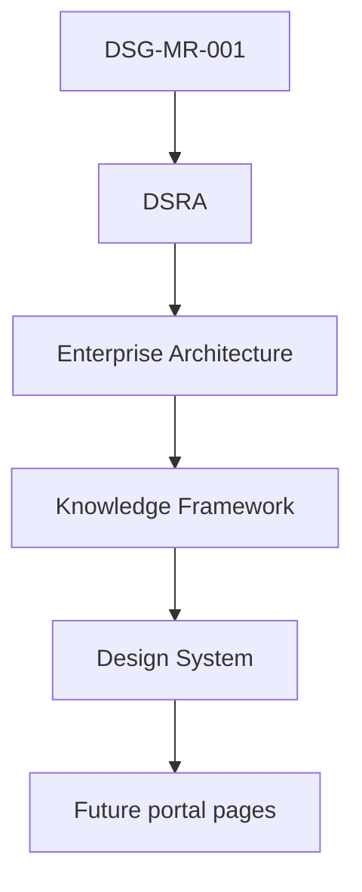

# DSG-DS-001 - Design System Baseline

| Campo | Valore |
|---|---|
| Documento | Design System Baseline |
| ID | `DSG-DS-001` |
| Stato | Official Design System Baseline |
| Versione | 1.0 |
| Data | 2026-07-27 |
| Owner | Chief UX Architect / Design System Architect |
| Fonte gerarchica | `DSG-MR-001` -> DSRA -> Enterprise Architecture -> Knowledge Framework |
| Ambito | Portale Digital StarGate, documentazione MkDocs, dashboard e future interfacce utente |

## Purpose

Questo documento istituisce il Design System Baseline ufficiale del programma Digital StarGate.

Il baseline certifica e formalizza l'esperienza utente gia presente nel portale, senza ridisegnarla e senza introdurre codice applicativo. Ogni futura interfaccia utente dovra derivare da questo baseline e rispettare la gerarchia di governance:

## Vision

Il Design System Digital StarGate deve rendere il portale riconoscibile come ambiente professionale per un osservatorio astronomico remoto: chiaro, leggibile di notte, coerente con MkDocs Material, orientato a dati scientifici, stato operativo, conoscenza architetturale e manutenzione.

La visione non e creare una nuova identita visiva, ma preservare e standardizzare quella esistente: superfici scure, accenti blu/ciano, contenuti tecnici leggibili, dashboard operative e componenti riutilizzabili con prefisso `dsg-`.

## Design Principles

| Principio | Significato | Evidenza corrente |
|---|---|---|
| Continuita visiva | Le nuove pagine devono sembrare parte nativa del portale esistente. | `docs/ui/design-system.md`, `docs/styles/extra.css` |
| Dark-first | L'esperienza deve funzionare bene in uso notturno e ambienti operativi a bassa luce. | Palette navy, slate, indigo e cyan. |
| Engineering clarity | Le informazioni tecniche devono essere dense, scansionabili e verificabili. | Manuali, dashboard, tabelle e assessment. |
| Scientific traceability | Dati, sessioni, KPI e risultati devono mantenere contesto e origine. | Knowledge Framework, Traceability Matrix. |
| Component reuse | Nuove pagine devono riusare componenti e token esistenti prima di crearne nuovi. | Classi `dsg-*`, Material for MkDocs. |
| Accessibility by design | Colore, testo, contrasto, tastiera e responsive behavior sono requisiti di base. | Existing Design System and publication guidelines. |
| Governance alignment | Ogni decisione UI significativa deriva dalla catena roadmap-architecture-knowledge-design. | EA-000, Knowledge Framework. |

## Relationship with Enterprise Architecture

Il Design System deriva dalla Enterprise Architecture Baseline `EA-000` e supporta le viste applicative gia definite:

| Architettura | Impatto sul Design System |
|---|---|
| Business Architecture | Stabilisce missione, stakeholder e capacita che il portale deve rendere visibili. |
| Application Architecture | Definisce i portali e i servizi applicativi a cui i pattern UI devono aderire. |
| Data Architecture | Guida rappresentazione di sessioni, cataloghi, prodotti scientifici e metadati. |
| Technology Architecture | Conferma l'uso del portale MkDocs e delle risorse esistenti come contesto documentale. |
| Security Architecture | Influenza accesso, visibilita, audit e protezione delle informazioni sensibili. |
| Integration Architecture | Informa pattern per stato integrazioni, errori, retry e recovery. |
| Observability Architecture | Guida dashboard, alert, health, metrica e log viewer. |

## Relationship with Knowledge Framework

Il Knowledge Framework fornisce la semantica che il Design System deve rispettare:

| Artefatto Knowledge | Uso nel Design System |
|---|---|
| Domain Model | Nomi e relazioni di oggetti UI come Observation Session, Equipment, Alert e Scientific Product. |
| Canonical Information Model | Identificatori, stati, versioni e metadati visualizzati. |
| Enterprise Glossary | Terminologia ufficiale di label, menu, badge e documentazione UI. |
| Requirements Repository | Requisiti di accessibilita, tracciabilita, sicurezza e qualita. |
| Traceability Matrix | Regole di cross-reference tra pagine, capability e documenti governati. |
| Repository Taxonomy | Naming, cartelle e posizionamento documentale. |
| Repository Quality Model | Criteri di completezza, coerenza, freschezza e validazione. |

## Governance

- Il Design System e il riferimento unico per future interfacce Digital StarGate.
- Nessuna pagina futura deve violare palette, gerarchia, componenti, terminologia o pattern definiti qui.
- Modifiche sostanziali a componenti, colori, layout, navigazione o comportamento richiedono review di design e, se impattano architettura o governance, ADR.
- Il Design System non sostituisce EA-000, Knowledge Framework, ADR o SOP: li consuma e li traduce in regole UX.
- Ogni pagina nuova o modificata deve essere verificata contro `docs/design-system/design-governance.md` e `docs/developer/portal-publication-guidelines.md`.

## Future Evolution

L'evoluzione futura dovra avvenire per estensione controllata:

1. identificare il bisogno UI da capability, requisito, ADR, SOP o manuale;
2. verificare se un pattern esistente copre il bisogno;
3. documentare eventuale estensione nel Design System;
4. aggiornare navigazione e riferimenti;
5. validare staticamente o con `mkdocs build --strict` quando disponibile;
6. registrare la modifica con commit convenzionale e release evidence quando applicabile.

Nuovi framework, librerie o componenti applicativi non sono autorizzati da questo documento. Eventuali scelte tecnologiche future dovranno seguire la governance architetturale.