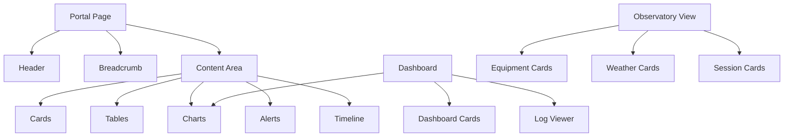

# Component Library

| Campo | Valore |
|---|---|
| Documento | Component Library |
| ID | `DSG-DS-CMP-001` |
| Stato | Controlled Baseline |
| Fonte | Portale corrente, `docs/ui/design-system.md`, `docs/styles/extra.css`, `docs/styles/analytics.css` |

## Purpose

La component library identifica i componenti UI riutilizzabili del portale Digital StarGate. Non implementa componenti e non prescrive codice: stabilisce funzione, contenuto minimo, varianti e regole d'uso.

## Component Inventory

| Componente | Scopo | Contenuto minimo | Regole baseline |
|---|---|---|---|
| Cards | Raggruppare un singolo concetto, documento, capability o link. | Titolo, descrizione, eventuale stato o azione. | Una responsabilita per card; evitare testi lunghi. |
| Dashboard cards | Mostrare KPI o sintesi operativa. | Label, valore, unita, periodo, stato. | `N/D` per dati assenti; non usare zero se non misurato. |
| Status badges | Rappresentare stato operativo o documentale. | Testo esplicito e colore semantico. | Il colore non e sufficiente; usare label. |
| Buttons | Attivare azioni chiare. | Etichetta descrittiva. | Una sola azione primaria dominante per pagina. |
| Forms | Raccogliere input controllati. | Label, helper text, validazione, stato errore. | Da usare solo in future UI autorizzate; non introdotte da questo baseline. |
| Dialogs | Confermare o mostrare decisioni puntuali. | Titolo, messaggio, azioni. | Necessari per azioni distruttive o operative. |
| Tabs | Separare viste correlate dello stesso contesto. | Label brevi. | Non sostituire navigazione principale. |
| Tables | Presentare dati strutturati. | Intestazioni, unita, ordinamento logico. | Supportare responsive e leggibilita tecnica. |
| Charts | Visualizzare trend, distribuzioni e KPI. | Titolo, periodo, unita, legenda, stato dati. | Palette DSG e messaggio dati assenti. |
| Progress indicators | Mostrare avanzamento processi o pipeline. | Nome processo, percentuale/stato, fase. | Evitare animazioni invadenti in uso notturno. |
| Alerts | Segnalare condizioni rilevanti. | Severita, messaggio, causa, azione suggerita. | Usare semantica success/warning/danger/info. |
| Notification panels | Raccogliere notifiche operative o di sistema. | Stato, timestamp, origine, messaggio. | Ordinare per priorita e tempo. |
| Log viewer | Visualizzare log o eventi. | Timestamp, sorgente, livello, messaggio. | Font monospaziato per log; scroll controllato. |
| Timeline | Rappresentare eventi ordinati. | Data/ora, evento, stato, riferimento. | Usare per sessioni, manutenzione, release e incidenti. |
| Equipment cards | Sintetizzare asset osservatorio. | Nome, tipo, stato, integrazione, riferimenti. | Collegare Equipment Registry e manuali. |
| Weather cards | Mostrare meteo e sicurezza. | Condizione, timestamp, stato safe/unsafe, fonte. | Evidenziare safety con testo e colore. |
| Observation cards | Sintetizzare richiesta, target o prodotto osservativo. | Target, sessione, stato, data, link catalogo. | Usare termini del Domain Model. |
| Session cards | Rappresentare sessioni osservative. | Session ID, target, durata, stato, output. | Collegare manifest, raw data e report. |
| Hero | Presentare home, portali o sezioni principali. | Titolo, sottotitolo, azioni, facts. | Usare solo dove serve contesto, non su ogni pagina tecnica. |
| Breadcrumbs | Orientare nel sito. | Percorso gerarchico. | Coerente con MkDocs nav. |
| Admonitions | Evidenziare note, info, warning, danger. | Titolo e contenuto breve. | Usare tipologie Material esistenti. |

## Component Relationship

## Component States

| State | Use |
|---|---|
| Default | Normal available component. |
| Hover | Interactive component under pointer. |
| Focus | Keyboard or accessibility focus. |
| Active | Current selection or active page. |
| Disabled | Unavailable action, with reason if needed. |
| Loading | Data or content pending. |
| Empty | No data available; show `N/D` or explanatory message. |
| Error | Recoverable or blocking error with next action. |

## Reuse Policy

- Prefer Material for MkDocs components and existing `dsg-*` classes.
- Reuse existing color, spacing and elevation tokens.
- Introduce a new component only when no existing component covers the semantic need.
- Document each new component before broad reuse.
- Components must respect Knowledge Framework terminology and traceability.