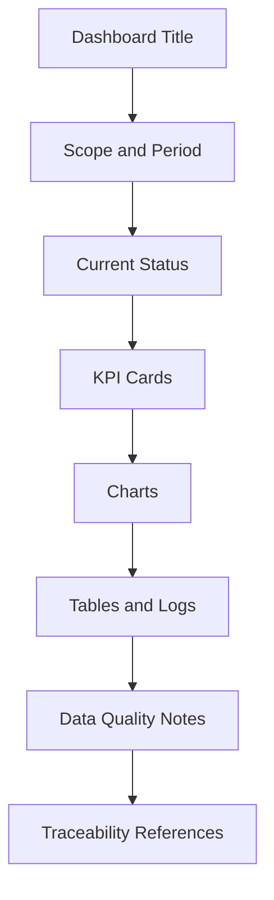

# Dashboard Patterns

| Campo | Valore |
|---|---|
| Documento | Dashboard Patterns |
| ID | `DSG-DS-DASH-001` |
| Stato | Controlled Baseline |
| Fonte | Analytics dashboard corrente, Observability Architecture, Knowledge Framework |

## Dashboard Philosophy

Le dashboard Digital StarGate sono strumenti decisionali e operativi, non pagine decorative. Devono mostrare rapidamente stato, trend, qualita dati, alert e collegamenti a evidenze.

Ogni dashboard deve rispondere a tre domande:

1. qual e lo stato attuale;
2. cosa e cambiato o richiede attenzione;
3. quale evidenza o procedura supporta l'azione successiva.

## Common Structure

## Required Elements

| Elemento | Regola |
|---|---|
| Titolo | Descrive il dominio della dashboard. |
| Periodo | Indica finestra temporale o data refresh. |
| Stato aggiornamento | Mostra quando dati e KPI sono stati aggiornati. |
| KPI principali | Non piu del necessario nella prima vista. |
| Grafici | Con titolo, unita, legenda e stato dati. |
| Tabelle dettaglio | Solo dati necessari a diagnosi o approfondimento. |
| Note qualita | Evidenziano incompletezza, controlli e limiti. |
| Riferimenti | Link a catalogo, sessione, architettura, SOP o runbook. |

## Science Dashboard

| Aspetto | Pattern |
|---|---|
| Scopo | Presentare target, sessioni, prodotti scientifici e pubblicazione. |
| KPI | Target osservati, prodotti validati, copertura temporale, qualita dati. |
| Componenti | Observation cards, charts, tables, status badges. |
| Riferimenti | Observation Catalog, Scientific Product, Data Architecture. |

## Engineering Dashboard

| Aspetto | Pattern |
|---|---|
| Scopo | Monitorare asset, configurazioni, integrazioni e salute tecnica. |
| KPI | Disponibilita equipment, errori integrazione, manutenzioni aperte, configurazioni. |
| Componenti | Equipment cards, log viewer, timeline, alerts. |
| Riferimenti | Equipment Registry, Technology Architecture, Integration Architecture. |

## Operations Dashboard

| Aspetto | Pattern |
|---|---|
| Scopo | Supportare osservazioni, automazione, safety e sessioni remote. |
| KPI | Sessioni completate, sessioni fallite, weather safe, alert attivi. |
| Componenti | Weather cards, session cards, notification panels, progress indicators. |
| Riferimenti | Observability Architecture, SOP, Runbooks. |

## Maintenance Dashboard

| Aspetto | Pattern |
|---|---|
| Scopo | Evidenziare interventi, asset critici, obsolescenza e recovery readiness. |
| KPI | Attivita pianificate, scadenze, incidenti ricorrenti, backup/recovery checks. |
| Componenti | Timeline, equipment cards, status badges, tables. |
| Riferimenti | Maintenance Activity, Technical Manuals, Runbooks. |

## Analytics Dashboard

| Aspetto | Pattern |
|---|---|
| Scopo | Mostrare indicatori aggregati e validazione dello storico osservativo. |
| KPI | Ore acquisizione, immagini, target, filtri, coerenza dataset. |
| Componenti | Dashboard shell, iframe transitorio, charts, quality notes. |
| Riferimenti | Analytics docs, ADR-002, ADR-003, Data Platform. |

## AI Dashboard

| Aspetto | Pattern |
|---|---|
| Scopo | Presentare raccomandazioni AI, evidenze, fonti e stato decisionale. |
| KPI | Raccomandazioni aperte, accettate, respinte, senza evidenza sufficiente. |
| Componenti | AI recommendation cards, evidence tables, alerts, traceability links. |
| Riferimenti | Knowledge Graph Model, AI Assistant, Security Architecture. |

## Dashboard Governance

- Ogni dashboard deve indicare origine dati e stato aggiornamento.
- I KPI devono essere tracciabili a dataset, catalogo, sessione o documento.
- Le raccomandazioni non sono decisioni: diventano decisioni solo tramite governance.
- Alert e condizioni safety devono essere testuali, non solo cromatiche.
- Dashboard future devono riusare palette e componenti baseline.