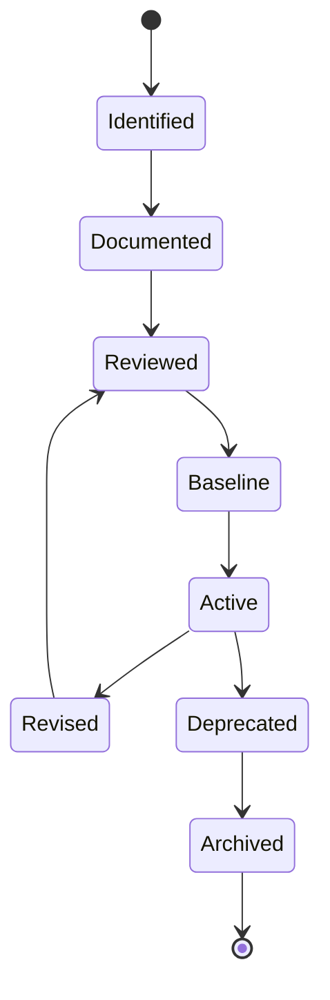
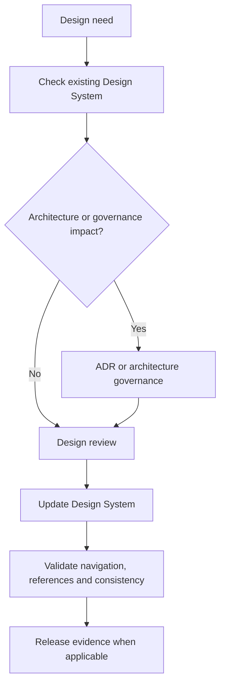

# Design Governance

| Campo | Valore |
|---|---|
| Documento | Design Governance |
| ID | `DSG-DS-GOV-001` |
| Stato | Controlled Baseline |
| Fonte gerarchica | `DSG-MR-001` -> DSRA -> Enterprise Architecture -> Knowledge Framework -> Design System |

## Purpose

Design Governance definisce come il Design System viene mantenuto, versionato, approvato e collegato alle decisioni architetturali. Non sostituisce la governance enterprise: la specializza per l'esperienza utente.

## Component Lifecycle

| Stato | Significato |
|---|---|
| Identified | Bisogno UI identificato da capability, requisito, SOP, dashboard o portale. |
| Documented | Pattern descritto nel Design System. |
| Reviewed | Verifica di coerenza con EA, Knowledge Framework e UI corrente. |
| Baseline | Pattern incluso nel baseline ufficiale. |
| Active | Pattern utilizzabile nelle pagine future. |
| Revised | Pattern aggiornato sotto controllo. |
| Deprecated | Pattern non raccomandato per nuovo uso. |
| Archived | Pattern conservato per tracciabilita. |

## Versioning

| Artefatto | Regola |
|---|---|
| Design System Baseline | Versione maggiore per cambiamenti incompatibili; minore per estensioni coerenti. |
| Componenti | Stato e descrizione aggiornati nel documento componente. |
| Palette | Nuovi token solo se derivati da UI corrente o approvati tramite governance. |
| Pattern dashboard | Aggiornati quando cambiano metriche, dati o architettura osservabilita. |
| Navigazione | Aggiornata in `mkdocs.yml` con commit dedicato. |

## Approval

Le modifiche UI seguono questa catena:

## Deprecation

Un componente o pattern puo essere deprecato quando:

- duplica un pattern migliore;
- viola accessibilita o responsive behavior;
- non rispetta terminologia o tassonomia;
- non e coerente con il portale corrente;
- e sostituito da decisione architetturale approvata.

La deprecazione deve essere documentata. Non cancellare conoscenza governata senza preservare tracciabilita.

## Design Review

Ogni nuova pagina o modifica rilevante deve verificare:

- aderenza a palette e tipografia;
- uso di componenti esistenti;
- coerenza con Knowledge Framework;
- accessibilita base;
- responsive behavior;
- assenza di contenuto duplicato;
- riferimenti corretti a roadmap, architettura, ADR, SOP o manuali.

## Relationship with ADR

Serve ADR quando una modifica UI:

- introduce un nuovo framework o tecnologia frontend;
- cambia architettura di portale o dashboard;
- impatta sicurezza, identita, accesso o audit;
- modifica il modello di pubblicazione;
- altera componenti che rappresentano dati o decisioni architetturali;
- cambia il ruolo dei portali Science, Engineering, Maintenance, Analytics o AI.

Non serve ADR per correzioni editoriali, aggiunte di pagine conformi al baseline o piccoli miglioramenti visuali che riusano componenti esistenti.

## Governance Rules Created by This Baseline

- Il Design System e riferimento obbligatorio per future UI.
- Le pagine future devono preservare l'identita visuale esistente.
- Nuovi componenti devono essere documentati prima di diventare riutilizzabili.
- I termini UI devono derivare dal Glossario Enterprise.
- Le pagine dashboard devono dichiarare origine dati e stato aggiornamento.
- Le modifiche con impatto architetturale richiedono ADR.