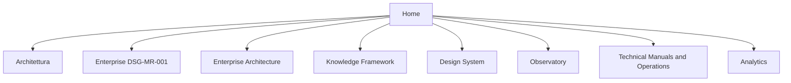

# Navigation Patterns

| Campo | Valore |
|---|---|
| Documento | Navigation Patterns |
| ID | `DSG-DS-NAV-001` |
| Stato | Controlled Baseline |
| Fonte | `mkdocs.yml`, Repository Taxonomy, Portal Publication Guidelines |

## Navigation Hierarchy

La navigazione deve riflettere la struttura governata del repository e non solo la comodita visuale.



## Menu Behavior

| Area | Regola |
|---|---|
| Top navigation | Deve restare coerente con le sezioni MkDocs esistenti. |
| Sidebar | Deve usare label brevi e ordinamento stabile. |
| Enterprise sections | Devono rispettare la gerarchia di governance. |
| Operational manuals | Devono restare raggiungibili e non duplicati in sezioni UI. |
| Design System | Deve contenere solo documentazione di design governance. |

## Breadcrumbs

I breadcrumb devono rappresentare posizione e contesto, non marketing copy.

Formato consigliato:

```text
Home / Design System / Component Library
```

Le pagine integrate in MkDocs possono affidarsi alla navigazione Material; eventuali breadcrumb manuali devono rimanere coerenti con `mkdocs.yml`.

## Search

La ricerca usa il plugin Material configurato nel repository. Il Design System richiede:

- titoli chiari;
- termini del glossario;
- identificativi documentali nei metadati;
- link descrittivi;
- nessun contenuto duplicato che confonda i risultati.

## Knowledge Navigation

Le pagine UI che espongono conoscenza devono collegare:

- Domain Model per oggetti di dominio;
- Canonical Information Model per identificatori e stati;
- Enterprise Glossary per termini ufficiali;
- Traceability Matrix per catena documentale;
- Repository Taxonomy per posizione e naming.

## Cross References

| Tipo riferimento | Regola |
|---|---|
| Roadmap | Usare `DSG-MR-001` quando si cita autorita o scope. |
| Architecture | Linkare la vista architetturale specifica, non solo la sezione generale. |
| Knowledge | Linkare modello, glossary, taxonomy o traceability quando rilevante. |
| ADR | Linkare ADR specifico o Architecture Decision Catalog. |
| SOP/manual/runbook | Linkare il documento operativo quando esiste. |

## Navigation Anti-Patterns

- Creare sezioni parallele che duplicano Enterprise Architecture o Knowledge Framework.
- Inserire pagine in nav senza relazione con la tassonomia.
- Usare label vaghe come `Altro`, `Varie`, `Tools`.
- Spostare documenti governati per ragioni puramente estetiche.
- Nascondere pagine controllate senza motivazione documentata.