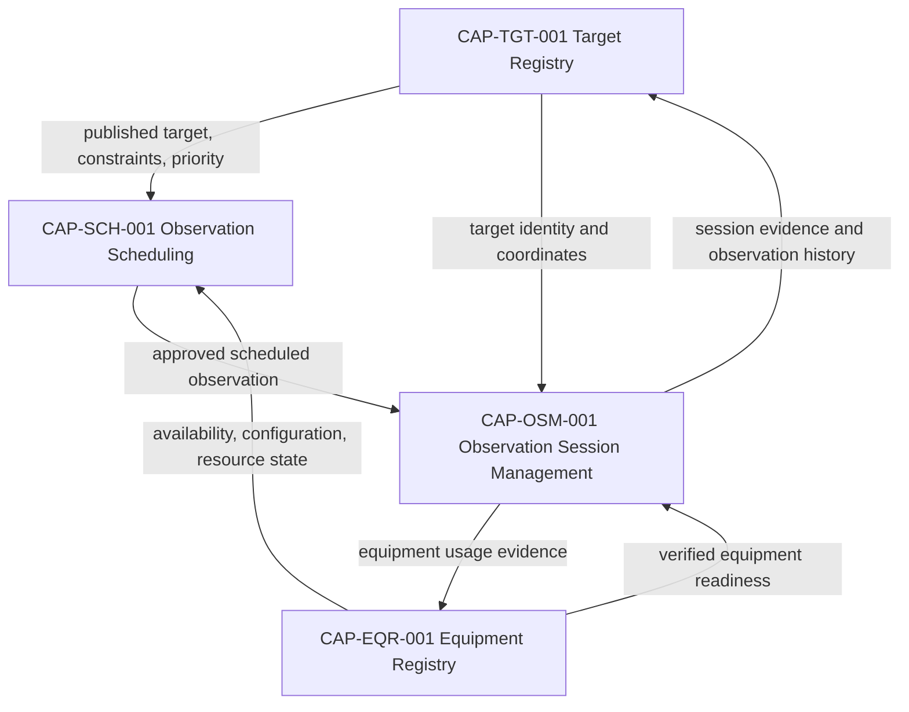
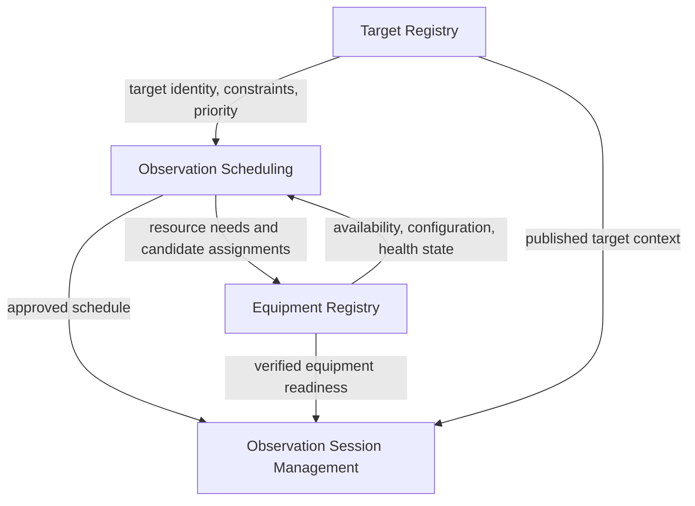

# DOM-001 - Core Observatory Domain Blueprint

| Campo | Valore |
|---|---|
| Documento | Core Observatory Domain Blueprint |
| ID | `DOM-001` |
| Stato | Domain Blueprint Baseline |
| Versione | 0.1 |
| Owner | Enterprise Domain Architect |
| Fonte gerarchica | `DSG-MR-001` -> DSRA -> `EA-000` -> Knowledge Framework -> Design System -> `CAP-000` -> `REL-000` -> Domain Blueprints -> Capability Packages |
| Capability incluse | `CAP-OSM-001`, `CAP-SCH-001`, `CAP-EQR-001`, `CAP-TGT-001` |

## Purpose

Il Core Observatory Domain Blueprint consolida le capability documentate che governano il nucleo operativo dell'osservatorio Digital StarGate: target, equipment, scheduling and observation session management.

Il blueprint non introduce nuova architettura, non ridefinisce confini capability e non crea capability aggiuntive. Rende esplicita la collaborazione tra capability gia approvate e documentate nel repository.

## Scope

Incluso:

- consolidamento del dominio Core Observatory;
- responsabilita e confini del dominio;
- capability gia documentate e loro maturity/readiness;
- collaborazione tra `CAP-TGT-001`, `CAP-SCH-001`, `CAP-EQR-001` and `CAP-OSM-001`;
- interazioni concettuali con Acquisition, Data Platform, Knowledge and Experience domains;
- interfacce concettuali del dominio;
- governance, KPI documentali and traceability.

Escluso:

- nuova architettura enterprise;
- nuovi servizi, API, database, frontend or backend;
- ridefinizione di CAP-001/CAP-002/CAP-003/CAP-TGT;
- dettaglio interno di Acquisition, Data Platform, Knowledge or Experience domains;
- documentazione di Weather Monitoring or Observatory Safety oltre al riferimento come evoluzione futura.

## Business Value

- Allinea target, equipment, schedule and session come nucleo operativo unico.
- Riduce ambiguita tra capability gia documentate.
- Fornisce una vista di dominio per governance, release and traceability.
- Supporta futura implementazione capability-by-capability senza cambiare baseline.
- Rende evidente quali informazioni devono fluire prima dell'acquisizione dati.

## Domain Responsibilities

| Responsibility | Description | Owning Capability |
|---|---|---|
| Target governance | Gestione identita, catalog references, classification, constraints and lifecycle target. | `CAP-TGT-001` |
| Scheduling governance | Trasformazione di richieste e target in schedule approvate and pubblicate. | `CAP-SCH-001` |
| Equipment governance | Registro autorevole di asset fisici/logici, configuration, state and assignments. | `CAP-EQR-001` |
| Session governance | Preparazione, esecuzione, recovery, chiusura and manifest della sessione osservativa. | `CAP-OSM-001` |
| Readiness evidence | Evidenza documentale che target, equipment and schedule siano pronti per sessione. | Shared by included capabilities |
| Traceability | Collegamento tra target, schedule, equipment, session and governance artefacts. | Shared by included capabilities |

## Domain Boundaries

### Belongs to Core Observatory

- Target identity and publication for operational use.
- Equipment identity, configuration and lifecycle state.
- Observation scheduling, priority, conflicts and publication.
- Observation session readiness, execution boundary, recovery and close evidence.
- Conceptual handoff from validated target and equipment to scheduled session.

### Belongs to Other Domains

| Domain | Boundary |
|---|---|
| Acquisition Domain | Image acquisition execution, raw image creation and acquisition-specific data capture after session execution starts. |
| Data Platform Domain | Storage, cataloguing, lineage, archive and scientific product data governance after observation outputs exist. |
| Knowledge Domain | Semantic relationships, glossary, traceability matrix and knowledge graph model beyond Core Observatory flow. |
| Experience Domain | Portals, dashboards, navigation and UI patterns governed by Design System. |
| Safety / Weather Future Domain Extension | Weather safety and observatory safety capability packages when documented. |

## Included Capabilities

| Capability | Purpose | Responsibility | Current Maturity | Current Readiness | Dependencies |
|---|---|---|---|---|---|
| `CAP-TGT-001` Target Registry | Single conceptual source of truth for astronomical targets managed by Digital StarGate. | Target identity, catalogue references, coordinates, classifications, constraints, lifecycle. | Documented | Implementation Ready | Knowledge Framework, CAP-SCH-001, CAP-OSM-001, Data Platform. |
| `CAP-SCH-001` Observation Scheduling | Prepare and publish governed observation schedules. | Astronomical windows, resource availability, weather/safety checks, priority resolution, approval, publication. | Documented | Implementation Ready | CAP-TGT-001, CAP-EQR-001, Weather Monitoring, Observatory Safety, CAP-OSM-001. |
| `CAP-EQR-001` Equipment Registry | Authoritative registry for physical and logical observatory assets. | Equipment identity, type, state, configuration, firmware, drivers, maintenance evidence, assignments. | Documented | Implementation Ready | CAP-SCH-001, CAP-OSM-001, Observatory Safety, Maintenance Portal, Engineering Portal. |
| `CAP-OSM-001` Observation Session Management | Govern the observation session as the operational, informational and traceability unit. | Session preparation, readiness, execution boundary, manifest, recovery, close and knowledge update. | Documented | Implementation Ready | CAP-SCH-001, CAP-TGT-001, CAP-EQR-001, N.I.N.A., ASCOM, Data Platform, Weather/Safety. |

## Capability Collaboration

## Domain Context

| External Domain | Interaction |
|---|---|
| Acquisition Domain | Receives an executable observation context from Observation Session Management and produces acquisition outputs. Core Observatory does not define image acquisition internals. |
| Data Platform Domain | Receives session, target and acquisition evidence for catalogue, archive, lineage and data products. Core Observatory does not define storage or warehouse internals. |
| Knowledge Domain | Consumes governance and traceability evidence, and links target/equipment/session concepts to documentation and knowledge graph. Core Observatory does not define graph implementation. |
| Experience Domain | Future UI surfaces may present targets, equipment, schedules and sessions. Core Observatory does not define UI implementation and remains governed by Design System. |

## Domain Information Flow

## Domain Interfaces

| Interface | Provider | Consumer | Type | Description |
|---|---|---|---|---|
| Published Target Context | `CAP-TGT-001` | `CAP-SCH-001`, `CAP-OSM-001` | Conceptual information | Canonical target, coordinates, type, constraints, priority and lifecycle state. |
| Equipment Readiness Context | `CAP-EQR-001` | `CAP-SCH-001`, `CAP-OSM-001` | Conceptual information | Equipment identity, state, configuration, health, assignment and lifecycle. |
| Approved Schedule Context | `CAP-SCH-001` | `CAP-OSM-001` | Conceptual handoff | Scheduled Observation, observation window, priority, constraints and approval evidence. |
| Session Evidence Context | `CAP-OSM-001` | Data Platform, Knowledge Domain, CAP-TGT-001, CAP-EQR-001 | Conceptual evidence | Session result, manifest evidence, target usage and equipment usage references. |
| Governance Evidence | All included capabilities | CAP-000, REL-000, Knowledge Framework | Documentation evidence | ADR, SOP, runbook, manual, test, acceptance and traceability links. |

## Governance

This domain blueprint derives from and must remain consistent with:

- `DSG-MR-001` Master Roadmap;
- DSRA;
- `EA-000` Enterprise Architecture Baseline;
- Knowledge Framework;
- `DSG-DS-001` Design System Baseline for any future experience surface;
- `CAP-000` Capability Registry;
- `REL-000` Release Management Baseline;
- capability packages `CAP-OSM-001`, `CAP-SCH-001`, `CAP-EQR-001`, `CAP-TGT-001`.

The blueprint does not change lifecycle state, readiness, release rules or capability ownership.

## KPIs

Governance KPIs only:

| KPI | Definition | Current Evidence |
|---|---|---|
| Capability Coverage | Included Core Observatory capability packages documented vs expected for this blueprint. | 4 / 4 documented. |
| Documentation Coverage | Required capability package artefacts present for included capabilities. | Overview, process, requirements, mapping, data model, ADR, SOP, runbooks, manual, tests, acceptance, traceability exist for included packages. |
| Traceability Coverage | Included capabilities trace to Roadmap, DSRA, EA, Knowledge, CAP-000 and REL-000. | Present in capability traceability documents. |
| Implementation Readiness | Included capabilities marked Implementation Ready in CAP-000. | 4 / 4 Implementation Ready. |
| Governance Alignment | Domain blueprint does not introduce new capability, architecture or implementation. | This document is consolidation only. |

## Traceability

| Capability | Package | Registry Reference | Release Reference | Domain Role |
|---|---|---|---|---|
| `CAP-TGT-001` Target Registry | `docs/capabilities/target-registry/` | `CAP-000` Target Registry entry | `REL-000` capability reference | Target identity and constraints source. |
| `CAP-SCH-001` Observation Scheduling | `docs/capabilities/observation-scheduling/` | `CAP-000` Observation Scheduling entry | `REL-000` capability reference | Schedule approval and publication. |
| `CAP-EQR-001` Equipment Registry | `docs/capabilities/equipment-registry/` | `CAP-000` Equipment Registry entry | `REL-000` capability reference | Equipment readiness and resource state. |
| `CAP-OSM-001` Observation Session Management | `docs/capabilities/observation-session-management/` | `CAP-000` Observation Session Management entry | `REL-000` lifecycle rules | Session lifecycle and handoff to acquisition/data. |

## Future Evolution

The following capabilities are already present in `CAP-000` and naturally extend the Core Observatory domain. They are not documented by this blueprint:

| Capability | CAP-000 Identifier | Note |
|---|---|---|
| Weather Monitoring | `CAP-WEA-001` | Current registry identifier. No `CAP-WTH-001` entry is introduced by this blueprint. |
| Observatory Safety | `CAP-SAF-001` | Future domain extension candidate. |

Future extension must follow the approved governance chain and create capability/domain documentation only through governed release activity.
