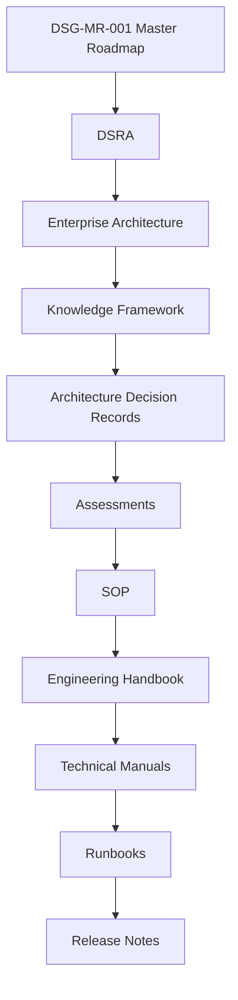
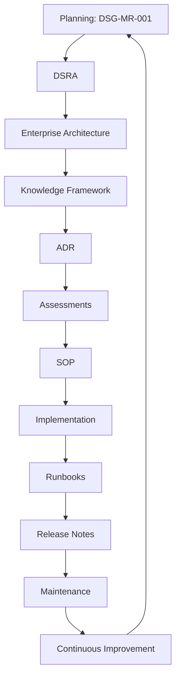

# EA-000 - Enterprise Architecture Baseline

| Campo | Valore |
|---|---|
| Documento | Enterprise Architecture Baseline |
| ID | `EA-000` |
| Stato | Official Architecture Baseline |
| Versione | 1.0 |
| Data | 2026-07-27 |
| Owner | Chief Enterprise Architect |
| Fonte gerarchica | `DSG-MR-001` |
| Vincolo | Master Roadmap frozen |

## Purpose

This document formally establishes the Digital StarGate Enterprise Architecture Baseline.

The baseline certifies the current repository state as the official architectural reference from which every future activity shall derive. It does not introduce new architecture, new governance, implementation work, software, APIs, databases or deployment scope.

The baseline exists to:

- confirm that the Enterprise Architecture phase is complete for the current governance stage;
- preserve the frozen authority of `DSG-MR-001`;
- bind DSRA, Enterprise Architecture, Knowledge Framework, ADRs, assessments, SOPs, manuals, runbooks and release notes into one governed chain;
- define the compliance rules that future work must respect.

## Scope

This baseline covers the architectural and knowledge artefacts currently present in the repository, including:

- Master Roadmap authority: `docs/enterprise-roadmap/DSG-MR-001-master-roadmap.md`;
- DSRA and reference architecture artefacts: `DSRA-000`, `DSRA-001` and `docs/enterprise/DSRA-risk-assessment.md`;
- Enterprise Architecture views in `docs/enterprise-architecture/`;
- Enterprise Solution Blueprint artefacts in `docs/enterprise-solution-blueprint/`;
- Knowledge Framework artefacts in `docs/knowledge/`;
- ADR catalog and existing ADRs;
- downstream governance layers for assessments, SOP, Engineering Handbook, technical manuals, runbooks and release notes.

The scope is documentary and architectural. It explicitly excludes implementation, software development, backend, frontend, APIs, databases and runtime deployment changes.

## Architectural Principles

The baseline preserves the principles already adopted by the repository architecture:

| Principle | Baseline interpretation | Reference |
|---|---|---|
| Roadmap authority | `DSG-MR-001` remains the highest source of scope, sequencing and governance. | Master Roadmap, Repository Map |
| DSRA alignment | Enterprise Architecture derives from DSRA and may not bypass risk and reference architecture. | DSRA, Repository Map |
| Layered governance | Each documentation layer derives from the previous layer and informs the next one. | Repository Map, Traceability Matrix |
| No orphan architecture | Every architecture element must remain traceable to roadmap, DSRA and downstream evidence. | `docs/knowledge/traceability-matrix.md` |
| Decision control | Architecture changes require ADR governance or higher-level roadmap/DSRA evolution. | `docs/enterprise-architecture/architecture-decision-catalog.md` |
| Knowledge consistency | Terms, information objects, requirements, capabilities and taxonomy are governed by the Knowledge Framework. | `docs/knowledge/` |
| Implementation separation | Architecture certification does not create implementation work. | Enterprise Architecture, Knowledge Framework |
| Open decisions remain open | Unknown topics are recorded in decision catalogues and are not resolved by assumption. | Architecture Decision Catalog, Knowledge Framework |

## Governance Hierarchy

The official Digital StarGate governance hierarchy is immutable for this baseline:

No document may bypass this chain. Knowledge Framework is positioned after Enterprise Architecture as the semantic backbone that organizes terminology, entities, requirements, traceability and quality before downstream ADR, assessment and operating artefacts are produced or revised.

## Enterprise Architecture Layers

This baseline summarizes the layers already documented. Detailed content remains in the referenced documents.

| Layer | Baseline summary | Reference |
|---|---|---|
| Business Architecture | Defines mission, capabilities, stakeholders, value streams and operating model for an automated astronomical observatory. | `docs/enterprise-architecture/business-architecture.md` |
| Application Architecture | Defines application services including observatory control, session management, scheduling, registries, processing, portals, analytics and AI support. | `docs/enterprise-architecture/application-architecture.md` |
| Data Architecture | Defines enterprise information objects and astronomical data lifecycle from request to archive and scientific products. | `docs/enterprise-architecture/data-architecture.md` |
| Technology Architecture | Defines physical deployment context, observatory nodes, EAGLE, Windows, astronomy software, storage, network and remote access. | `docs/enterprise-architecture/technology-architecture.md` |
| Security Architecture | Defines identity, authentication, authorization, VPN, secrets, certificates, audit, backup encryption and disaster recovery concerns. | `docs/enterprise-architecture/security-architecture.md` |
| Integration Architecture | Defines integrations with N.I.N.A., ASCOM, Alpaca, CPWI, PHD2, PixInsight, ASTAP, AllSky, OpenAI, Astrometry.net, TNS, AAVSO, GitHub, Teltonika, Weather Station and Cloud Storage. | `docs/enterprise-architecture/integration-architecture.md` |
| Observability Architecture | Defines logging, telemetry, metrics, health checks, alerts, weather safety, observatory safety, session monitoring and recovery triggers. | `docs/enterprise-architecture/observability-architecture.md` |
| Knowledge Framework | Defines semantic domain model, canonical information model, glossary, requirements repository, maturity model, traceability matrix, taxonomy, governance, conceptual Knowledge Graph and quality model. | `docs/knowledge/` |

## Repository Structure

The repository structure is governed by the Architecture Repository Map and MkDocs navigation.

| Repository area | Baseline role | Reference |
|---|---|---|
| `docs/enterprise-roadmap/` | Master Roadmap authority. | `docs/enterprise-roadmap/DSG-MR-001-master-roadmap.md` |
| `docs/enterprise-architecture/` | Enterprise Architecture views, decision catalog, repository map and this baseline. | `docs/enterprise-architecture/repository-map.md` |
| `docs/enterprise-solution-blueprint/` | Logical solution decomposition, data flows, component registry and integration catalog. | `docs/enterprise-solution-blueprint/index.md` |
| `docs/knowledge/` | Knowledge Framework and semantic governance layer. | `docs/knowledge/repository-taxonomy.md` |
| ADR locations | Existing architecture decisions and enterprise documentation baseline ADRs. | `docs/enterprise-architecture/architecture-decision-catalog.md` |
| Enterprise and chapter documentation | Assessments, SOP, handbook, technical manuals, runbooks and release documentation. | `docs/enterprise-architecture/repository-map.md` |

## Traceability

Traceability is enforced by the repository governance chain, the Architecture Repository Map and the Knowledge Framework Traceability Matrix.

Every future controlled artefact shall maintain traceability across:

1. Roadmap authority;
2. DSRA alignment;
3. Enterprise Architecture reference;
4. Knowledge Framework terminology and taxonomy;
5. ADR decision status where applicable;
6. assessment evidence;
7. SOP and manual derivation;
8. runbook and release evidence.

The active traceability control is documented in `docs/knowledge/traceability-matrix.md`. The repository map is documented in `docs/enterprise-architecture/repository-map.md`.

## Architecture Lifecycle

The baseline architecture lifecycle is summarized below.

| Lifecycle stage | Baseline meaning |
|---|---|
| Planning | Roadmap defines authorized direction and remains frozen for this baseline. |
| Architecture | Enterprise Architecture defines the current official architectural baseline. |
| Knowledge | Knowledge Framework stabilizes terminology, requirements, entities and traceability. |
| ADR | Architecture decisions refine or change architecture only through approved records. |
| SOP | Procedures derive from architecture, knowledge, ADR and assessments. |
| Implementation | Implementation proceeds only from governed capabilities and approved decisions. |
| Runbooks | Operational execution and recovery evidence derive from manuals and SOPs. |
| Release Notes | Releases record completed, validated and traceable changes. |
| Maintenance | Architecture and knowledge are reviewed when triggered by governance, risk, operation or release evidence. |
| Continuous Improvement | Improvements feed future roadmap, DSRA or ADR evolution without bypassing the chain. |

## Architecture Freeze Policy

The Enterprise Architecture is now baselined.

Future architectural evolution shall occur only through:

- roadmap evolution approved under roadmap governance;
- DSRA evolution approved under risk/reference architecture governance;
- approved ADRs that explicitly reference the roadmap, DSRA, affected architecture layer and Knowledge Framework impact.

Direct modification of baseline architecture is not permitted. Changes that affect architecture scope, security, data lifecycle, deployment, integration, observability, application boundaries or governance must be routed through the approved governance chain.

## Architectural Compliance

Every future document shall:

- reference `DSG-MR-001`;
- reference the applicable DSRA artefact or DSRA layer;
- reference the applicable Enterprise Architecture layer;
- reference related ADRs or the Architecture Decision Catalog;
- maintain traceability through the Knowledge Framework Traceability Matrix;
- respect the Repository Taxonomy;
- use terms consistently with the Enterprise Glossary;
- preserve the governance hierarchy;
- record unknowns as open decisions rather than assumptions;
- avoid introducing implementation detail unless the document is in an authorized downstream implementation or operating layer.

## Current Repository Status

| Area | Status | Baseline statement |
|---|---|---|
| Enterprise Architecture | Completed | Business, application, data, technology, security, integration and observability layers are present. |
| Enterprise Solution Blueprint | Completed | Logical architecture, data architecture, component registry, integrations and open decisions are present. |
| Knowledge Framework | Completed | Domain model, canonical information model, glossary, requirements, maturity, traceability, governance, Knowledge Graph model, taxonomy and quality model are present. |
| Traceability | Completed for current baseline | Architecture elements are mapped through the Knowledge Framework traceability matrix. |
| Governance | Completed for current baseline | Repository hierarchy, decision catalog and lifecycle controls are documented. |
| Implementation | Not complete | Implementation shall proceed in future phases, capability by capability, under this baseline. |

## Open Architectural Decisions

Open architectural decisions are not duplicated in this baseline.

The canonical source is `docs/enterprise-architecture/architecture-decision-catalog.md`. Related solution and knowledge open decisions shall remain traceable to that catalog during future maintenance.

## Next Phase

Digital StarGate now enters the implementation phase.

Implementation shall proceed capability by capability, with each increment deriving from the baselined architecture, Knowledge Framework, approved ADRs and applicable SOP/manual/runbook evidence.

No additional enterprise architecture layers shall be created unless approved through governance. Future work shall refine, implement or operate the baseline rather than redesign it.
