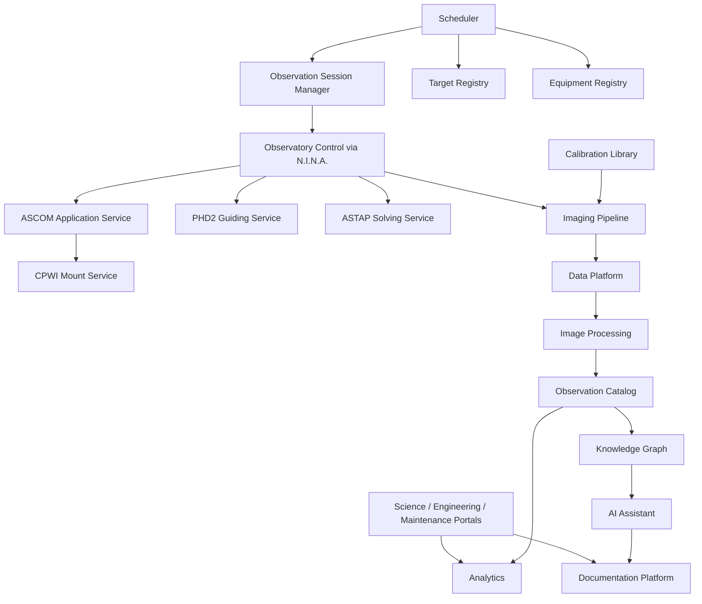
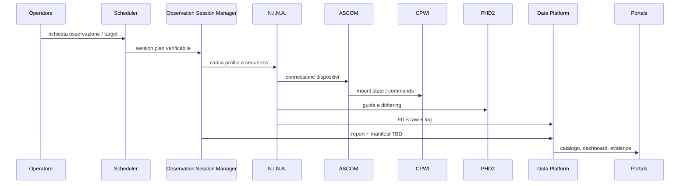

# DSG-EA-AA-001 - Application Architecture

| Campo | Valore |
|---|---|
| Layer | Application Architecture |
| Stato | Proposed refinement |
| Versione | 0.1 |
| Data | 2026-07-27 |
| Fonte gerarchica | `DSG-MR-001` |
| DSRA | `DSRA-000`, `DSRA-001` |

## Scopo

Descrivere i servizi applicativi Digital StarGate, separando componenti AS-IS documentati, componenti logici di transizione e capability TO-BE. Questa architettura non implementa applicazioni: definisce responsabilita, interfacce e dipendenze governate.

## Logical Dependency View

## Application Services Catalog

| Application Service | Purpose | Responsibilities | Interfaces | Dependencies | Consumed services | Provided services | Related ADR | Related SOP | Lifecycle status | Traceability |
|---|---|---|---|---|---|---|---|---|---|---|
| Observatory Control | Controllare dispositivi astronomici e stato operativo locale | Connessione device, Park/Unpark, mount, camera, focuser, filter wheel, solve | N.I.N.A., ASCOM, CPWI, PHD2, ASTAP | EAGLE, Windows, CGX-L, camere | Weather safety, Equipment Registry | Device state, acquisition readiness | `ADR-001` | Capitoli 16-17 | AS-IS | Roadmap Operations; DSRA Observatory; Manuali 6-14 |
| Observation Session Manager | Governare sessione come unita tracciabile | Readiness, sequenza, eventi, log, chiusura dati, manifest TBD | File/report, N.I.N.A., log app | Scheduler, Observatory Control, Data Platform | Target Registry, Equipment Registry, Calibration Library | Session report, Session Manifest | `ADR-001` / OPEN manifest | Capitoli 16-17, 28 | Transition | Roadmap Data/Operations; DSRA Data lineage |
| Scheduler | Preparare piani osservativi | Target, finestra, meteo, luna, profilo ottico, priorita | Target registry, session plan TBD | Observatory readiness, Equipment Registry | Target data, weather state | Observation Request, Session Plan | OPEN | OPEN / Capitolo 17 | TO-BE | Roadmap Operations; DSRA TO-BE |
| Equipment Registry | Governare asset e configurazioni | CGX-L, C8, Quattro, camere, filtri, fuocheggiatori, driver, profili | Markdown/registry TBD | Manuali tecnici, backup configurazioni | Asset/manual data | Configurazioni standard | OPEN | Capitolo 22 | Transition | Roadmap Observatory; DSRA Asset TBD; Manuali 7-10,22 |
| Target Registry | Gestire target candidati e osservati | Coordinate, priorita, filtri, configurazione, stato osservazione | Registry TBD | Scheduler, Science Portal | Observation Request | Target backlog | OPEN | OPEN | TO-BE | Roadmap Data/Community; DSRA Knowledge TBD |
| Calibration Library | Gestire frame e master calibration | Dark, flat, bias, dark-flat, validita per camera/config | File system/calibration catalog | Equipment Registry, Imaging Pipeline | Raw calibration frames | Master Calibration | OPEN | Capitolo 28 | Transition | Roadmap Data; Manuali 10,28 |
| Imaging Pipeline | Acquisire e organizzare FITS | Light frames, naming, header, logs, raw workspace | N.I.N.A., file system | Observatory Control, Calibration Library | Session Plan, device state | Raw Images, acquisition log | `ADR-001` | Capitolo 17 | AS-IS / Transition | Roadmap Image Repository; Manuali 11-17 |
| Image Processing | Elaborare raw in prodotti | Calibrazione, registrazione, integrazione, export, metriche | PixInsight, FITS/XISF/export | Data Platform, Calibration Library | Raw Images, Master Calibration | Registered, Integrated, Processed Images | OPEN | Capitolo 28 | Transition | Roadmap Data/Analytics; Manuale 28 |
| Knowledge Graph | Collegare conoscenza architetturale e osservativa | Entita asset-target-sessione-documento-ADR-rischio | Storage graph TBD | Data Platform, Documentation Platform | Observation Catalog, registri, ADR | Relazioni, context retrieval | OPEN | OPEN | TO-BE | Roadmap Knowledge; DSRA KG TBD |
| AI Assistant | Supportare analisi e ricerca non safety | Retrieval, sintesi, troubleshooting, audit, human review | OpenAI TBD, KG, docs | Knowledge Graph, Governance | Fonti approvate, prompt sanitizzati | Suggerimenti revisionabili | OPEN | OPEN | TO-BE | Roadmap AI; Governance AI; DSRA Safety boundary |
| Analytics | Produrre KPI e dashboard | Warehouse, quality gates, dashboard, validation history | Dataset, dashboard statiche | Data Platform, Documentation Platform | Observation Catalog, logs | KPI, dashboard, quality evidence | `ADR-002`, `ADR-003` | Release docs | Transition | Roadmap Analytics; DSRA Data lineage |
| Science Portal | Pubblicare risultati scientifici/astrofotografici | Osservazioni, immagini finali, metadata, submission candidate | MkDocs/GitHub Pages | Image Processing, Observation Catalog | Processed Images, metadata | Pagine science, catalog views | OPEN | OPEN | TO-BE / Transition | Roadmap Community/Data; DSRA Web Portal |
| Engineering Portal | Pubblicare architettura e controllo tecnico | EA, blueprint, ADR, registri, dashboard engineering | MkDocs/GitHub Pages | Documentation, Analytics | ADR, registri, KPI | Manuale tecnico navigabile | `DSG-ADR-004` | Release docs | Transition | Roadmap Documentation; DSRA Documentation |
| Maintenance Portal | Supportare manutenzione e recovery | Incident, backup, asset, obsolescenza, checklist | MkDocs/GitHub Pages | Documentation, Backup, Equipment Registry | Log, backup evidence, asset status | Runbook e checklist | OPEN | Capitoli 18, 21, 30-32 | Transition | Roadmap Operations/DR; DSRA Transition |
| Documentation Platform | Source of record documentale | MkDocs, GitHub, registri, SOP, release notes | GitHub, Markdown, mkdocs.yml | PC Principale, Governance | Architecture, manuals, ADR | Sito statico, release evidence | `DSG-ADR-004` | Governance/release SOP | AS-IS / Transition | Roadmap Documentation; DSRA Web Portal |

## Application Interaction View

## Consumed and Provided Services Summary

| Provider | Provided service | Consumers |
|---|---|---|
| Observatory Control | Device state, acquisition readiness | Session Manager, Scheduler, Imaging Pipeline |
| Scheduler | Session Plan | Session Manager, Operator |
| Calibration Library | Master Calibration | Imaging Pipeline, Image Processing |
| Data Platform | Observation Catalog, curated datasets | Analytics, KG, Portal, Archive |
| Documentation Platform | Published documentation and governance evidence | Engineering Portal, Maintenance Portal, AI Assistant |
| Analytics | KPI and quality gates | Engineering Portal, Governance, Release readiness |

## ArchiMate Application Viewpoint

| ArchiMate concept | Digital StarGate element |
|---|---|
| Application Component | N.I.N.A., ASCOM, CPWI, PHD2, ASTAP, PixInsight, MkDocs, Warehouse |
| Application Service | Observatory Control, Imaging Pipeline, Analytics, Documentation Platform |
| Application Interface | ASCOM driver, PHD2 integration, file system, GitHub/MkDocs, OpenAI API TBD |
| Data Object | Observation Manifest, Raw Images, Catalog, Knowledge Graph |

## Open Architectural Decisions

Open decisions are maintained in [Architecture Decision Catalog](architecture-decision-catalog.md#open-architectural-decisions). This application layer does not close Scheduler, Target Registry, Equipment Registry schema, Knowledge Graph, AI Assistant, Science Portal or Maintenance Portal decisions.