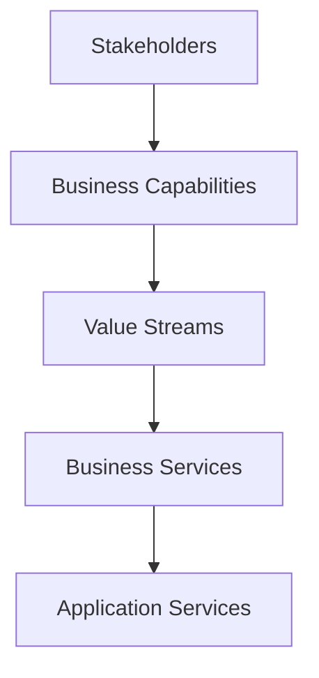
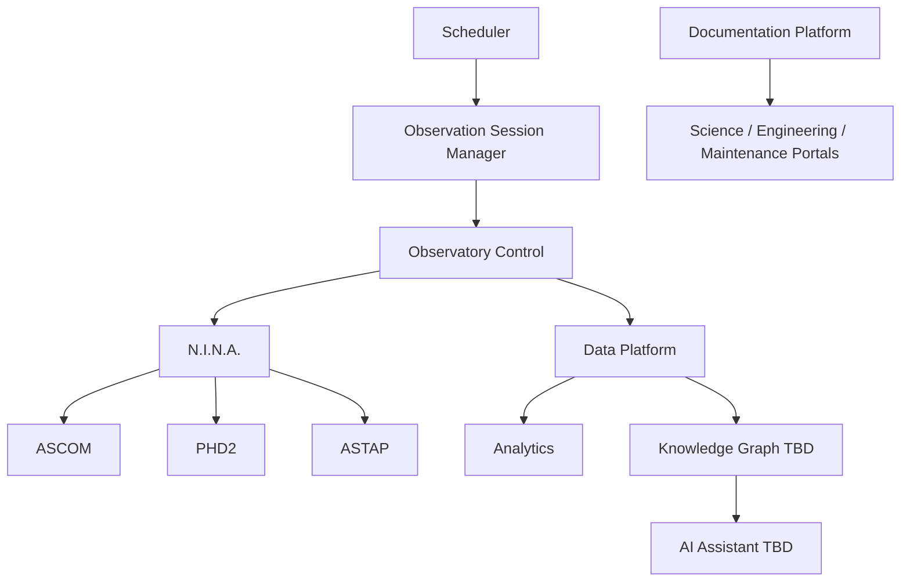
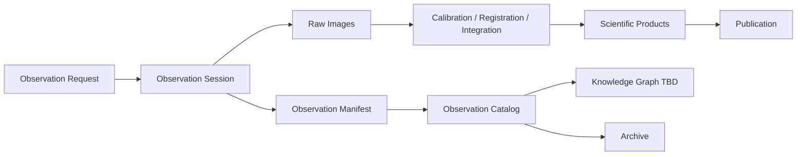
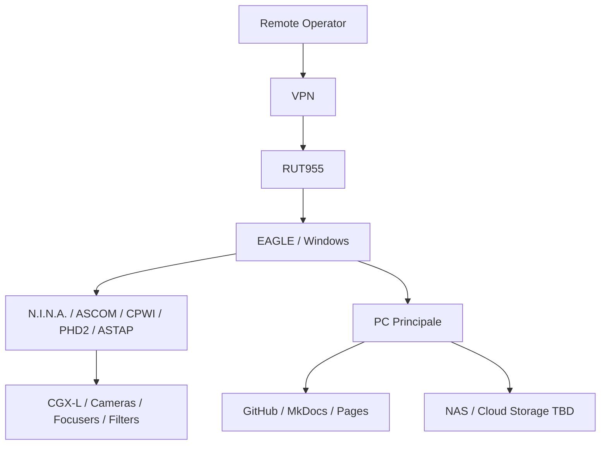
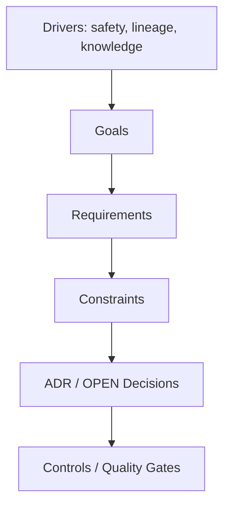
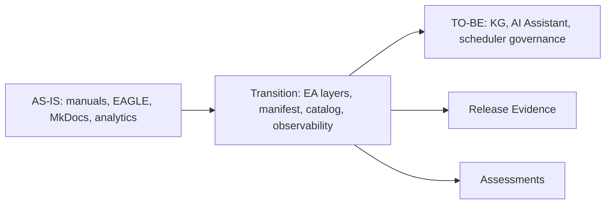

# DSG-EA-AVP-001 - ArchiMate Viewpoints

| Campo | Valore |
|---|---|
| Documento | ArchiMate Viewpoints |
| Stato | Proposed refinement |
| Versione | 0.1 |
| Data | 2026-07-27 |
| Fonte gerarchica | `DSG-MR-001` |

## Scopo

Organizzare l'Enterprise Architecture Digital StarGate secondo viewpoint ArchiMate adattati al dominio osservativo, senza introdurre strumenti o repository esterni. I viewpoint sono descrittivi e usano Mermaid/tabelle nei documenti Markdown.

## Viewpoint Catalog

| Viewpoint | Purpose | Primary document | Key elements | Traceability |
|---|---|---|---|---|
| Business | Mission, capability, servizi, stakeholder, value stream | [Business Architecture](business-architecture.md) | Business Actor, Role, Service, Function, Value Stream | Roadmap Operations/Data/Documentation; DSRA target/reference |
| Application | Servizi applicativi e dipendenze | [Application Architecture](application-architecture.md) | Application Component, Service, Interface, Data Object | ADR-001/002/003/004, SOP, manuals |
| Information | Oggetti informativi e relazioni dati | [Data Architecture](data-architecture.md) | Business Object, Data Object, Representation, Meaning | Data roadmap, DSRA data lineage, ADR-003 |
| Technology | Nodi, dispositivi, rete e deployment | [Technology Architecture](technology-architecture.md) | Node, Device, System Software, Communication Network, Artifact | DSRA PC/EAGLE separation, manuals 5-14, 21 |
| Security/Motivation | Driver, requisiti, vincoli e controlli | [Security Architecture](security-architecture.md), [Architecture Decision Catalog](architecture-decision-catalog.md) | Driver, Goal, Requirement, Constraint, Assessment | Governance, DSRA, ADR, open decisions |
| Integration/Cross-layer | Relazioni tra business, app, tecnologia e dati | [Integration Architecture](integration-architecture.md) | Serving, Access, Flow, Triggering | Integration catalog, manuals, SOP |
| Implementation & Migration | Plateau, gaps, roadmap e release evidence | [Repository Map](repository-map.md), [Observability Architecture](observability-architecture.md) | Work Package, Deliverable, Plateau, Gap | DSG-MR-001, assessments, release docs |

## Business Viewpoint

Focus: Operate Observatory, Prepare Observation, Acquire Scientific Data, Calibrate Data, Process Images, Validate Results, Publish Results, Preserve Knowledge, Support Engineering, Support Scientific Research, Continuous Improvement.

## Application Viewpoint

Focus: application services and their provided/consumed services.

## Information Viewpoint

Focus: lifecycle and relationships of data objects.

## Technology Viewpoint

Focus: nodes, devices, networks and artifacts.

## Motivation Viewpoint

Focus: why architectural elements exist and which constraints govern them.

## Implementation & Migration Viewpoint

Focus: movement from AS-IS to Transition to TO-BE without bypassing roadmap freeze.

## Cross-Reference Matrix

| Element | Business | Application | Data | Technology | Security | Integration | Observability |
|---|---|---|---|---|---|---|---|
| Observation Session | Value stream | Session Manager | Manifest/metadata | EAGLE/N.I.N.A. | safety controls | N.I.N.A./ASCOM/PHD2 | logs/health checks |
| Raw Images | Acquire Scientific Data | Imaging Pipeline | Raw Image object | EAGLE/storage | backup protection | file sync | file count/hash |
| Weather Safety | Operate Observatory | Observatory Control | weather evidence | Weather Station/AllSky | UNKNOWN unsafe | sensor integration | alerts/recovery |
| Publication | Publish Results | Documentation/Portal | Scientific Product | GitHub/MkDocs | no secrets | GitHub/Pages | build/link evidence |
| Knowledge Graph | Preserve Knowledge | KG service TBD | graph object | storage TBD | data governance | KG/OpenAI TBD | provenance checks |

## No External Tooling Requirement

The viewpoint models are maintained as Markdown, Mermaid and tables. Any future adoption of ArchiMate tooling is an OPEN decision and cannot be required by this baseline.