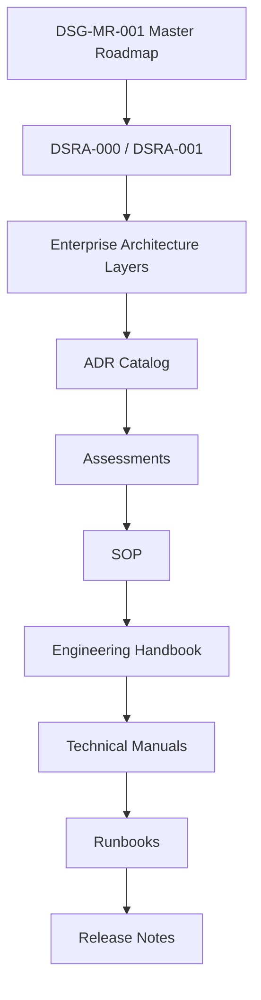

# DSG-EA-ADC-001 - Architecture Decision Catalog

| Campo | Valore |
|---|---|
| Documento | Architecture Decision Catalog |
| Stato | Proposed refinement |
| Versione | 0.1 |
| Data | 2026-07-27 |
| Fonte gerarchica | `DSG-MR-001` |
| DSRA | `DSRA-000`, `DSRA-001` |

## Scopo

Fornire il catalogo decisionale dell'Enterprise Architecture Digital StarGate. Le decisioni approvate sono solo quelle documentate negli ADR esistenti o nella baseline DSRA/EAM. Le decisioni mancanti restano OPEN.

## Decision Hierarchy

## Approved Architectural Decisions

| Decision | Status | Scope | Architectural impact | Roadmap | DSRA | Related ADR | Related SOP | Related Manual |
|---|---|---|---|---|---|---|---|---|
| `ADR-001` Session Layer | Accepted | Session model | Session as traceable unit for acquisition/data/reporting | Operations/Data | `DSRA-001` Data lineage | `docs/architecture/ADR-001-Session-Layer.md` | Capitoli 16-17 | N.I.N.A./session reports |
| `ADR-002` Analytics Quality Gates | Accepted | Analytics validation | Dashboard and KPI require quality gates | Analytics | `DSRA-001` Data lineage | `docs/architecture/ADR-002-Analytics-Quality-Gates.md` | Release docs | Analytics docs |
| `ADR-003` Warehouse Engine | Accepted | Data/warehouse | Warehouse engine supports analytics dataset governance | Data/Analytics | `DSRA-001` Data | `docs/architecture/ADR-003-Warehouse-Engine.md` | Data governance | Warehouse docs |
| `DSG-ADR-004` Enterprise documentation baseline | Accepted | Documentation governance | MkDocs/enterprise docs are governed baseline | Documentation/Governance | `DSRA-001` Documentation | `docs/enterprise/adr/ADR-004-enterprise-documentation-baseline.md` | Release documentation | Enterprise docs |
| `DSRA-000-DEC-001` Roadmap source | Approved baseline | Architecture governance | Target architecture derives from `DSG-MR-001` | All | `DSRA-000` | DSRA baseline | Governance | Enterprise architecture |
| `DSRA-000-DEC-002` PC/EAGLE separation | Approved baseline | Operating model | PC Principale and EAGLE have distinct responsibilities | Operations/Documentation | `DSRA-000` | DSRA baseline | SOP operations | Capitoli 5-17 |
| `DSRA-000-DEC-003` AI/KG TO-BE | Approved baseline | AI/Knowledge | AI and KG require governance before implementation | AI/Knowledge | `DSRA-000` | DSRA baseline | Governance AI | Knowledge docs |
| `DSRA-001-DEC-001` PC governance role | Approved baseline | Deployment | PC Principale governs engineering, analytics, release, docs | Documentation/Analytics | `DSRA-001` | DSRA baseline | Release docs | Developer/Analytics |
| `DSRA-001-DEC-002` EAGLE operations role | Approved baseline | Deployment | EAGLE governs field operations and acquisition | Observatory/Operations | `DSRA-001` | DSRA baseline | Capitoli 16-17 | Capitolo 6 |
| `DSRA-001-DEC-003` AI/KG validation | Approved baseline | AI/Knowledge | Knowledge Graph and AI remain TO-BE until validation | AI/Knowledge | `DSRA-001` | DSRA baseline | Governance AI | Knowledge index |
| `DSRA-001-DEC-004` Domains map to roadmap | Approved baseline | Enterprise modeling | Domains are roadmap mappings, not new programs | All | `DSRA-001` | DSRA baseline | Governance | EAM-001 |

## Open Architectural Decisions

This is the canonical Enterprise Architecture list of unresolved decisions. Related solution-blueprint open decisions should be reconciled here during future maintenance.

| ID | Decision | Impact | Owner | Reason | Required Input |
|---|---|---|---|---|---|
| `EA-OAD-001` Observation Request schema | Scheduling, catalog, science portal | Operations/Science Owner | Request object is not formally defined | Fields, lifecycle, examples |
| `EA-OAD-002` Target Registry structure | Planning, KG, publication | Science Owner | Target registry is TO-BE/TBD | Target list, coordinates, priority model |
| `EA-OAD-003` Equipment Registry completion | Calibration, scheduling, maintenance | Engineering Owner | Asset/config registry incomplete | Serial numbers, versions, USB/power mapping |
| `EA-OAD-004` Observation Manifest schema | Data lineage, archive, analytics | Data Owner | Manifest not standardized | Schema, ID, checksum, file links |
| `EA-OAD-005` Observation Catalog storage | Data Platform and Analytics | Data Owner | Final catalog store not decided | Markdown/CSV/Parquet/warehouse choice |
| `EA-OAD-006` Warehouse vs catalog boundary | KPI, data governance | Data/Analytics Owner | ADR-003 covers warehouse, not full observation catalog | Dataset model and refresh policy |
| `EA-OAD-007` Retention for raw/intermediate/final data | Storage cost and reprocessing | Data/Infrastructure Owner | Existing docs leave observational data retention partly open | Volume, scientific value, capacity |
| `EA-OAD-008` RTO/RPO for astronomical data | DR and continuity | Infrastructure Owner | Manual has partial RTO/RPO only | Targets by data class |
| `EA-OAD-009` NAS and Cloud Storage model | Archive and off-site backup | Infrastructure/Data Owner | Provider and topology TBD | Storage options, encryption, budget |
| `EA-OAD-010` Weather Station model/protocol/soglie | Safety and automation | Operations Owner | Weather safety thresholds not finalized | Sensor model, thresholds, freshness |
| `EA-OAD-011` EAGLE telemetry contract | Observability/dashboard | Engineering/Data Owner | Telemetry format/frequency not defined | Metrics, format, transfer path |
| `EA-OAD-012` Scheduler rule model | Operations and scientific planning | Operations/Science Owner | Scheduler remains TO-BE | Target priority, moon/weather constraints |
| `EA-OAD-013` N.I.N.A. Scheduler/plugin decision | Application architecture | Architecture Owner | Scheduler implementation not selected | Compatibility and safety evaluation |
| `EA-OAD-014` ASCOM Alpaca enablement | Network/security/device control | Architecture/Security Owner | Alpaca not approved | Use case, auth, threat model |
| `EA-OAD-015` Knowledge Graph model/storage | Knowledge and AI | Knowledge/Architecture Owner | KG is TO-BE/TBD | Ontology, storage, query needs |
| `EA-OAD-016` AI Assistant use cases | AI governance/security | Governance Owner | AI not baseline operational | Use cases, allowed data, human review |
| `EA-OAD-017` OpenAI data handling | Security/privacy/audit | Governance/Security Owner | Provider retention/sanitization TBD | Data handling policy |
| `EA-OAD-018` Astrometry.net policy | External integration/privacy | Science/Security Owner | External solve usage TBD | When to use, payload limits, fallback |
| `EA-OAD-019` TNS submission process | Scientific publication | Science Owner | Submission workflow not defined | Criteria, account, review, format |
| `EA-OAD-020` AAVSO submission process | Scientific data submission | Science Owner | Photometric workflow not defined | Standards, validation, account |
| `EA-OAD-021` Alert/escalation channels | Incident response | Operations Owner | Notification channels not defined | Recipients, severity, channel, tests |
| `EA-OAD-022` Session log correlation format | Troubleshooting/analytics | Operations/Data Owner | Logs exist in multiple systems but no standard correlation schema | Session ID, timestamp, severity |
| `EA-OAD-023` Science Portal publication model | Publication and community | Science/Documentation Owner | Portal view not formalized | Templates, metadata, review |
| `EA-OAD-024` Maintenance Portal operating model | Maintenance/recovery | Maintenance Owner | Portal workflow not formalized | Incident, asset, backup templates |
| `EA-OAD-025` API Gateway future scope or exclusion | Avoid unsupported architecture | Architecture Owner | No approved API platform exists | Confirm exclusion or real use case |
| `EA-OAD-026` Backup encryption and key custody | Security/DR | Infrastructure/Security Owner | Encryption method not specified | Tooling, key storage, restore test |
| `EA-OAD-027` Certificate inventory and expiry management | VPN/API/security | Security Owner | Certificates are mentioned only as sensitive | Inventory, expiry, rotation process |

## Decision Governance

- Accepted decisions require an ADR or approved baseline document.
- OPEN decisions must not be implemented as if accepted.
- Decisions affecting roadmap scope require roadmap governance and cannot bypass `DSG-MR-001`.
- Decisions affecting safety must reference DSRA and SOP before operational use.

## ArchiMate Motivation Viewpoint

| Motivation concept | Digital StarGate mapping |
|---|---|
| Driver | Safe remote observatory operations, data lineage, knowledge preservation |
| Goal | Operate, acquire, validate, publish, preserve |
| Requirement | No orphan architecture, no secrets, AS-IS/Transition/TO-BE clarity |
| Constraint | Roadmap freeze, no AI safety autonomy, unknowns remain OPEN |
| Assessment | DSRA, ADR, assessment documents, quality gates |