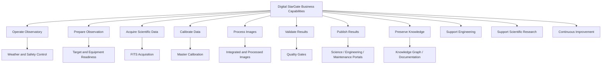
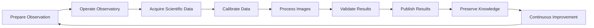

# DSG-EA-BA-001 - Business Architecture

| Campo | Valore |
|---|---|
| Layer | Business Architecture |
| Stato | Proposed refinement |
| Versione | 0.1 |
| Data | 2026-07-27 |
| Fonte gerarchica | `DSG-MR-001` |
| DSRA | `DSRA-000`, `DSRA-001` |
| Vincolo | Roadmap Freeze Policy |

## Scopo

Definire la vista business di Digital StarGate come piattaforma enterprise per operare un osservatorio astronomico automatizzato, preservare conoscenza, produrre dati scientifici/astrofotografici e governare evoluzione tecnica e documentale.

## Mission

Operare Digital StarGate in modo sicuro, ripetibile e tracciabile, trasformando sessioni osservative remote in dati astronomici validati, immagini elaborate, conoscenza documentata e miglioramento continuo.

## Vision

Una piattaforma osservativa governata end-to-end: osservatorio, automazione, dati, analytics, AI assistiva, knowledge graph e portale documentale lavorano come un unico sistema verificabile, senza bypassare safety e governance.

## Business Goals

| Goal | Descrizione | Roadmap | DSRA | ADR | SOP | Manuale |
|---|---|---|---|---|---|---|
| `BG-01` Operare in sicurezza | Apertura, acquisizione e chiusura avvengono solo con condizioni coerenti | `DSG-MR-001` Operations/Security | `DSRA-001` Safety boundary | `ADR-001` | `docs/enterprise/sop.md` | Capitoli 16, 18, 25, 26 |
| `BG-02` Produrre dati scientifici | FITS, calibrazioni, metadata e catalogo restano tracciati | `DSG-MR-001` Data/Image Repository | `DSRA-001` Data lineage | `ADR-003` | Capitolo 28 | Capitoli 10, 17, 28 |
| `BG-03` Pubblicare risultati | Immagini, dashboard e documenti sono validati prima della pubblicazione | Documentation/Analytics | `DSRA-000` Web Portal | `ADR-002`, `DSG-ADR-004` | Release documentation | Analytics, Developer |
| `BG-04` Preservare conoscenza | Decisioni, rischi, registri, manuali e sessioni restano collegati | Knowledge/Documentation | `DSRA-000` Knowledge Graph TBD | `DSG-ADR-004` | Handbook | Enterprise docs |
| `BG-05` Migliorare in modo controllato | Ogni evoluzione passa da roadmap, ADR/assessment e quality gate | Governance | `DSRA-001` TBD discipline | ADR index | Governance SOP | Capitoli 30-34 |

## Capability Map

## Business Capabilities

| Capability | Purpose | Business Service | Function | Stakeholders | Roadmap | DSRA | ADR | SOP | Manuale |
|---|---|---|---|---|---|---|---|---|---|
| Operate Observatory | Condurre osservatorio remoto in stato sicuro | Observatory Operations | Avvio, meteo, Park, chiusura | Operatore, Maintainer | Operations | `DSRA-001` Observatory | `ADR-001` | SOP avvio/chiusura | Capitoli 5, 6, 16, 25, 26 |
| Prepare Observation | Preparare target, profilo e configurazione | Observation Planning | Selezione target, readiness, profili | Operatore, Science Owner | Operations/Data | `DSRA-000` Transition | OPEN | Capitolo 17 | Capitoli 10, 17 |
| Acquire Scientific Data | Acquisire FITS e log | Acquisition Service | N.I.N.A., CPWI, PHD2, ASCOM, ASTAP | Operatore | Image Repository | `DSRA-001` Data | `ADR-001` | Capitolo 17 | Capitoli 11-14, 17 |
| Calibrate Data | Produrre calibrazioni riusabili | Calibration Service | Dark, flat, bias, master | Imaging Owner | Data | `DSRA-001` Data lineage | OPEN | Capitolo 28 | Capitoli 10, 28 |
| Process Images | Trasformare raw in prodotti | Image Processing Service | Calibrazione, registrazione, integrazione | Imaging Owner | Data/Analytics | `DSRA-000` Data | OPEN | Capitolo 28 | Capitolo 28 |
| Validate Results | Applicare quality gates | Validation Service | KPI, dashboard, controlli qualita | Analytics Owner | Analytics | `DSRA-001` Data lineage | `ADR-002` | Release docs | Analytics, warehouse |
| Publish Results | Pubblicare manuale, dashboard e prodotti | Publication Service | MkDocs, GitHub Pages, release | Documentation/Science Owner | Documentation/Web Portal | `DSRA-000` Web Portal | `DSG-ADR-004` | Release docs | Developer guidelines |
| Preserve Knowledge | Collegare documenti, decisioni, rischi e dati | Knowledge Service | Registri, knowledge index, KG TO-BE | Architecture Owner | Knowledge | `DSRA-000` KG TBD | OPEN | Handbook | Enterprise docs |
| Support Engineering | Governare configurazioni, asset e release | Engineering Governance Service | ADR, registri, assessment, release | Maintainer, Architecture Owner | Governance | `DSRA-001` Documentation | ADR index | Handbook | Capitoli 20-24, 34 |
| Support Scientific Research | Preparare dati e submission candidate | Science Support Service | Catalogo, metadata, TNS/AAVSO TBD | Science Owner | Community/Data | `DSRA-000` TO-BE | OPEN | OPEN | Data architecture |
| Continuous Improvement | Chiudere loop incident, post-mortem e miglioramento | Improvement Service | Problem management, assessment, roadmap follow-up | Governance Owner | Governance | `DSRA-001` Transition | ADR future | Capitoli 30-31 | Capitoli 30-34 |

## Stakeholders and Actors

| Tipo | Nome | Interesse | Interazione primaria |
|---|---|---|---|
| Stakeholder | Massimo Mainini | Ownership, approvazione, governance | Roadmap, review, release |
| Stakeholder | Operatore remoto | Operare sessioni sicure | EAGLE, VPN, N.I.N.A., SOP |
| Stakeholder | Maintainer tecnico | Mantenere asset, rete, software e backup | Manuali, registry, maintenance portal |
| Stakeholder | Science Owner | Validare target, dati e pubblicazioni scientifiche | Target registry, data catalog, science portal |
| Stakeholder | Documentation Owner | Mantenere MkDocs, handbook e release evidence | GitHub, MkDocs, ADR, registri |
| Actor | EAGLE | Esegue controllo operativo e acquisizione | N.I.N.A., CPWI, PHD2, ASCOM |
| Actor | PC Principale | Produce governance, processing, docs e analytics | GitHub, MkDocs, PixInsight, warehouse |
| Actor | GitHub | Conserva source of record documentale | Repository, Pages, commit, review |

## Value Streams

| Value Stream | Trigger | Outcome | Evidence |
|---|---|---|---|
| Observation to Archive | Sessione pianificata | FITS, manifest, catalogo e archive | Log, report, hash, stato `ARCHIVED` |
| Data to Insight | Dataset catalogato | KPI e dashboard | Warehouse, dashboard, quality gate |
| Image to Publication | Immagine processata | Prodotto pubblicabile | Metadata, review, release evidence |
| Incident to Improvement | Anomalia operativa | Azione correttiva | Incident report, post-mortem, registry update |

## Operating Model

| Nodo | Business role | Responsabilita |
|---|---|---|
| EAGLE | Operations execution | Acquisizione, controllo strumenti, telemetria, automazione e dati raw |
| PC Principale | Engineering and governance | Documentazione, processing, analytics, release, registri e decisioni |
| GitHub/MkDocs | Source and publication | Versionamento, review, sito documentale, release evidence |
| Storage/Archive | Preservation | Conservazione raw, processed, configurazioni e restore evidence |

## ArchiMate Business Viewpoint

| ArchiMate concept | Digital StarGate element |
|---|---|
| Business Actor | Operatore remoto, Maintainer, Science Owner, Documentation Owner |
| Business Role | Operations Owner, Engineering Owner, Data Owner, Governance Owner |
| Business Service | Observatory Operations, Acquisition, Publication, Knowledge, Improvement |
| Business Function | Prepare, acquire, calibrate, process, validate, publish, preserve |
| Value Stream | Observation to Archive, Data to Insight, Image to Publication |

## Open Architectural Decisions

Le decisioni business non risolte sono registrate in [Architecture Decision Catalog](architecture-decision-catalog.md#open-architectural-decisions). Nessuna capacita business TO-BE e considerata implementata finche la decisione non e chiusa.