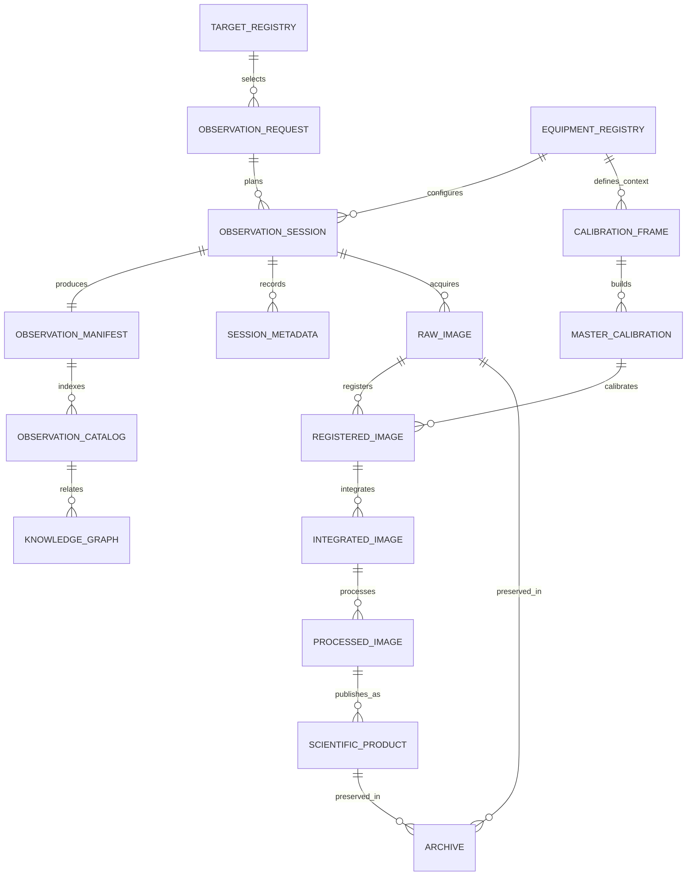
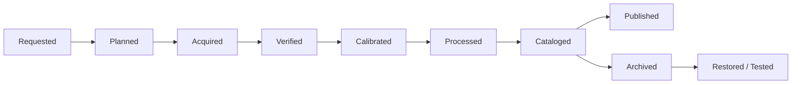

# DSG-EA-DA-001 - Data Architecture

| Campo | Valore |
|---|---|
| Layer | Data Architecture |
| Stato | Proposed refinement |
| Versione | 0.1 |
| Data | 2026-07-27 |
| Fonte gerarchica | `DSG-MR-001` |
| DSRA | `DSRA-000`, `DSRA-001` |

## Scopo

Definire il modello informativo enterprise di Digital StarGate, allineato alla gestione dati e archiviazione, al warehouse, agli analytics e al blueprint del ciclo dati astronomico.

## Enterprise Information Model

## Information Object Catalog

| Information Object | Owner | Producer | Consumer | Retention | Storage | Lifecycle | Relationships | Roadmap | DSRA | ADR | SOP | Manual |
|---|---|---|---|---|---|---|---|---|---|---|---|---|
| Observation Request | Operations/Science Owner | Scheduler/operatore | Session Manager | Permanente se osservata; altrimenti decisione aperta | Registry TBD | Requested -> Planned -> Closed | Target, equipment, session | Operations/Data | `DSRA-001` | OPEN | OPEN | Capitolo 17 |
| Observation Session | Operations Owner | EAGLE/operatore | Data Platform, Analytics | Permanente come evidenza | Session reports/repository | Planned -> Acquired -> Archived | Manifest, raw, logs, metadata | Operations | `DSRA-001` | `ADR-001` | SOP avvio/acquisizione | Capitoli 16-17 |
| Equipment Registry | Engineering Owner | Maintainer | Scheduler, Calibration, Maintenance | Permanente | Registry documentale TBD | Draft -> Validated -> Superseded | Devices, profiles, calibrations | Observatory | `DSRA-001` TBD assets | OPEN | Capitolo 22 | Capitoli 7-10,22 |
| Target Registry | Science Owner | Operatore/planner | Scheduler, Science Portal | Permanente | Registry TBD | Candidate -> Planned -> Observed -> Published | Requests, sessions, catalog | Data/Community | `DSRA-000` | OPEN | OPEN | Capitolo 17 |
| Observation Manifest | Data Owner | Session Manager | Catalog, Archive, KG | Permanente | Session folder/catalog TBD | Draft -> Verified -> Archived | Session, raw, logs, hash | Data | `DSRA-001` Data lineage | OPEN | Capitolo 28 | Capitolo 28 |
| Session Metadata | Data Owner | FITS headers, logs, report | Analytics, KG | Allineata alla sessione | Catalog/warehouse | Captured -> Curated -> Published | Session, raw, catalog | Data/Analytics | `DSRA-001` | `ADR-003` | Capitolo 28 | Capitolo 28 |
| Raw Images | Data Owner | N.I.N.A./cameras | Processing, Archive | Lungo termine per selezionati; policy aperta | EAGLE, primary archive, backup | Acquired -> Verified -> Archived | Session, calibration, metadata | Image Repository | `DSRA-001` | OPEN | Capitolo 28 | Capitoli 17,28 |
| Calibration Frames | Imaging Owner | N.I.N.A./camera/flat panel | Master Calibration | Fino a validita configurazione | Calibration library | Captured -> Validated -> Superseded | Equipment, master calibration | Data | `DSRA-001` | OPEN | Capitolo 28 | Capitoli 10,28 |
| Master Calibration | Imaging Owner | PixInsight/processing | Registration, Processing | Fino a sostituzione validata | Calibration library/archive | Built -> Validated -> Retired | Calibration frames, raw | Data | `DSRA-001` | OPEN | Capitolo 28 | Capitolo 28 |
| Registered Images | Imaging Owner | PixInsight | Integration | Secondo progetto/spazio | Processing workspace | Registered -> Integrated -> Archived/Discarded | Raw, master calibration | Data | `DSRA-001` | OPEN | Capitolo 28 | Capitolo 28 |
| Integrated Images | Imaging Owner | PixInsight | Processing, Science Portal | Secondo progetto; finali permanenti | Processing/archive | Integrated -> Processed | Registered, processed | Data/Analytics | `DSRA-000` | OPEN | Capitolo 28 | Capitolo 28 |
| Processed Images | Imaging/Science Owner | PixInsight | Science Portal, Publication | Permanente per finali | Processed archive/exports | Processed -> Reviewed -> Published | Integrated, scientific product | Community/Data | `DSRA-000` | OPEN | Release docs | Capitolo 28 |
| Observation Catalog | Data Owner | Data Platform | Analytics, KG, portals | Permanente | Warehouse/catalog TBD | Draft -> Curated -> Published | Manifest, metadata, products | Data/Knowledge | `DSRA-001` | `ADR-003` | Capitolo 28 | Warehouse docs |
| Knowledge Graph | Knowledge Owner | Traceability mapper TBD | AI Assistant, Engineering Portal | TBD/versionato | Graph storage TBD | Proposed -> Validated -> Published | Catalog, docs, ADR, DSRA | Knowledge | `DSRA-000` KG TBD | OPEN | OPEN | Knowledge index |
| Scientific Products | Science Owner | Image Processing/Science Portal | Community, archive | Permanente | Portal/archive | Candidate -> Reviewed -> Published | Processed image, catalog | Community/Data | `DSRA-000` | OPEN | OPEN | Data docs |
| Archive | Infrastructure/Data Owner | Backup & Recovery | Restore, audit, reprocessing | Secondo classe dati | Primary + secondary/off-site TBD | Active -> Archived -> Restored/Tested | Raw, processed, manifest, configs | DR/Data | `DSRA-001` | OPEN | Capitolo 21 | Capitoli 21,28 |

## Data Lifecycle View

## Relationship Rules

| Rule | Description |
|---|---|
| `DA-RULE-001` | No Raw Image is orphan: it must link to an Observation Session. |
| `DA-RULE-002` | No Processed Image is published without catalog metadata. |
| `DA-RULE-003` | Calibration validity depends on Equipment Registry context. |
| `DA-RULE-004` | Analytics datasets must identify source and quality state. |
| `DA-RULE-005` | Knowledge Graph facts require provenance from docs, catalog, ADR or DSRA. |
| `DA-RULE-006` | Missing data remains OPEN or Da validare, never invented. |

## ArchiMate Information Viewpoint

| ArchiMate concept | Digital StarGate element |
|---|---|
| Business Object | Observation Request, Scientific Product |
| Data Object | Raw Images, Manifest, Metadata, Catalog |
| Representation | FITS, Markdown, CSV/Parquet, dashboard page, processed image |
| Meaning | Target, session state, quality status, publication status |

## Open Architectural Decisions

Canonical open decisions are maintained in [Architecture Decision Catalog](architecture-decision-catalog.md#open-architectural-decisions), including schemas for Observation Request, Target Registry, Equipment Registry, Observation Manifest, catalog storage, retention and Knowledge Graph.