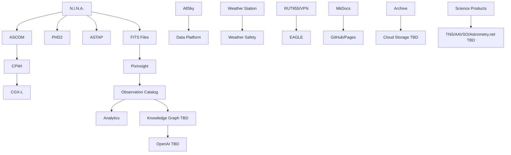

# DSG-EA-IA-001 - Integration Architecture

| Campo | Valore |
|---|---|
| Layer | Integration Architecture |
| Stato | Proposed refinement |
| Versione | 0.1 |
| Data | 2026-07-27 |
| Fonte gerarchica | `DSG-MR-001` |
| DSRA | `DSRA-000`, `DSRA-001` |

## Scopo

Documentare le integrazioni tra componenti Digital StarGate e sistemi esterni, evitando concetti generici non supportati. Le integrazioni operative reali restano locali su EAGLE e rete osservatorio; servizi cloud/scientifici sono TBD quando non approvati.

## Integration Flow View

## Integration Catalog

| Integration | Protocol | Direction | Frequency | Authentication | Payload | Failure Behaviour | Retry Strategy | Recovery | Traceability |
|---|---|---|---|---|---|---|---|---|---|
| N.I.N.A. -> ASCOM | ASCOM COM/local driver | N.I.N.A. to devices | Continuous during session | Windows context | Device commands/state | Device unavailable, driver error | Reconnect device/app | Stop sequence, validate device, resume only coherent | Roadmap Automation; DSRA Automation; ADR-001; SOP 17; Manual 11,14 |
| ASCOM -> CPWI | ASCOM Telescope/CPWI | ASCOM to mount | Continuous | Windows context | Mount state, slew, tracking, Park | Mount state incoherent | Reconnect CPWI/ASCOM | Verify real position, plate solve, recover | Manual 7,13,14 |
| N.I.N.A. -> PHD2 | Local application integration | N.I.N.A. to guiding | During guiding/dither | Windows context | Guide state, dither, settle | Pulse Guide Failed, guide lost | Reconnect/settle retry | Stop acquisition, regain guide, resume | Manual 12,17 |
| N.I.N.A. -> ASTAP | Local solver/file | N.I.N.A. to solver | Slew/solve/flip | Local app | Solve frame, coordinates | Solve failure | Repeat solve with corrected inputs | Verify scale, focus, weather, database | Manual 11,17 |
| EAGLE -> Data Platform | File copy/sync TBD | EAGLE to PC/storage | After/during session as safe | VPN/local permissions TBD | FITS, logs, reports, manifest | Transfer interrupted | Retry with manifest/hash | Do not delete local before verification | Manual 21,28; ADR-003 |
| PixInsight -> Data Platform | File system | PC processing to catalog | Post-session | Local account | Master, registered, integrated, processed images | Non-reproducible output | Reprocess from raw | Preserve raw, update process evidence | Manual 28 |
| AllSky -> Data Platform | HTTP/file TBD | AllSky to monitoring/data | Continuous/periodic | TBD | Images, timelapse, timestamp | stale image/unreachable | Recheck source | Treat as WARNING, not reduced safety | Manual 27 |
| Weather Station -> Safety | Sensor/export TBD | Weather to operations | Continuous/pre-session | TBD | Rain, wind, humidity, dew point | missing/stale/incoherent | Refresh/check sensors | UNKNOWN as UNSAFE | Manual 26 |
| RUT955 -> EAGLE | VPN/LAN/RDP | Operator to EAGLE | Operational access | VPN credentials/certs TBD | Remote session, network status | VPN down/failover fail | reconnect/failover | Local intervention or router recovery | Manual 5,24 |
| GitHub -> MkDocs/Pages | Git/Pages/static build | PC/GitHub to portal | Per commit/release | GitHub auth | Markdown, nav, static site | build/link failure | fix and rebuild | restore via Git history | DSG-ADR-004; release docs |
| Data Platform -> Analytics | Local dataset/warehouse | Data to dashboard | Per refresh | Local/repo permissions | Catalog, KPI dataset | schema/gate failure | Rebuild after correction | Roll back dataset/recompute | ADR-002, ADR-003 |
| Observation Catalog -> KG | TBD | Catalog to KG | TBD | TBD | Entities, relationships, provenance | mapping unsupported | No automatic retry | keep OPEN until KG ADR | DSRA KG TBD |
| KG -> OpenAI | HTTPS API TBD | KG/docs to AI | On request | API key TBD | Sanitized context/prompt | provider unavailable/output unverified | Retry only non-safety | human review/fallback docs | Governance AI |
| Cloud Storage | Sync/API TBD | Archive to cloud | After session/policy | Cloud creds TBD | archive sets, hash, manifest | upload/cost/retention failure | retry resumable sync | restore test, no local deletion | Manual 21 |
| Astrometry.net | HTTPS/API TBD | PC/EAGLE to external | Occasional/TBD | Account/API key TBD | image/metadata/solution | latency/privacy/service down | fallback ASTAP | use only approved SOP | OPEN |
| TNS | Web/API TBD | Science Portal/PC to TNS | Event-based/TBD | Account/API key TBD | transient metadata/report | rejected/incomplete submission | correct and resubmit | review before submission | OPEN |
| AAVSO | Web/API TBD | PC to AAVSO | Campaign/TBD | Account/API key TBD | photometry/metadata | format/calibration rejection | correct data | SOP/review required | OPEN |

## Failure Pattern Classification

| Pattern | Examples | Default response |
|---|---|---|
| Safety critical | Weather unavailable, mount state unknown, VPN loss during unsafe condition | Conservative stop/block/close according to SOP |
| Acquisition critical | N.I.N.A. device missing, PHD2 guide lost, ASTAP solve failed | Stop or pause acquisition, recover locally, log evidence |
| Data critical | Copy interrupted, hash mismatch, catalog schema failure | Preserve source, retry, verify integrity |
| Publication critical | MkDocs link/build issue | Correct documentation before release |
| Optional external | OpenAI, TNS, AAVSO, Astrometry.net unavailable | Fallback to local/manual process |

## ArchiMate Cross-Layer Viewpoint

| ArchiMate relation | Digital StarGate example |
|---|---|
| Application uses Technology | N.I.N.A. uses EAGLE/Windows/ASCOM |
| Application accesses Data | PixInsight accesses FITS and calibration frames |
| Business uses Application | Operatore uses Observation Session Manager/N.I.N.A. |
| Technology serves Application | RUT955/VPN serves remote operations |
| Data realizes Knowledge | Observation Catalog feeds Knowledge Graph TBD |

## Open Architectural Decisions

The canonical list is [Architecture Decision Catalog](architecture-decision-catalog.md#open-architectural-decisions). Integration-specific OPEN items include Alpaca, cloud storage, OpenAI, Astrometry.net, TNS, AAVSO, weather station protocol and telemetry contracts.