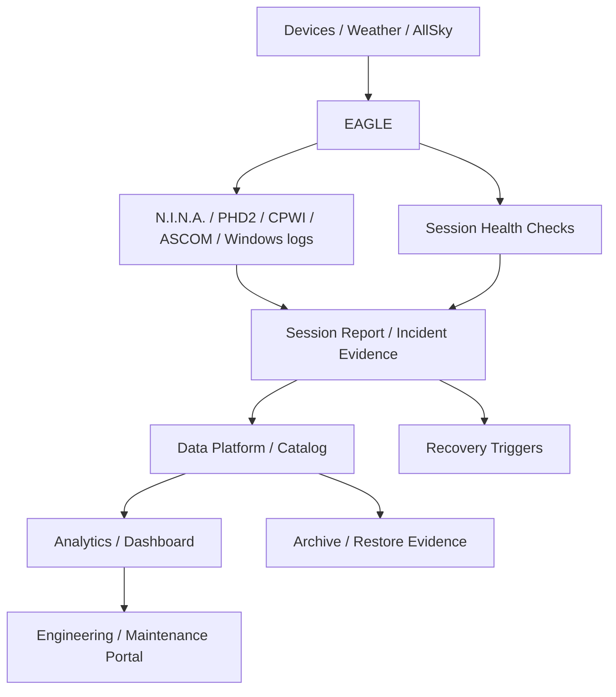
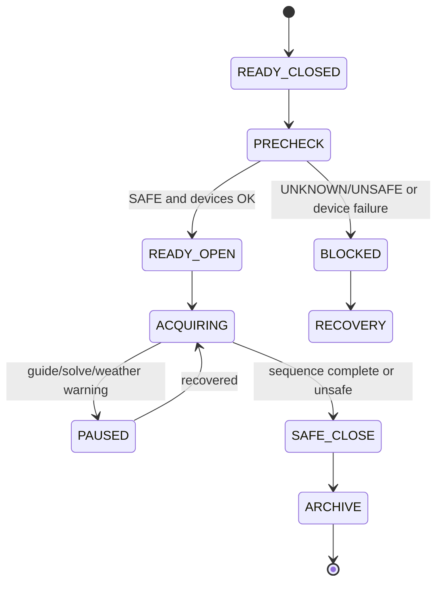

# DSG-EA-OA-001 - Observability Architecture

| Campo | Valore |
|---|---|
| Layer | Observability Architecture |
| Stato | Proposed refinement |
| Versione | 0.1 |
| Data | 2026-07-27 |
| Fonte gerarchica | `DSG-MR-001` |
| DSRA | `DSRA-000`, `DSRA-001` |

## Scopo

Definire come Digital StarGate osserva lo stato operativo dell'osservatorio, della sessione, dei dati, della rete, della pubblicazione e del recovery. Non introduce stack di monitoring non documentati: usa log, report, dashboard, health check e decisioni aperte.

## Observability Flow

## Logging

| Source | Content | Consumer | Retention | Traceability |
|---|---|---|---|---|
| N.I.N.A. | Sequenza, device connection, acquisition, errors | Session Manager, Data Platform | Almeno quanto sessione/dati correlati | Roadmap Operations; DSRA Data; ADR-001; SOP 17; Manual 11 |
| PHD2 | Guida, RMS, SNR, pulse guide, calibration | Session report, Analytics | Sessione correlata | Manual 12 |
| CPWI | Mount state, Park/Unpark, tracking, errors | Operations, Maintenance | Sessione/incidente | Manual 13 |
| ASCOM | Driver state, connection errors | Troubleshooting | Sessione/incidente | Manual 14 |
| Windows/EAGLE | System health, device manager, disk, time | Maintenance Portal | Da validare | Manual 6,16 |
| RUT955 | VPN, WAN, failover, firewall events | Network/recovery | Da validare | Manual 5 |
| AllSky | Image freshness, timelapse, logs | Weather safety, session evidence | Da validare | Manual 27 |
| Weather Station | SAFE/WARNING/UNSAFE/UNKNOWN input | Automation, safety evidence | Da validare | Manual 26 |
| GitHub/MkDocs | Commit, build/release evidence | Documentation governance | Permanente per release | DSG-ADR-004 |

## Telemetry and Metrics

| Area | Metric | Purpose | Status |
|---|---|---|---|
| Observatory safety | weather state, sensor freshness, AllSky freshness | decide safe/open/close | Transition / thresholds TBD |
| EAGLE health | CPU, RAM, disk free, time sync, device manager | readiness | AS-IS checks, telemetry contract TBD |
| Network | VPN reachability, Starlink/RUT955 state, failover | remote access continuity | AS-IS / details TBD |
| Acquisition | frame count, exposure status, solve result, autofocus status | session quality | AS-IS from N.I.N.A. logs |
| Guiding | RMS RA/DEC, SNR, lost stars | data quality | AS-IS from PHD2 logs |
| Data integrity | file count, FITS readable, hash/checksum | archive readiness | Transition |
| Processing | rejected frames, FWHM/HFR, integration status | quality assessment | Transition |
| Analytics | quality gate status, refresh timestamp | dashboard reliability | ADR-002/ADR-003 |
| Backup | backup status, restore test, checksum | DR evidence | Transition |

## Health Checks

| Check | Trigger | Expected result | Failure behaviour | Traceability |
|---|---|---|---|---|
| Network/VPN check | Pre-session | RUT955/VPN/EAGLE reachable | Block remote start, troubleshoot network | Manual 5,16 |
| EAGLE readiness | Pre-session | disk, CPU/RAM, time, devices OK | Block session or recovery | Manual 6,16 |
| Weather safety | Pre-open and during session | SAFE and fresh | UNKNOWN/UNSAFE blocks or closes | Manual 26 |
| Mount state | Pre-slew, park, recovery | Park/Ready/Tracking coherent | Stop commands, verify state | Manual 7,13 |
| Guiding stability | Before/during exposures | RMS/SNR within profile | Pause/stop acquisition | Manual 12,17 |
| Plate solving | Slew/flip | target centered within tolerance | Retry/stop | Manual 11,17 |
| Storage capacity | Pre/during session | free space above threshold | Stop nonessential acquisition | Manual 16,28 |
| Data archive | Session close | files readable, copied, verified | keep local copy, retry | Manual 28 |
| MkDocs/release | Publication | build/nav/link valid | no release until fixed | Release docs |

## Alerts and Recovery Triggers

| Trigger | Severity | Action | Recovery reference |
|---|---|---|---|
| Rain or UNSAFE weather | Critical | Stop new exposure, park, close, log | Manual 26,25 |
| Weather UNKNOWN | Critical/Warning | Treat conservatively; block opening | Manual 26 |
| VPN loss | High | Preserve local safety; recover network | Manual 5,18 |
| Pulse Guide Failed | High | Pause/stop sequence, reconnect PHD2/CPWI | Manual 12 |
| CPWI/mount incoherent | Critical | Stop commands, verify physical position | Manual 7,13,18 |
| Disk low | High | Stop nonessential acquisition, free controlled space | Manual 16,28 |
| FITS integrity failure | Medium/High | Preserve file, investigate, do not overwrite | Manual 28 |
| Backup failure | Medium/High | Retry, record failure, do not delete primary | Manual 21 |
| MkDocs build/link failure | Medium | Fix documentation before release | Release docs |

## Session Monitoring View

## Observability Evidence

| Evidence | Stored in | Used by |
|---|---|---|
| Session report | `docs/session-reports/` or session archive | Data Platform, Maintenance Portal |
| Logs | EAGLE/session folder/archive | Troubleshooting, analytics, incident review |
| Dashboard | Analytics section | Engineering Portal, release evidence |
| Backup log | Backup registry/runbook | DR governance |
| Incident report | Problem management docs/issues | Continuous improvement |
| Commit/build history | GitHub | Documentation governance |

## ArchiMate Implementation and Operations Viewpoint

| Concept | Digital StarGate element |
|---|---|
| Work Package | Session validation, backup test, dashboard refresh |
| Deliverable | Session report, archive manifest, dashboard, release evidence |
| Plateau | AS-IS manual/logs, Transition manifest/catalog, TO-BE KG/AI |
| Gap | Telemetry contract, alert channels, weather thresholds, restore metrics |

## Open Architectural Decisions

Open observability decisions are maintained in [Architecture Decision Catalog](architecture-decision-catalog.md#open-architectural-decisions): telemetry contracts, log correlation format, alert channels, weather thresholds, backup metrics and dashboard refresh policy.