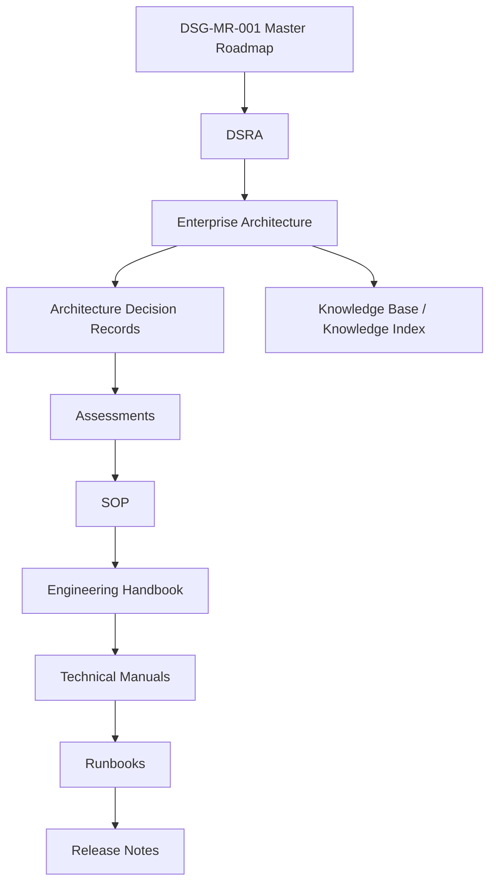
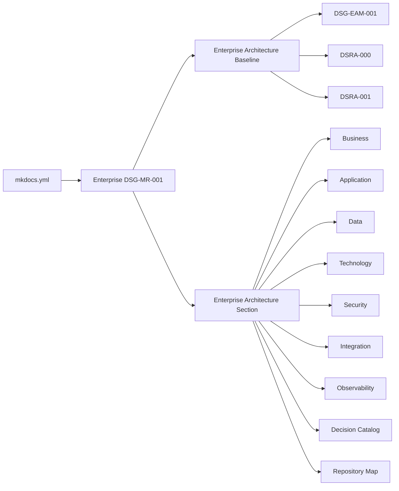

# DSG-EA-ARM-001 - Architecture Repository Map

| Campo | Valore |
|---|---|
| Documento | Architecture Repository Map |
| Stato | Proposed refinement |
| Versione | 0.1 |
| Data | 2026-07-27 |
| Fonte gerarchica | `DSG-MR-001` |

## Scopo

Descrivere come il repository Digital StarGate organizza roadmap, DSRA, Enterprise Architecture, ADR, assessment, SOP, handbook, manuali, runbook, release notes e knowledge base. Questa mappa preserva la gerarchia richiesta e non modifica i documenti congelati.

## Governance Hierarchy

## Repository Map

| Layer | Repository area | Purpose | Governed by | Traceability target |
|---|---|---|---|---|
| Roadmap | `docs/enterprise-roadmap/DSG-MR-001-master-roadmap.md` | Highest governance and scope source | Roadmap Freeze Policy | All architecture artifacts |
| DSRA | `docs/enterprise-architecture/DSRA-000-vision-target-architecture.md`, `DSRA-001-reference-architecture.md`, `docs/enterprise/DSRA-risk-assessment.md` | Target/reference architecture and risks | `DSG-MR-001` | EA layers, security, observability |
| Enterprise Architecture | `docs/enterprise-architecture/*.md` | Business, application, data, technology, security, integration, observability | DSRA/EAM | ADR, assessments, SOP |
| ADR | `docs/architecture/ADR-*.md`, `docs/enterprise/adr/*.md` | Accepted architecture decisions | EA and Governance | Assessments, manuals, release |
| Assessments | `docs/architecture/assessments/*.md`, `docs/enterprise/assessment.md` | Validate maturity, gaps, environment | ADR/Governance | SOP and backlog |
| SOP | `docs/enterprise/sop.md`, `docs/chapters/16-*`, `17-*`, `18-*`, `25-*`, `26-*`, `28-*` | Operational procedures | Assessments/Governance | Handbook/manual execution |
| Engineering Handbook | `docs/enterprise/handbook.md` | Contributor and maintainer guide | SOP/Governance | Technical manuals |
| Technical Manuals | `docs/chapters/*.md` | Detailed observatory, equipment, network, software and operations docs | Handbook/SOP | Runbooks and release evidence |
| Runbooks | Technical procedures and incident/recovery chapters | Actionable recovery and maintenance | Manuals | Release readiness |
| Release Notes | `docs/releases/*.md`, `docs/enterprise/release-documentation.md` | Published release evidence | Governance/release process | Change history |
| Knowledge Base | `docs/enterprise/knowledge-index.md`, registries, MkDocs navigation | Searchable knowledge and traceability | EA/Documentation governance | AI/KG future scope |

## Navigation View

## Relationship Matrix

| Source | Refines | Consumed by | Must not contradict |
|---|---|---|---|
| `DSG-MR-001` | Program scope, objectives, frozen roadmap | DSRA, EA, ADR | None |
| `DSRA-000/001` | Roadmap into target/reference architecture | EA layers | `DSG-MR-001` |
| EA layers | DSRA into business/application/data/technology views | ADR, assessments, SOP | Roadmap, DSRA, Governance |
| ADR | Decisions needed by architecture | Assessments, manuals, release | Roadmap, DSRA, EA |
| Assessments | Evidence and maturity checks | SOP, handbook | ADR and EA |
| SOP | Operational execution | Manuals/runbooks | Safety and governance |
| Manuals | Detailed technical operation | Runbooks, maintenance | SOP and EA |
| Release Notes | Published change evidence | Stakeholders and future audits | Governance and source docs |

## ArchiMate Viewpoint Organization

| Viewpoint | Document |
|---|---|
| Business | [Business Architecture](business-architecture.md) |
| Application | [Application Architecture](application-architecture.md) |
| Information | [Data Architecture](data-architecture.md) |
| Technology | [Technology Architecture](technology-architecture.md) |
| Motivation | [Architecture Decision Catalog](architecture-decision-catalog.md) and [Security Architecture](security-architecture.md) |
| Implementation & Migration | [Observability Architecture](observability-architecture.md), [Repository Map](repository-map.md), roadmap/release docs |
| Cross-layer | [Integration Architecture](integration-architecture.md) |

## No-Orphan Rule

Every architecture element in the Enterprise Architecture section must reference at least:

- roadmap domain or objective;
- DSRA baseline or principle;
- related ADR or OPEN decision;
- related SOP or operational procedure;
- related manual or source documentation.

## Maintenance Rule

When a new architecture element is added:

1. verify roadmap scope;
2. verify DSRA consistency;
3. decide whether ADR is required;
4. update affected assessment/SOP/manual references;
5. update `mkdocs.yml` navigation;
6. update release evidence when published.

## Open Architectural Decisions

Open decisions are maintained in [Architecture Decision Catalog](architecture-decision-catalog.md#open-architectural-decisions). This map does not create a second decision list.